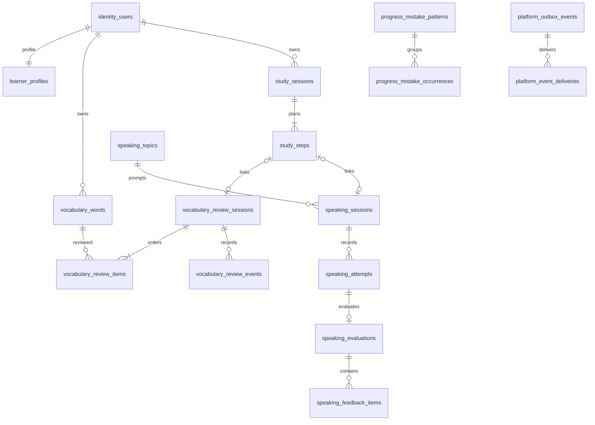

# Mimic Backend — Modular Monolith Plan

> Trạng thái: kế hoạch triển khai, chưa phải tài liệu xác nhận backend đã hoàn thành.
>
> Phạm vi: xây một Spring Boot application duy nhất, chia module theo domain, phục vụ frontend Mimic hiện tại và thay dần mock/localStorage bằng API thật.

> Revision 2: mục 17–25 bổ sung đặc tả triển khai và nghiệm thu. Thời hạn, quota và thuật toán học là mặc định thiết kế đề xuất, chưa phải kết quả thử nghiệm hay cam kết sản phẩm. Các mục này phải được cập nhật cùng schema/API/test khi thay đổi quyết định.

Đọc mục 17 trước khi tạo module; mục 18–19 trước migration/business logic; mục 20–22 trước auth/worker/controller. Triển khai theo mục 24, nghiệm thu theo mục 25. Tài liệu này cho phép chuẩn bị implementation bằng fake adapter; provider, model, region và ngân sách thực tế được ghi ADR trước khi bật tích hợp.

### Implementation snapshot — 2026-09-08

- B00 hoàn thành ở local: toolchain/profiles/Compose, V1 platform migration, Problem Details,
  security baseline, request ID, ArchUnit và Testcontainers PostgreSQL đã chạy qua Maven verify.
- B01 core hoàn thành: job queue + JobHandler SPI, polling/retry/heartbeat/checkpoint,
  claim/lease/generation fencing, outbox + delivery riêng cho từng EventConsumer, typed idempotency
  execution và quota reserve/consume/release đã có recovery/concurrency test trên PostgreSQL 17.6.
- B11 observability slice đã có worker outcome/duration/heartbeat metrics và maintenance
  count/failure/last-success metrics cho context analysis, review session và audio retention;
  queue observer đã có due-count, oldest-due-job age, delivery lag và refresh-health gauges.
  Migration V15 bổ sung partial index cho expired lease; suite unit/architecture hiện có 101 test
  đã pass. PostgreSQL observation IT đã được viết nhưng cần Docker daemon để thực thi.
- B11 audited event-delivery replay đã có internal command, dry-run, row lock, reset retry budget
  và audit bền vững cho cả accepted/rejected/not-found outcome; không mở HTTP và chủ động loại job
  replay khỏi phạm vi vì paid-work cần policy riêng.
- B11 restore drill đã có PowerShell automation tạo custom-format dump, restore vào database cách
  ly, kiểm tra Flyway/audio metadata, xuất object manifest + SHA-256/timing evidence và runbook an
  toàn. Chưa ghi nhận RPO/RTO đạt vì Docker/production-like storage chưa sẵn sàng để đo.
- B11 load-test harness k6 cho upload/evaluation polling và release checklist đã có; guardrail và
  precondition ghi rõ, không tự tuyên bố SLO/RPO/RTO khi chưa có staging evidence.
- Platform release hardening còn lại: chạy load test/restore drill production-like, chốt provider
  evidence và ký release approval.
- B02 đã bắt đầu theo vertical slice register: V2 tạo identity/learner/session/token tables; user và
  learner profile dùng Spring Data JPA; password dùng Argon2id; `GET /api/v1/auth/csrf` và
  `POST /api/v1/auth/register` đã có validation, CSRF, duplicate handling và transaction xuyên
  identity → learner. Integration test xác nhận email normalization, hash password và rollback
  boundary trên PostgreSQL thật.
- B02 auth session đã có login, access JWT RS256 loại `at+jwt` sống 10 phút, refresh opaque
  256-bit chỉ lưu SHA-256, cookie Secure/HttpOnly/SameSite=Lax, rotation khóa row, reuse detection
  revoke cả family và logout. Decoder kiểm tra algorithm/typ/issuer/audience/time với clock skew
  30 giây, đồng thời kiểm tra account/authVersion/session trong DB nên access token bị vô hiệu ngay
  sau revoke.
- B02 email verification đã nối transaction đăng ký với platform job; durable payload không chứa
  raw token. Worker tạo token 256-bit, chỉ lưu SHA-256 với TTL 24 giờ rồi gọi fake email adapter
  ngoài transaction. Verify dùng row lock + token một lần; resend trả response chung chống dò tài
  khoản. Integration test đã kiểm chứng enqueue, không lộ token, consume, verify và resend.
- B02 forgot/reset hoàn thành với reset token 30 phút chỉ lưu hash, generic 202 chống dò account,
  đổi Argon2id hash + tăng authVersion + revoke toàn bộ session trong một transaction.
- B02 auth rate limit hoàn thành bằng PostgreSQL atomic fixed-window counter: login thất bại
  10/15 phút theo email/IP hash; forgot/resend 3/giờ theo email hash và 20/giờ theo IP hash. Vi phạm
  trả 429 + Retry-After.
- B03 backend profile slice đã có `GET /api/v1/me`, `PATCH /api/v1/me/profile` và
  `PUT /api/v1/me/onboarding`; ownership lấy duy nhất từ JWT subject. Profile update dùng
  compare-and-set theo `expectedVersion`; onboarding retry cùng payload là idempotent và không tăng
  version.
- `POST /api/v1/auth/change-password` đã được tách khỏi public auth allowlist, kiểm tra mật khẩu
  hiện tại, tăng `authVersion`, revoke toàn bộ session và expire refresh cookie. Unit/architecture
  suite hiện có 19 test đã pass; integration test B03 đã được viết nhưng lần chạy local này bị chặn
  do Docker Desktop daemon đang tắt.
- B03 account deletion backend đã có `DELETE /api/v1/me`, trạng thái `DELETING`, revoke tức thời,
  maintenance job, `AccountDataCleaner` SPI, drain guard, platform/learner cleaner, checkpoint từng
  bước và tombstone không có FK. Integration scenario đã bao phủ CSRF, mật khẩu sai, token mất hiệu
  lực và thứ tự xóa vật lý; cần Docker chạy để thực thi. Phần còn lại của milestone là frontend
  adapter.
- B04 đã bắt đầu với vocabulary core migration và module `vocabulary`: entity/repository JPA,
  owner-scoped pagination/filter, `GET /api/v1/vocabulary/words`,
  `PATCH /api/v1/vocabulary/words/{id}`, semantic duplicate key, optimistic locking và
  vocabulary deletion cleaner. Mastery/status/schedule không cho client sửa.
- B04 context-analysis đã có verified-email gate, `Idempotency-Key`, quota reservation,
  transactional enqueue, polling API, result JSON versioned, deterministic fake adapter chỉ ở
  dev/test và POST lưu 1–20 suggestions bằng semantic upsert. Job hết retry sẽ gọi final-failure
  hook, chuyển analysis `pending` sang `failed` có điều kiện và quyết toán quota đúng một lần.
  Expiry cleanup chạy theo batch có khóa `SKIP LOCKED`, release quota của analysis còn pending và
  xóa payload hết hạn trong cùng transaction. Unit/architecture suite hiện có 30 test đã pass;
  Review foundation đã có migration V6, JPA session/item stores, partial unique active session,
  pessimistic word selection, transactional review lock, timezone/order snapshot và API
  create/get/active có idempotency. Rating đã dùng `simple-v1`, session pessimistic lock + optimistic
  version, conditional word/item/cursor mutation, before/after JSON snapshot và duration server cap
  120 giây trong một transaction. Undo chỉ chấp nhận active event ngay trước cursor, khôi phục
  before-state, đánh dấu audit `undoneAt` và rewind nguyên tử; retry được idempotent. Complete chỉ
  chấp nhận khi mọi item có active rating, tổng hợp accepted duration, phát transactional
  `VocabularyReviewCompleted` và nhả toàn bộ word lock. Abandon giữ rating đã áp dụng, không phát
  completion event và cũng nhả lock; cả hai dùng expectedVersion + Idempotency-Key. Cleanup dùng
  batch `FOR UPDATE SKIP LOCKED`, mặc định tự abandon session không hoạt động 24 giờ và nhả lock
  trong cùng transaction.
- B05 ledger tối thiểu đã hoàn thành: V7 tạo immutable `progress_activity_ledger`; consumer
  `progress-activity-ledger-v1` validate `VocabularyReviewCompleted`, tính activity date theo timezone
  snapshot và upsert chống trùng bằng cả event ID lẫn logical source/session. Consumer write và
  fenced delivery acknowledgement cùng transaction; account deletion có progress cleaner riêng.
  PostgreSQL IT cho V6/V7 đã viết nhưng cần Docker daemon để chạy.
- B06 đã bắt đầu với migration V8, bốn topic seed không chứa mock result, JPA topic/session stores và
  API topic + create/get/active/abandon session. Session snapshot toàn bộ prompt revision cùng
  timezone, giới hạn một `IN_PROGRESS` session/user, ownership và idempotency/expectedVersion được
  enforce phía server. V9 đã bổ sung attempt metadata/state, đánh số dưới session lock, object key do
  server sinh, allowlist MIME, giới hạn 20 MiB và storage signing port. Create attempt idempotent trả
  upload grant 10 phút; renew chỉ cho owned `AWAITING_UPLOAD` đúng version. Adapter dev/test dùng URL
  `.invalid`, không giả lập upload thành công và production buộc cung cấp adapter thật. Upload-complete
  đã verify SHA-256/size/detected MIME/duration từ storage, seal immutable object version trong
  transaction khóa session → attempt và idempotent khi retry cùng checksum. Playback chỉ cấp URL 60
  giây cho audio `AVAILABLE` còn retention, kèm `Cache-Control: no-store`; expired trả 410. Retention
  scheduler xử lý batch cấu hình được: xóa versioned object trước, CAS metadata sang `DELETED` sau,
  lỗi storage giữ record để retry và không chặn phần còn lại của batch. Phần còn lại để bật B06 trên
  production là storage adapter thật.
- B07 đã bắt đầu với V10 tạo evaluation/feedback schema, unique một evaluation/attempt, API evaluate
  trả 202 + Location/Retry-After và API poll owner-scoped. Paid-work guard, retained audio, session
  state, quota reservation, enqueue job, attempt `QUEUED` và idempotency được enforce cùng
  transaction; key mới vẫn reuse evaluation cũ nên không thể vượt quota. STT và feedback dùng hai
  outbound port riêng, không giữ DB transaction khi gọi provider. Worker persist transcript trước
  khi feedback; retry tại stage `FEEDBACK` bỏ qua STT. Result schema được validate, JSON result và
  feedback rows persist cùng attempt `COMPLETED` + quota consume sau khi khóa kiểm tra session vẫn
  active. Final failure cập nhật cả evaluation/attempt; quota release nếu chưa authorize provider,
  consume nếu đã authorize. Dev/test có deterministic adapter ghi rõ `source=fake`; production
  fail-fast nếu thiếu adapter thật. History có pagination; detail chứa attempt/evaluation. Complete
  session bắt buộc selected attempt đã evaluate, không còn evaluation queued/running, khóa session
  và CAS expectedVersion. Duration cộng một lần cho mọi attempt evaluate thành công; transition và
  `SpeakingSessionCompleted` outbox event commit cùng transaction. Progress consumer validate
  event rồi ghi ledger idempotent theo ngày của timezone snapshot. Provider failure taxonomy phân
  biệt TIMEOUT/RATE_LIMITED/UNAVAILABLE có retry với AUTHENTICATION_FAILED/REQUEST_REJECTED và
  invalid response terminal; error code được prefix theo STT/FEEDBACK. Platform worker hỗ trợ
  fail-final ngay, không đốt retry budget cho lỗi terminal. Suite hiện có 71 unit/architecture test
  đã pass. B07 đã đủ contract nội bộ; adapter provider thật và timeout HTTP cụ thể được tích hợp ở
  B10 khi chốt vendor/credentials.
- B08 đã bắt đầu với V11 tạo `study_sessions`/`study_steps`, FK child và constraint đúng một child
  theo kind. API create/get/active hỗ trợ đúng ba plan `[vocabulary]`, `[speaking]`,
  `[vocabulary,speaking]`; parent, child sessions, links và mọi idempotency record commit/rollback
  cùng transaction. Study chỉ gọi public API của child, không tạo JPA association liên module.
  Existing active parent/independent child bị từ chối, không tự attach. Step transition chỉ tiến
  đúng một bước khi child hiện tại completed. Complete idempotent yêu cầu mọi child completed và
  không phát duration event; abandon giữ child completed, chỉ abandon child còn active rồi CAS
  parent trong cùng transaction. Account cleaner xóa Study links trước progress/speaking/vocabulary.
  Suite hiện có 80 unit/architecture test đã pass. Backend B08 đã hoàn thành; phần frontend combined
  flow và end-to-end PostgreSQL test chờ môi trường Docker.
- B09 đã bắt đầu với V12 tạo daily projection từ activity ledger. Review/speaking consumer chỉ cộng
  projection khi insert ledger mới thành công và hai write cùng transaction, nên event/logical
  source lặp không cộng duration lần hai. API `GET /progress/daily` trả chuỗi ngày dày tối đa 366
  ngày; `GET /progress/overview` trả total minutes, streak theo timezone hiện tại, today seconds và
  daily goal. Historical date vẫn dùng timezone snapshot của child session. V13 thêm mistake
  pattern/occurrence từ `SpeakingEvaluationCompleted`; feedbackItemId chống trùng và unknown key
  không bị merge theo prose. API mistake list/detail có pagination, status update dùng optimistic
  version. Overview recommendation theo rule overdue vocabulary → active mistake → speaking topic.
  V14 thêm versioned projection generation và internal rebuild command: build từ ledger, khóa
  shared/exclusive đồng bộ writer với catch-up, validate tổng seconds rồi atomic switch active
  pointer; generation cũ giữ RETIRED và generation lỗi không được serve. Suite hiện có 93
  unit/architecture test đã pass. Backend B09 đã hoàn thành; frontend dashboard và PostgreSQL
  concurrency execution còn chờ môi trường tích hợp.
- B10 đã bắt đầu với core frontend transport/adapters: API client xử lý CSRF, refresh cookie và
  chỉ retry một lần khi 401, giữ nguyên Idempotency-Key, hỗ trợ 204/non-JSON/requestId/Retry-After,
  AbortSignal và không gắn Content-Type sai cho FormData. Auth thật đã nối login, reload /me,
  register cần xác minh email, logout và xóa cache theo user. Vocabulary, speaking và progress
  service đã bỏ silent mock fallback; speaking dùng create attempt → presigned upload → checksum
  SHA-256 → complete → evaluate/poll đúng backend contract. Progress page, mistake detail và
  Dashboard đã đọc overview/daily/mistake projection thật; update mistake gửi expectedVersion và
  không còn localStorage write path. Transport có timeout 15 giây, phân loại riêng
  timeout/quota/rate-limit/network và UI có loading/error/requestId/retry. Dashboard đã tạo/resume
  Study plan thật bằng topic UUID; Vocab Review dùng server snapshot và đủ
  rate/undo/complete/abandon với optimistic version + idempotency, đồng thời đã xóa review mutation
  local khỏi Zustand. Speaking room đã bỏ topic/evaluation mock: tải topic và active session từ API,
  chỉ tạo session khi bắt đầu ghi âm, gửi Blob qua presigned PUT, seal bằng SHA-256, evaluate/poll có
  timeout/hủy, retry lỗi hiển thị rõ, complete bằng selected attempt + optimistic version, rồi complete
  Study parent nếu đây là combined flow. Metric thiếu từ provider để null và UI không tự gán điểm;
  source evaluation được hiển thị. Speaking history/detail đọc pagination/detail thật và playback
  qua signed URL ngắn hạn. Session Summary tải Study trước rồi lấy Review/Speaking theo đúng child ID,
  không còn tự complete khi mở trang và không hiển thị duration/remembered/WPM giả. Phiên chưa hoàn
  tất được điều hướng về đúng bước hiện tại. Progress lấy tổng vocabulary và speaking session từ
  pagination metadata thay vì mảng demo. Local Study/Speaking lifecycle mutations và session history
  cache đã được gỡ khỏi Zustand; chỉ giữ active Study pointer để phối hợp điều hướng. Vocabulary
  catalog tải words thật, context capture dùng start → poll → map existingWordId → save suggestion IDs,
  giữ analysis ID khi retry và phân biệt retry analyze/save. Dashboard tải vocabulary/topic từ API;
  Speaking lấy carried words từ review child snapshot thay vì cache. Vocab data/mutation slice đã được
  xóa; fixture vocab/speaking không còn consumer cũng đã được loại bỏ. Ba storage key core cũ chỉ còn
  trong cleanup để logout xóa dữ liệu từ phiên bản trước. Hiện có
  20 API boundary regression test; toàn bộ 35 frontend test pass, production build và lint các file
  thay đổi đều sạch.
  OpenAPI code-first đã dùng springdoc 3.0.3:
  contract test dựng đủ controller mà không cần DB/provider, so sánh JSON theo semantic để chặn
  drift và export artifact tại backend/openapi. Frontend dùng openapi-typescript 7.13.0 sinh type
  từ artifact; các service boundary đã thay DTO viết tay bằng generated type và production build
  đã pass. Phần frontend adapter của B10 đã hoàn thành cho core flow; B10 chưa đóng vì provider/storage
  thật trong staging còn chờ vendor, credentials và budget;
  vendor/credentials/budget chưa được chốt nên chưa tự ý thêm adapter trả phí.
- PostgreSQL/Testcontainers IT cho các migration đã viết nhưng vẫn cần Docker daemon để chạy.

## 1. Mục tiêu và quyết định kiến trúc

### 1.1 Mục tiêu

- Một backend deployable duy nhất, một repository và một PostgreSQL database.
- Chia code theo domain/business capability thay vì chia toàn dự án thành các package `controller`, `service`, `repository` dùng chung.
- Biên module rõ ràng để có thể kiểm thử độc lập và tách service về sau nếu thực sự cần.
- API ổn định, có version, validation, security, error contract và migration database ngay từ đầu.
- AI, speech-to-text, email và object storage đi qua port/adapter; domain không phụ thuộc trực tiếp nhà cung cấp.
- Thay mock frontend theo từng lát dọc, không thực hiện một lần chuyển đổi lớn.

### 1.2 Kiểu kiến trúc

Chọn **modular monolith + package by feature**.

```text
HTTP request
    │
    ▼
Module API → Application use case → Domain model
                                  │
                                  ▼
                       Infrastructure adapters
                    PostgreSQL / AI / STT / Storage / Email
```

Quy tắc bắt buộc:

1. Module chỉ gọi `application/publicapi` và dùng event contract tại `application/events` theo allowlist mục 17; không truy cập repository/entity nội bộ của nhau.
2. Controller không chứa business logic và không trả JPA entity.
3. Application service điều phối use case và transaction; domain giữ invariant và rule nghiệp vụ.
4. Infrastructure triển khai port do application/domain định nghĩa.
5. Không tạo package `common` làm nơi chứa mọi thứ. Chỉ đưa vào `shared` khi thực sự dùng chung và không thuộc domain nào.
6. Không tạo interface/service/repository nếu chưa có nhu cầu thay thế hoặc biên kiến trúc rõ ràng.

### 1.3 Root package

Giữ root package hiện có để tránh đổi namespace không cần thiết:

```text
com.dev.heymimic
```

Nếu trước khi bắt đầu coding có domain tổ chức chính thức, có thể đổi một lần sang namespace tương ứng. Không đổi giữa quá trình triển khai.

## 2. Stack chuẩn

| Mảng | Lựa chọn |
|---|---|
| Runtime | Java 21 cho dev/build/CI/container; Maven Wrapper khóa version |
| Framework | Spring Boot trong pom hiện tại là baseline; kiểm tra compatibility tại B00 |
| HTTP | Spring MVC, Bean Validation |
| Persistence | Spring Data JPA + PostgreSQL |
| Migration | Flyway; schema chỉ thay đổi qua migration |
| Security | Spring Security; access token ngắn hạn, refresh token xoay vòng |
| API docs | OpenAPI sinh từ controller/DTO |
| Mapping | Mapper Java tường minh; chưa cần MapStruct ở giai đoạn đầu |
| Testing | JUnit theo Boot BOM, Mockito, MockMvc, Testcontainers PostgreSQL, ArchUnit |
| Observability | Actuator, structured logging, correlation/request ID |
| External media | Object storage adapter; không lưu audio/video blob trong PostgreSQL |

Không dùng Lombok ở core model. Ưu tiên Java record cho request/response và value object bất biến.

## 3. Cấu trúc thư mục chuẩn

```text
backend/
├── pom.xml
├── mvnw
├── mvnw.cmd
├── src/
│   ├── main/
│   │   ├── java/com/dev/heymimic/
│   │   │   ├── HeymimicApplication.java
│   │   │   ├── identity/
│   │   │   │   ├── api/
│   │   │   │   ├── application/
│   │   │   │   ├── domain/
│   │   │   │   └── infrastructure/
│   │   │   ├── learner/
│   │   │   ├── study/
│   │   │   ├── vocabulary/
│   │   │   ├── speaking/
│   │   │   ├── progress/
│   │   │   ├── platform/
│   │   │   └── shared/
│   │   │       ├── config/
│   │   │       ├── error/
│   │   │       ├── security/
│   │   │       ├── time/
│   │   │       └── web/
│   │   └── resources/
│   │       ├── application.yml
│   │       ├── application-dev.yml
│   │       ├── application-prod.yml
│   │       └── db/migration/
│   └── test/
│       ├── java/com/dev/heymimic/
│       │   ├── architecture/
│       │   ├── identity/
│       │   ├── vocabulary/
│       │   ├── speaking/
│       │   └── support/
│       └── resources/
│           └── application-test.yml
```

Mỗi module feature dùng cùng một cấu trúc nội bộ:

```text
vocabulary/
├── api/
│   ├── VocabularyController.java
│   ├── request/
│   │   ├── AnalyzeContextRequest.java
│   │   └── RateWordRequest.java
│   └── response/
│       └── VocabularyWordResponse.java
├── application/
│   ├── VocabularyFacade.java
│   ├── publicapi/
│   ├── events/
│   ├── command/
│   ├── query/
│   └── port/
├── domain/
│   ├── VocabularyWord.java
│   ├── ReviewSession.java
│   ├── ReviewEvent.java
│   └── VocabularyStatus.java
└── infrastructure/
    ├── persistence/
    │   ├── VocabularyWordEntity.java
    │   ├── JpaVocabularyWordRepository.java
    │   └── VocabularyPersistenceAdapter.java
    └── ai/
        └── AiVocabularyExtractionAdapter.java
```

Không bắt buộc tạo đủ thư mục rỗng. Chỉ thêm package/file khi có use case thật.

`content` tạo ở P2. `platform` sở hữu job runtime, outbox và idempotency; `shared` chỉ chứa primitive/config. Test profile chỉ nằm trong `src/test/resources`.

## 4. Quy chuẩn file và code

### 4.1 Tên file

| Loại | Quy ước | Ví dụ |
|---|---|---|
| REST controller | `{Feature}Controller` | `VocabularyController` |
| Use-case facade | `{Feature}Facade` | `SpeakingFacade` |
| Command/query handler | `{Verb}{Noun}Handler` | `CompleteStudySessionHandler` |
| Request/response DTO | `{Action}Request`, `{Resource}Response` | `LoginRequest`, `ProfileResponse` |
| Domain object | Tên nghiệp vụ, không hậu tố kỹ thuật | `StudySession`, `MistakePattern` |
| JPA entity | `{DomainName}Entity` | `StudySessionEntity` |
| Spring Data repository | `Jpa{DomainName}Repository` | `JpaStudySessionRepository` |
| Domain/application port | `{DomainName}Repository`, `{Capability}Port` | `AudioStoragePort` |
| Adapter | `{Provider}{Capability}Adapter` | `WhisperTranscriptionAdapter` |
| Mapper | `{Source}Mapper` hoặc `{Feature}Mapper` | `VocabularyMapper` |
| Exception | `{Meaning}Exception` | `SessionNotFoundException` |
| Migration | `V{number}__{snake_case}.sql` | `V1__create_identity_tables.sql` |

### 4.2 Code style

- Constructor injection; không field injection.
- Controller chỉ nhận request, gọi use case và map response/status.
- Request DTO dùng `jakarta.validation`; domain tự bảo vệ invariant quan trọng.
- Transaction đặt ở application layer. Query mặc định `readOnly = true`.
- Timestamp lưu UTC bằng `Instant`; ngày học lưu `LocalDate` cùng timezone IANA của user.
- ID dùng UUID do application tạo; không để frontend tự quyết định ID persisted.
- Enum persisted dạng string, không ordinal.
- Không trả `null` collection; trả array rỗng.
- Không log token, password, raw audio hoặc transcript nhạy cảm.
- Secret chỉ lấy từ environment/secret manager; không commit vào YAML.
- Một public top-level class/record trên mỗi file.
- JavaDoc chỉ dùng cho public contract hoặc quyết định khó hiểu; không mô tả lại code.

## 5. Biên module

### 5.1 `identity`

Chịu trách nhiệm:

- Đăng ký, đăng nhập, refresh, logout.
- Hash password, email verification, forgot/reset password.
- Access/refresh token lifecycle và revoked session.

Không chịu trách nhiệm lưu mục tiêu học hoặc tiến độ.

### 5.2 `learner`

Chịu trách nhiệm:

- Profile, onboarding, target language, learning goal, self-assessed level.
- Daily-minute goal và timezone.

### 5.3 `study`

Chịu trách nhiệm:

- Vòng đời buổi học tổng: planned steps, current step, completed/abandoned.
- Liên kết vocab review và speaking session.
- Idempotent completion.

### 5.4 `vocabulary`

Chịu trách nhiệm:

- Từ đã lưu, nguồn ngữ cảnh, trạng thái mastery.
- Context extraction qua AI port.
- Review session, review event, undo và lịch spaced repetition.

### 5.5 `speaking`

Chịu trách nhiệm:

- Topic, speaking session, attempt và audio metadata.
- Upload/presigned upload, transcription job, AI feedback và metrics.
- Trạng thái xử lý bất đồng bộ: `UPLOADED → TRANSCRIBING → ANALYZING → COMPLETED` hoặc `FAILED`.

### 5.6 `progress`

Chịu trách nhiệm:

- Daily activity, streak, aggregate metrics.
- Mistake pattern, occurrence, status và recommendation.
- Đọc event/kết quả từ study, vocabulary và speaking qua public contract/event.

### 5.7 `content`

Module P2 sở hữu listening exercise, writing template và video metadata. Speaking topic, seed và version thuộc riêng `speaking`; `content` không ghi bảng topic.

### 5.8 P2 modules

- `dialogue`: AI role-play theo lượt.
- `peer`: matching, room, session và feedback; nếu có realtime sẽ dùng WebSocket riêng trong cùng monolith trước.
- `media`: chỉ tách khi asset lifecycle đủ lớn; MVP để audio port/adapter và metadata trong `speaking`.

## 6. API contract

### 6.1 Quy ước chung

- Base path: `/api/v1`.
- JSON dùng `camelCase` để khớp frontend.
- Thành công trả resource trực tiếp; không bọc `{ data, status }` nếu không có metadata cần thiết.
- Danh sách lớn dùng `items`, `page`, `size`, `totalItems`, `totalPages`.
- Lỗi dùng `application/problem+json` theo Problem Details, bổ sung `code`, `fieldErrors`, `requestId`.
- `401` cho chưa xác thực, `403` cho không đủ quyền, `404` khi resource không tồn tại, `409` cho xung đột trạng thái, `422` cho rule nghiệp vụ không thể thực hiện.
- Mutating endpoint quan trọng hỗ trợ `Idempotency-Key`, đặc biệt upload/complete/evaluate.
- OpenAPI là contract nguồn; frontend DTO sinh hoặc đối chiếu từ contract này.

Ví dụ lỗi:

```json
{
  "type": "https://heymimic.com/problems/validation-error",
  "title": "Request validation failed",
  "status": 400,
  "code": "VALIDATION_ERROR",
  "requestId": "req_...",
  "fieldErrors": {
    "email": "must be a valid email"
  }
}
```

### 6.2 Endpoint P0/P1

#### Auth và learner

| Method | Path | Mục đích |
|---|---|---|
| POST | `/auth/register` | Tạo tài khoản |
| POST | `/auth/login` | Đăng nhập |
| POST | `/auth/refresh` | Xoay refresh token |
| POST | `/auth/logout` | Thu hồi phiên hiện tại |
| POST | `/auth/forgot-password` | Gửi reset flow |
| POST | `/auth/reset-password` | Đổi password bằng token một lần |
| GET | `/auth/csrf` | Cấp token CSRF cho browser |
| POST | `/auth/verify-email` | Xác minh email bằng token một lần |
| POST | `/auth/resend-verification` | Yêu cầu gửi lại verification |
| POST | `/auth/change-password` | Đổi mật khẩu, yêu cầu password hiện tại |
| DELETE | `/me` | Yêu cầu xóa tài khoản, xác thực lại |
| GET | `/me` | User + learner profile hiện tại |
| PATCH | `/me/profile` | Cập nhật profile/settings |
| PUT | `/me/onboarding` | Hoàn thành onboarding idempotently |

#### Study

| Method | Path | Mục đích |
|---|---|---|
| POST | `/study-sessions` | Bắt đầu buổi học |
| GET | `/study-sessions/{id}` | Lấy trạng thái buổi |
| PATCH | `/study-sessions/{id}/step` | Chuyển bước hợp lệ |
| POST | `/study-sessions/{id}/complete` | Hoàn thành idempotently |
| POST | `/study-sessions/{id}/abandon` | Bỏ buổi |

#### Vocabulary

| Method | Path | Mục đích |
|---|---|---|
| GET | `/vocabulary/words` | Danh sách/filter từ của user |
| POST | `/vocabulary/context-analysis` | Trích gợi ý từ context |
| POST | `/vocabulary/words` | Lưu các gợi ý đã chọn |
| PATCH | `/vocabulary/words/{id}` | Chỉnh nghĩa/context; mastery/lịch ôn do server tính |
| POST | `/vocabulary/review-sessions` | Bắt đầu lượt ôn |
| GET | `/vocabulary/review-sessions/{id}` | Resume session và thứ tự từ |
| POST | `/vocabulary/review-sessions/{id}/ratings` | Ghi remembered/needsReview |
| DELETE | `/vocabulary/review-sessions/{id}/ratings/{eventId}` | Undo event |
| POST | `/vocabulary/review-sessions/{id}/complete` | Kết thúc lượt ôn |

#### Speaking

| Method | Path | Mục đích |
|---|---|---|
| GET | `/speaking/topics` | Topic theo level/goal |
| POST | `/speaking/sessions` | Bắt đầu session |
| GET | `/speaking/sessions` | Lịch sử có pagination |
| GET | `/speaking/sessions/{id}` | Chi tiết session |
| POST | `/speaking/sessions/{id}/attempts` | Tạo attempt/upload instruction |
| POST | `/speaking/attempts/{id}/upload-complete` | Kiểm chứng object upload |
| GET | `/speaking/attempts/{id}/audio` | Cấp signed playback URL |
| POST | `/speaking/attempts/{id}/evaluate` | Khởi chạy transcription + feedback |
| GET | `/speaking/attempts/{id}/evaluation` | Poll trạng thái/kết quả |
| POST | `/speaking/sessions/{id}/complete` | Chốt session |

Không giữ endpoint đồng bộ `/speaking/evaluate` cho audio dài. Evaluation cần async để tránh timeout và cho phép retry có kiểm soát.

#### Progress

| Method | Path | Mục đích |
|---|---|---|
| GET | `/progress/overview` | Streak, totals, recommendation |
| GET | `/progress/daily` | Chuỗi hoạt động theo date range |
| GET | `/progress/mistakes` | Danh sách pattern |
| GET | `/progress/mistakes/{id}` | Pattern và occurrences |
| PATCH | `/progress/mistakes/{id}` | Cập nhật status |

## 7. Data model và migration

### 7.1 Bảng P0/P1

```text
identity_users
identity_session_families
identity_refresh_tokens
identity_email_tokens
learner_profiles

study_sessions

vocabulary_words
vocabulary_review_sessions
vocabulary_review_events

speaking_topics
speaking_sessions
speaking_attempts
speaking_evaluations
speaking_feedback_items

progress_daily_activities
progress_mistake_patterns
progress_mistake_occurrences

platform_jobs
platform_outbox_events
platform_event_deliveries
platform_idempotency_records
platform_rate_limit_buckets
platform_quota_reservations
```

Mục 18 bổ sung bảng item/link/ledger và constraint đầy đủ cho MVP.

Quy tắc schema:

- Tên bảng/cột `snake_case`, có prefix module để tránh va chạm.
- Mọi bảng owned resource có `id`, `user_id` nếu áp dụng, `created_at`, `updated_at`.
- Dùng optimistic locking (`version`) cho aggregate có concurrent update.
- Unique/index tối thiểu: email normalized; refresh token hash; từ theo `(user_id, target_language, normalized_word, sense_key)`; activity theo `(user_id, activity_date)`; job status/next attempt.
- Refresh/reset/verification token chỉ lưu hash.
- Audio table chỉ lưu object key, MIME type, duration, size, checksum và retention state.
- Transcript/feedback cần retention policy và khả năng xóa theo user.
- Không dùng `ddl-auto=update`; production dùng `validate` và Flyway.

Migration đề xuất:

1. `V1__create_platform_tables.sql` — outbox/job/idempotency/rate-limit/quota.
2. `V2__create_identity_and_learner_tables.sql`.
3. `V3__create_vocabulary_and_progress_ledger.sql` — ledger có trước sự kiện học đầu tiên.
4. `V4__create_speaking_tables.sql`.
5. `V5__create_study_tables.sql` — liên kết child sessions đã tồn tại.
6. `V6__create_progress_projections.sql`.
7. `V7__seed_speaking_topics.sql`.

Áp dụng cho database mới; migration đã chạy không được sửa. Không tạo bảng P2 trước nhu cầu.

## 8. Security và privacy

- Password hash bằng adaptive password encoder; áp dụng rate limit cho login/reset/evaluate.
- Access token sống ngắn; refresh token xoay vòng, lưu hash và có revoke/reuse detection.
- Ưu tiên refresh token trong Secure, HttpOnly, SameSite cookie. Frontend không tiếp tục lưu refresh token trong `localStorage`.
- CORS allowlist theo environment, không dùng wildcard với credential.
- Object storage upload qua presigned URL hoặc stream có giới hạn kích thước/type.
- Kiểm tra ownership ở application layer cho mọi resource có `userId`.
- Không nhận `userId` từ client cho endpoint `/me` hoặc resource riêng tư; lấy từ principal.
- Xóa tài khoản phải có flow xác nhận và background cleanup audio/transcript/token.
- Terms/Privacy cần phản ánh đúng provider AI/STT, nơi lưu dữ liệu và retention trước production.

## 9. AI, STT và job processing

### 9.1 Port

```text
VocabularyExtractionPort
SpeechTranscriptionPort
SpeakingFeedbackPort
RecommendationPort
AudioStoragePort
EmailDeliveryPort
```

Provider ban đầu theo định hướng hiện tại:

- Claude adapter cho vocabulary extraction và speaking feedback. Recommendation MVP dùng rule deterministic theo mục 19.4; RecommendationPort/AI adapter chỉ thêm khi nâng cấp tính năng đó.
- Whisper-compatible adapter cho speech-to-text.
- Local/no-op adapters ở `dev` và deterministic fake adapters ở test.

### 9.2 Job lifecycle

- Persist job trước khi gọi provider.
- Trạng thái: `PENDING`, `RUNNING`, `SUCCEEDED`, `FAILED_RETRYABLE`, `FAILED_FINAL`.
- Retry exponential backoff có giới hạn; lỗi validation không retry.
- Provider response phải map sang domain result có schema validation.
- Lưu provider name/model/version và prompt version để audit chất lượng, không trả raw provider response cho frontend.
- Giai đoạn đầu có thể dùng scheduler + database job table trong monolith; chưa cần Kafka/Redis queue.

## 10. Configuration và environment

`application.yml` chỉ chứa default an toàn và cấu trúc property. Các giá trị môi trường:

```text
SPRING_DATASOURCE_URL
SPRING_DATASOURCE_USERNAME
SPRING_DATASOURCE_PASSWORD
SECURITY_JWT_ISSUER
SECURITY_JWT_PRIVATE_KEY / SECURITY_JWT_PUBLIC_KEY
AI_PROVIDER_API_KEY
STT_PROVIDER_API_KEY
STORAGE_ENDPOINT
STORAGE_BUCKET
STORAGE_ACCESS_KEY
STORAGE_SECRET_KEY
APP_ALLOWED_ORIGINS
```

Profile:

- `dev`: PostgreSQL local/container, fake email, có thể chọn fake AI/STT.
- `test`: Testcontainers, fixed clock, deterministic adapters.
- `prod`: fail fast nếu thiếu secret/config, migration validate, log không chứa payload nhạy cảm.

Thêm `compose.yml` ở repository root khi bắt đầu infrastructure local, tối thiểu PostgreSQL và object storage tương thích S3 nếu speaking được triển khai.

## 11. Test strategy và quality gate

### 11.1 Test pyramid

- Domain unit test: state transition, mastery, review undo, streak, timezone, ownership rule.
- Application test: use case với fake port, transaction và idempotency.
- Web slice test: status code, validation, security, JSON contract.
- Repository integration test: PostgreSQL thật qua Testcontainers, không thay bằng H2.
- Module boundary test: module không import infrastructure/private package của module khác.
- End-to-end smoke: register → onboarding → review vocab → speaking evaluation fake → summary/progress.

### 11.2 Quality gate

CI chạy một quality gate:

```text
./mvnw -B verify
```

Spotless check gắn `validate`; Surefire chạy `*Test` gồm ArchUnit; Failsafe chạy `*IT` ở `integration-test/verify`. CI cần Docker cho Testcontainers và fail nếu integration tests bị bỏ qua. Các plugin này phải cấu hình tại B00, chưa được coi là sẵn có. Coverage chỉ là tín hiệu bổ sung.

### 11.3 Definition of Done cho endpoint

- OpenAPI contract và ví dụ request/response.
- Validation + Problem Details error.
- Authentication/authorization và ownership test.
- Application/domain test.
- Integration test nếu chạm persistence/provider.
- Migration và index nếu thêm data.
- Không log secret/PII nhạy cảm.
- Frontend adapter đã dùng endpoint hoặc endpoint được đánh dấu rõ là backend-only preparation.

## 12. Kế hoạch triển khai theo milestone

### Milestone 0 — Chuẩn hóa nền backend

1. Chốt namespace, PostgreSQL, auth/token strategy và audio retention.
2. Bổ sung web, validation, JPA, security, Flyway, PostgreSQL, actuator và test dependencies.
3. Chuyển `application.properties` sang YAML profiles.
4. Tạo shared error/security/web primitives.
5. Tạo migration V1 cho platform, Testcontainers base và worker recovery test.
6. Thêm architecture test bảo vệ module boundaries.

**Exit:** app boot với PostgreSQL, migration chạy, health endpoint hoạt động, test module boundary pass.

### Milestone 1 — Identity + learner

1. Register/login/refresh/logout.
2. `/me`, profile và onboarding.
3. Forgot/reset password qua fake email adapter ở dev.
4. Protected route contract cho frontend.
5. Verification, CSRF, đổi mật khẩu, deletion orchestration và giới hạn auth cơ bản ở milestone này.

**Exit:** frontend bỏ demo token và dùng auth thật; refresh/logout hoạt động; user chỉ đọc/sửa dữ liệu của mình.

### Milestone 2 — Vocabulary + study session

1. Persist vocab words và context source.
2. Review session/rating/undo/complete.
3. Dựng progress ledger và subscriber. Study orchestration đầy đủ hoàn tất sau khi speaking public API tồn tại ở milestone 3.
4. Context analysis trước tiên dùng deterministic adapter, sau đó bật Claude adapter.

**Exit:** review độc lập và review summary dùng backend, refresh resume được; learning event được lưu bền vững và consume idempotently. Combined study chưa thuộc exit này.

### Milestone 3 — Speaking pipeline

1. Topic catalog và speaking session.
2. Audio metadata/storage adapter.
3. Attempt + asynchronous evaluation job.
4. STT adapter, AI feedback adapter, retry/failure states.
5. History/detail/complete session.
6. Tạo study module liên kết review/speaking qua public API, nghiệm thu combined study flow.

**Exit:** audio thật tạo transcript/feedback; UI xử lý processing, retry và final failure minh bạch.

### Milestone 4 — Progress + coordinator

1. Daily activity và streak rule có timezone.
2. Mistake pattern/occurrence từ feedback.
3. Overview và recommendation.
4. Backfill/recompute command cho aggregate khi rule thay đổi.

**Exit:** Dashboard/Progress/Mistake Detail đọc cùng một nguồn backend và không cộng streak trùng.

### Milestone 5 — Hardening và release

1. Rate limit, security headers, audit và token cleanup.
2. Structured logs, metrics, health/readiness.
3. Backup/restore drill, data deletion và audio retention job.
4. Load test upload/evaluation polling.
5. Production config và CI/CD.

**Exit:** deployment repeatable, rollback được, observability đủ để tìm request/job lỗi.

### Milestone 6 — Feature expansion

Triển khai lần lượt content/listening, dialogue, writing, video và peer practice dựa trên usage thực tế. Không đưa các module này vào critical path của backend MVP.

## 13. Trình tự thay mock ở frontend

Không cho service tự nuốt mọi lỗi và trả mock trong production. Chuẩn hóa adapter như sau:

```text
VITE_IDENTITY_DATA_MODE=mock|api
VITE_VOCABULARY_DATA_MODE=mock|api
VITE_SPEAKING_DATA_MODE=mock|api
VITE_STUDY_DATA_MODE=mock|api
VITE_PROGRESS_DATA_MODE=mock|api
```

- `mock`: chỉ gọi mock adapter, không gửi request backend.
- `api`: chỉ gọi API adapter; lỗi được đưa lên UI/error boundary, không giả thành công.
- Giữ frontend view model độc lập với DTO server; mapper nằm trong frontend service layer.
- Chuyển theo thứ tự: auth/profile → vocabulary/study → speaking → progress.
- Sau khi một domain đã chuyển sang API, xóa write path tương ứng trong Zustand/localStorage; chỉ giữ UI state cục bộ.
- Đây là build-time config. Domain API yêu cầu identity API; study API yêu cầu vocabulary và speaking API. Production core flow yêu cầu tất cả core domain ở API mode.
- Staging chuyển tiếp phải tách store/nhãn demo; không gửi mock ID/event vào API hoặc progress thật. Ẩn combined flow khi dependency chưa chuyển đủ.

Contract hiện có cần đổi có chủ đích:

- `/vocab` → `/api/v1/vocabulary/words`.
- `/vocab/analyze` → `/api/v1/vocabulary/context-analysis`.
- `/speaking/evaluate` đồng bộ → attempt + async evaluation.
- `/progress/patterns` → `/api/v1/progress/mistakes`.
- `ApiResponse<T>` hiện khai báo nhưng client trả trực tiếp `T`; xóa hoặc dùng nhất quán, không để contract chết.

## 14. Các quyết định cần chốt trước Milestone 1

| Quyết định | Mặc định đề xuất | Ảnh hưởng |
|---|---|---|
| “Mono” | Modular monolith, một Spring Boot process | Package và deployment |
| Database | PostgreSQL | Migration, Testcontainers |
| Token | Access token + rotating refresh cookie | Frontend auth/security |
| Email | Provider qua adapter; fake ở dev | Verify/reset |
| Audio | Object storage, metadata trong DB | Cost/privacy/retention |
| Audio retention | Tự xóa raw audio sau khoảng thời gian cấu hình | Privacy và storage |
| AI/STT | Claude + Whisper-compatible qua port | Cost, latency, fallback |
| Evaluation | Async job + polling giai đoạn đầu | API/UI states |
| Timezone | IANA timezone theo learner profile | Streak/daily progress |

## 15. Việc không làm trong backend MVP

- Microservices, service mesh, distributed tracing phức tạp.
- Kafka/Redis chỉ để chạy job ban đầu.
- Generic base controller/service/repository.
- Event sourcing hoặc CQRS framework.
- Lưu blob audio/video vào PostgreSQL.
- Trả JPA entity trực tiếp qua API.
- Tự động fallback mock khi production API lỗi.
- Peer realtime và video processing trước khi flow học lõi ổn định.

## 16. Checklist bắt đầu implementation

- [ ] Ghi ADR baseline modular monolith, namespace `com.dev.heymimic`, PostgreSQL và mặc định revision 2.
- [ ] Kiểm tra và khóa dependency/toolchain matrix B00.
- [ ] Dựng local compose.
- [ ] Nghiệm thu auth/token/cookie theo mục 20.
- [ ] Chốt provider email, AI, STT, object storage hoặc chấp nhận adapter fake ở giai đoạn đầu.
- [ ] Chốt retention audio/transcript.
- [ ] Chuẩn hóa `pom.xml` và application profiles.
- [ ] Tạo V1 migration và integration-test foundation.
- [ ] Tạo shared Problem Details/security primitives.
- [ ] Tạo module boundary test.
- [ ] Triển khai Milestone 1 theo vertical slice đầu tiên: register → login → `/me` → onboarding.

## 17. Kiến trúc có thể kiểm chứng

### 17.1 Dependency và public contract

Mỗi module là package trong một Maven artifact, không phải Maven submodule. REST DTO ở `api` chỉ phục vụ HTTP. DTO công khai liên module là record trong `application/publicapi`; event record nằm trong `application/events`. Không truyền JPA entity, repository, HTTP request hoặc Spring Security authentication giữa các module.

| Module gọi | Được import từ module khác | Mục đích |
|---|---|---|
| identity | learner.publicapi, platform.publicapi, shared | Tạo profile cùng transaction đăng ký; gửi email/deletion job |
| learner | platform.publicapi, shared | Profile/onboarding và cleaner SPI |
| vocabulary | learner.publicapi, platform.publicapi, shared | Snapshot timezone, extraction job, event |
| speaking | learner.publicapi, platform.publicapi, shared | Snapshot timezone, audio evaluation job, event |
| study | learner.publicapi, vocabulary.publicapi, speaking.publicapi, platform.publicapi, shared | Tạo và liên kết child sessions; tổng kết |
| progress | vocabulary.events, speaking.events, vocabulary.publicapi, speaking.publicapi, learner.publicapi, platform.publicapi, shared | Consume event; read-only recommendation queries qua public API |
| platform | shared | Lưu/claim job, outbox/delivery, quota và idempotency |
| shared | Không module nghiệp vụ nào | Primitive, cấu hình toàn app |

`*.publicapi` và `*.events` trong bảng là viết tắt cho `application/publicapi` và `application/events`.

- Không có chiều vocabulary/speaking → study. Child session không giữ FK ngược về study; study giữ link đến child.
- Progress không phải dependency của vocabulary/speaking. Worker gọi subscriber được đăng ký qua platform SPI; platform không import event class của domain.
- Platform định nghĩa `JobHandler`, `EventConsumer`, `AccountDataCleaner`; adapter của domain implement và đăng ký bằng job type/consumer name. Runtime dispatch không tạo source-code dependency ngược.
- Xóa account do identity điều phối qua danh sách cleaner SPI. Các bước idempotent và có checkpoint theo module.
- Platform thêm AccountWorkGuard SPI do identity implement để worker kiểm tra account active; không import identity repository vào platform/domain khác.
- Shared security chứa principal record không phụ thuộc identity. Identity cung cấp authentication/filter adapter và kiểm tra session/account.
- `content` ở P2 phải bổ sung ADR dependency trước khi được import.
- ArchUnit kiểm tra allowlist trên, không có cycle, controller không truy cập persistence, domain không import Spring/JPA/HTTP.
- Chỉ đặt `@Configuration` toàn app trong shared/config; provider config ở infrastructure của module sử dụng provider.

### 17.2 Quy tắc mức độ trừu tượng

- CRUD nhỏ: một application service/facade đủ; không tạo cả facade và handler chỉ để chuyển tiếp cùng tham số.
- Tách handler khi use case có transaction/rule/test riêng đáng kể, như rate/undo/complete/evaluate.
- Port bắt buộc cho provider ngoài, clock và repository dùng bởi domain workflow. Không tạo `Service`/`ServiceImpl` nếu chỉ có một implementation nội bộ.
- Domain model tách JPA entity cho study/review/speaking và logic streak. Catalog CRUD có thể dùng persistence entity nội bộ + response mapper, không cần tạo domain model rỗng.
- Public facade không expose private application handler. Không tạo generic BaseService/BaseController.
- Database FK liên module được phép nhằm bảo vệ toàn vẹn, nhưng JPA association liên module bị cấm; dùng UUID và public API kiểm chứng.
- Package annotation/check được cấu hình bằng ArchUnit ở MVP. Không trộn thêm Spring Modulith runtime/event registry khi đã chọn platform outbox riêng nếu chưa có ADR thay thế.

### 17.3 Transaction boundaries

| Use case | Cùng transaction PostgreSQL | Ngoài transaction |
|---|---|---|
| Register | User + learner profile + email job | SMTP/provider |
| Rate/undo | Session item + review event + word state/version | Không gọi AI |
| Complete review | Terminal state + outbox event | Progress consumer |
| Create study | Parent + child sessions qua public API + step links | Không AI/network |
| Start evaluation | Attempt state + quota reservation + job + idempotency record | Storage verify/STT/AI |
| Complete evaluation | Result + job checkpoint + outbox event | Projection |
| Consume event | Consumer receipt + progress ledger/projection | Không network |
| Delete account request | Account disabled + revoke sessions + deletion job | Object removal và cleanup theo bước |

Storage verification thực hiện trước transaction tạo evaluation, gắn với immutable object key/checksum. Worker network calls không giữ DB transaction/row lock. Nếu transaction commit thất bại, không giả thành công với client.

## 18. Data dictionary và ERD MVP

### 18.1 Quy ước vật lý

UUID là primary key; timestamp là PostgreSQL `timestamptz`; ngày học là `date`. Monetary quota/budget dùng integer minor units hoặc numeric, không float. Bảng mutable có `version bigint`; append-only event có `created_at` và không cần updated_at/version.

Bảng owned data tham chiếu identity_users bằng FK RESTRICT. Parent-child cùng domain dùng FK và cascade chỉ khi có deletion policy rõ. Catalog đã được tham chiếu được archive/version, không xóa vật lý. Các migration sau thêm constraint chưa thể tạo ở migration đầu; không disable FK để seed.

### 18.2 Bảng, khóa và quan hệ

| Bảng / owner | Cột nghiệp vụ tối thiểu | Constraint / index |
|---|---|---|
| identity_users | email_normalized, password_hash, status, verified_at, auth_version, deletion_requested_at | Unique email_normalized; status ACTIVE/DELETING; không đưa password vào response |
| identity_session_families | user_id, expires_at, revoked_at | Family id là sid trong JWT; refresh khóa row này trước token row; revoke kiểm tra cùng row |
| identity_refresh_tokens | user_id, family_id, token_hash, parent_id, expires_at, consumed_at, revoked_at | Unique token_hash; index family_id và expires_at; rotation lock theo family |
| identity_email_tokens | user_id, purpose, token_hash, expires_at, consumed_at | Unique hash; purpose VERIFY/RESET; tiêu thụ bằng conditional update |
| learner_profiles | user_id, name, target_language, goal, self_assessed_level, daily_minutes_goal, timezone, onboarding_completed_at | user_id PK/FK 1:1; minute goal 5/10/15 |
| vocabulary_words | user_id, target_language, normalized_word, sense_key, word, meaning, pronunciation, part_of_speech, example, translation, source_context, mastery, status, interval_days, next_review_at, review_lock_session_id | Unique user/language/normalized_word/sense_key; mastery 0..100; due index user/next_review_at; optional lock FK review session |
| vocabulary_review_sessions | user_id, status, timezone_snapshot, started_at, completed_at, scheduler_version | Partial unique user_id khi IN_PROGRESS |
| vocabulary_review_items | session_id, word_id, position, active_rating_event_id | Unique session/position và session/word; snapshot thứ tự; không lấy lại từ catalog khi resume |
| vocabulary_review_events | session_id, word_id, rating, before_state, after_state, reviewed_at, undone_at, duration_seconds | before/after JSONB có schemaVersion; FK item bằng session/word; immutable payload, chỉ đánh dấu undone |
| vocabulary_context_analyses | user_id, input_hash, input_text, status, result, job_id, expires_at | result JSONB versioned; chỉ suggestions được chọn mới thành saved word |
| speaking_topics | title, category, level, prompt, content, revision, archived_at | Content JSONB gồm outline/keyVocab/modelAnswer; không có mockResult |
| speaking_sessions | user_id, topic_id, topic_revision, prompt_snapshot, timezone_snapshot, status, selected_attempt_id, started_at, completed_at | Partial unique user_id khi IN_PROGRESS; snapshot giữ lịch sử khi topic đổi |
| speaking_attempts | session_id, attempt_number, object_key, checksum, size_bytes, mime_type, duration_ms, audio_state, processing_state, retention_until | Unique session/attempt_number, object_key; size/duration giới hạn |
| speaking_evaluations | attempt_id, transcript, metrics, strengths, provider, model, prompt_version, rubric_version, source, status | Unique attempt_id cho evaluation chính thức MVP; metrics nullable; source fake/provider |
| speaking_feedback_items | evaluation_id, position, category, original_text, improved_text, note, pattern_key | Unique evaluation/position; category allowlist |
| study_sessions | user_id, status, timezone_snapshot, started_at, completed_at | Partial unique user_id khi IN_PROGRESS |
| study_steps | study_session_id, position, kind, review_session_id, speaking_session_id | Unique study/position; đúng một child FK theo kind; mỗi child chỉ thuộc tối đa một study |
| progress_activity_ledger | user_id, event_id, source_type, source_id, activity_date, timezone_snapshot, duration_seconds, rule_version | Unique event_id; immutable, dùng rebuild |
| progress_daily_activities | user_id, activity_date, vocab_seconds, speaking_seconds, qualifies_for_streak | Unique user/date; aggregate tái dựng được |
| progress_mistake_patterns | user_id, category, pattern_key, title, explanation, status | Unique user/category/pattern_key; count suy ra từ occurrence |
| progress_mistake_occurrences | pattern_id, evaluation_id, feedback_item_id, original_text, suggested_text, occurred_at | Unique feedback_item_id; idempotent |
| platform_jobs | owner_user_id, type, resource_id, status, payload_version, payload, attempts, next_attempt_at, lease_until, lease_owner, lease_generation, last_error_code, checkpoint | Unique type/resource_id cho job chính; index status/next_attempt_at |
| platform_outbox_events | owner_user_id, event_type, schema_version, aggregate_id, occurred_at, payload | Cùng transaction business write; UUID event id |
| platform_event_deliveries | event_id, consumer_name, status, attempts, lease_until, lease_generation, next_attempt_at | Unique event_id/consumer_name; FK outbox |
| platform_idempotency_records | user_id, operation, key, request_hash, response_status, response_body, expires_at | Unique user/operation/key; không chứa access/refresh/password |
| platform_rate_limit_buckets | scope_hash, window_start, count, expires_at | Unique scope_hash/window_start; atomic increment; không lưu raw IP/email |
| platform_quota_reservations | user_id, resource_id, quota_kind, amount, status, quota_date | Unique resource_id/quota_kind; RESERVED/CONSUMED/RELEASED |

Các link vòng nội bộ (review item ↔ event, session ↔ selected attempt) thêm FK sau khi tạo đủ bảng; application và composite constraint kiểm tra child thuộc cùng parent. Tương tự mọi link study-child phải kiểm chứng cùng user. `sense_key` được server chuẩn hóa từ nghĩa/ngôn ngữ/part-of-speech trong MVP; duplicate trả resource hiện có thay vì tăng mastery.

Bổ sung persisted fields: review_sessions.last_activity_at; review_items.presented_at; speaking_attempts.object_version. Platform V1 chưa có FK user vì identity tạo ở V2; V2 bổ sung FK. Deletion tombstone có nullable owner đã detach trước khi xóa account. Ledger event_id/source_id là logical IDs không FK tới outbox/child để event retention không xóa ledger. Word.review_lock_session_id phải nhả trước khi cleaner xóa review session. Topic snapshot giữ đầy đủ nội dung lịch sử cần hiển thị.



Diagram mô tả các quan hệ chính; bảng constraint ở trên là nguồn cho FK/uniqueness, bao gồm quan hệ sở hữu user được lược bớt trong diagram.

## 19. Invariant nghiệp vụ và cách tính

### 19.1 State transition

| Aggregate | Transition hợp lệ | Guard |
|---|---|---|
| Review | IN_PROGRESS → COMPLETED / ABANDONED | Complete khi mọi item có active rating; abandon nhả word locks |
| Speaking session | IN_PROGRESS → COMPLETED / ABANDONED | Complete cần selected attempt đã evaluate thành công |
| Study | IN_PROGRESS → COMPLETED / ABANDONED | Complete khi mọi planned child COMPLETED |
| Audio | AWAITING_UPLOAD → AVAILABLE → DELETED | AVAILABLE chỉ sau server verify |
| Evaluation | AWAITING_UPLOAD → QUEUED → TRANSCRIBING → ANALYZING → COMPLETED / FAILED | Retry FAILED chỉ nếu retryable và còn quota |

- JSON status dùng lowerCamelCase; DB/Java enum uppercase và mapper tường minh. Không để serializer mặc định quyết định contract.
- Không reopen terminal session. Luyện lại tạo session/attempt mới. Complete lặp lại trả cùng kết quả, không sinh thêm event.
- Abandon study gọi child public API để abandon child còn IN_PROGRESS trong cùng transaction; child đã complete vẫn giữ lịch sử và tiến độ.
- Khi một independent session đã active, tạo combined study trả 409 ACTIVE_SESSION_EXISTS; không âm thầm attach.
- Step tiến tiếp do server kiểm tra previous child complete. Client không tự ghi completedAt, score, count hoặc userId.

### 19.2 Review và undo

Mặc định MVP là scheduler đơn giản, có version `simple-v1`; không tuyên bố triển khai SM-2/FSRS.

- Word mới: mastery 0, interval_days 0, status new, due ngay.
- remembered: mastery +12, tối đa 100; interval lần đầu 1 ngày, sau đó nhân 2 và chặn 30 ngày.
- needsReview: mastery -8, tối thiểu 0; interval 1 ngày.
- Status suy ra: mastery 0 → new; 1..79 → reviewing; 80..100 → mastered. Mastered vẫn có nextReviewAt.
- nextReviewAt = reviewedAt + interval ngày; overdue không tự tăng/giảm mastery.
- Mỗi user tối đa một review IN_PROGRESS. Khi bắt đầu, khóa logic các word trong session; không cho session khác hoặc edit thao tác xung đột.
- Rating gửi wordId, rating, expectedVersion. Server kiểm tra đúng item hiện tại, lưu before/after snapshot và cập nhật word/session nguyên tử.
- Undo chỉ lượt active cuối của session còn IN_PROGRESS. Đánh dấu undoneAt, khôi phục snapshot trước đó, trả cursor về item; không xóa audit row.
- Chấm item cuối chưa auto complete: hiển thị summary có undo, chỉ khi submit complete mới terminal và nhả khóa.
- Session abandon giữ các rating đã áp dụng nhưng không tạo ReviewCompleted; không cộng streak cho session bỏ dở.
- Session không hoạt động 24h được abandon bằng cleanup; timeout là cấu hình và phải có test.
- Duration mỗi item lấy chênh lệch timestamp server khi item được mở/lượt trước kết thúc, chặn 0..120 giây. Đây là thời gian ước lượng, không phải đo attention; reload không reset mốc.
- Create review gán presentedAt cho item đầu; rate gán cho item kế tiếp. Undo mở lại item với mốc mới; completion chỉ tổng duration của active ratings. WordIds bỏ trống chọn tối đa 20 due words theo nextReviewAt/id; không có từ trả 422 NO_REVIEW_WORDS.

### 19.3 Streak và daily progress

- ReviewCompleted và SpeakingSessionCompleted là nguồn duration; StudyCompleted không cộng thêm duration để tránh đếm hai lần.
- Speaking duration lấy audio duration đã kiểm chứng của các attempt evaluated thành công trong session, mỗi attempt tính một lần.
- Complete speaking yêu cầu không còn queued/running evaluations. Sau complete/abandon không được tạo/upload/evaluate attempt mới. Worker commit kiểm tra session state; kết quả đến sau abandon không phát completion event.
- activityDate tính từ completedAt và timezone snapshot lúc bắt đầu child session. Buổi qua nửa đêm quy về ngày hoàn thành.
- Một ngày đủ streak khi tổng accepted duration ≥60 giây. Daily goal là mục tiêu UI riêng, không đổi ngưỡng streak.
- Học độc lập và combined đều được tính qua cùng child events.
- Current streak: đếm chuỗi ngày đạt ngưỡng kết thúc hôm nay; nếu hôm nay chưa đạt thì cho phép chuỗi kết thúc hôm qua; còn lại bằng 0.
- Đổi timezone chỉ ảnh hưởng session mới và khái niệm hôm nay; không viết lại activityDate cũ. History trả timezone snapshot để giải thích.
- Total minutes = floor(tổng accepted seconds /60), không cộng số phút demo cố định.
- Consumer ledger unique eventId; daily projection dùng cộng duration nguyên tử trong cùng transaction với receipt.
- Rebuild từ ledger vào bảng projection mới, kiểm tra totals rồi chuyển đọc; không replay provider hoặc phát lại learning event.
- Dashboard trả projectedThrough và pendingProjection để UI thể hiện độ trễ; mục tiêu bình thường ≤5 giây, kiểm chứng ở load test.

### 19.4 Mistake và recommendation

- Occurrence lấy từ feedback item đã qua schema validation; unique feedbackItemId chống trùng.
- patternKey thuộc taxonomy có version. MVP seed nhóm grammar/vocabulary/expression; unknown chưa tự merge chỉ vì AI viết title giống nhau.
- Pronunciation chỉ hiện khi có dữ liệu/phân tích audio hỗ trợ; không suy điểm phát âm từ transcript. Metric không có căn cứ trả null và lý do unavailable.
- Status mistake do user thay đổi, không làm mất occurrence/count.
- Recommendation MVP dùng rule deterministic: overdue vocab → active mistake → speaking topic; AI recommendation là nâng cấp tùy chọn.

## 20. Auth, session và lifecycle tài khoản

### 20.1 Mặc định triển khai

- Production frontend/API cùng origin qua reverse proxy. Local Vite proxy `/api` tới backend. Nếu deploy khác origin phải ghi ADR và kiểm thử lại cookie/CORS/CSRF.
- Access JWT: 10 phút, lưu trong memory frontend; header Authorization Bearer. Validate signature, allowlisted algorithm, issuer, audience, exp/nbf và clock skew tối đa 30 giây.
- Refresh token opaque random ≥256 bit; hash lưu DB, cookie `__Secure-mimic_refresh`, Secure, HttpOnly, SameSite=Lax, Path=/api/v1/auth. Session family hết hạn tuyệt đối sau 30 ngày; refresh không gia hạn vô hạn.
- Access token chứa sub, sid/familyId và authVersion. Mỗi authenticated request kiểm tra user còn active và family chưa revoke để logout/deletion/password change có hiệu lực ngay.
- Chỉ profile dev qua HTTP local được dùng cookie tên không prefix và Secure=false; production fail fast nếu cấu hình này còn bật.
- Signing key có kid, khóa cũ được giữ để verify tới khi token cũ hết hạn. Không hard-code key hoặc generate lại mỗi lần restart.
- Password 12..128 ký tự, không trim/truncate. Dùng Argon2id qua PasswordEncoder; thông số được benchmark và ghi ADR tại B01. Không tự viết thuật toán hash.

### 20.2 CSRF và browser client

- GET /auth/csrf trả token phục vụ gửi header X-CSRF-TOKEN; response no-store. Cookie/CSRF repository phải được cấu hình phù hợp SPA và test qua browser.
- Dùng CookieCsrfTokenRepository với headerName explicit X-CSRF-TOKEN, cookie HttpOnly + Secure ở production; frontend lấy token qua /auth/csrf. Bật SPA request handling phù hợp version Spring Security đã pin.
- Auth browser POST và DELETE /me yêu cầu CSRF token + Origin allowlist (Referer fallback nếu cần); không tắt CSRF toàn app vì dùng JWT.
- Business endpoints chỉ chấp nhận bearer token, không tự authenticate từ refresh cookie.
- Request chứa credential phải dùng credentials:include; CORS nếu bật phải có explicit origin và allowed headers.
- FE refresh single-flight trong tab; phối hợp giữa tab bằng browser lock/message. Nếu không có hỗ trợ lock, lỗi cạnh tranh refresh yêu cầu login lại thay vì nới lỏng reuse detection.
- Sau login/logout lấy lại CSRF token theo lifecycle cấu hình Spring Security.

### 20.3 Rotation, revoke và account flow

- Refresh transaction khóa family/token row; token chưa dùng được consume và sinh successor atomically.
- Token đã consume xuất hiện lại → revoke cả family, trả 401 REFRESH_REUSED. Request cạnh tranh không được tạo hai successor.
- Mất response refresh sau khi rotation đã commit: user có thể phải login lại; MVP không lưu raw successor token để replay.
- Logout thu hồi family hiện tại, xóa cookie đúng Path/Domain, 204 kể cả cookie đã hết hạn.
- Register tạo user/profile/email job cùng transaction; user được login nhưng AI trả phí yêu cầu verified email.
- Verification token hết hạn 24h, reset token 30 phút; resend vô hiệu token cũ cùng purpose. Token một lần, chỉ lưu hash.
- Forgot/resend trả 202 với nội dung giống nhau dù email có tồn tại; không trả thông tin tìm user.
- Reset/change password tăng authVersion và revoke toàn bộ families; frontend login lại.
- Email login lấy từ identity; PATCH profile không được thay email. Đổi email là P2 có verify riêng.
- Giới hạn mặc định: login 10 lần thất bại/15 phút theo IP hash và email hash; forgot/resend 3 lần/giờ theo email hash, 20/giờ theo IP hash. Atomic counters trong platform; trả 429 + Retry-After.
- Không khóa tài khoản vĩnh viễn vì bị spam login. Audit chỉ event code/userId/requestId, không raw token/email/password.

### 20.4 Xóa dữ liệu

- DELETE /me nhận currentPassword và confirmation=DELETE; bearer + CSRF bắt buộc. Trả 202 sau khi account DELETING và mọi family bị revoke.
- Không cho tạo upload/job mới. Worker kiểm tra account status trước provider call và trước commit; result đến muộn không được phục hồi dữ liệu đã xóa.
- Transaction finalize result lấy shared row lock trên account qua AccountWorkGuard, kiểm tra ACTIVE; delete lấy exclusive lock. Không giữ lock trong provider call. Quy tắc này chặn race giữa finalize và DELETE.
- Deletion job idempotent: dừng/drain jobs → xóa objects → study links → progress → speaking → vocabulary → learner → tokens → user. Cleaner checkpoint lưu không chứa nội dung người học.
- Platform gọi cleaners qua SPI; kiểm tra lease worker đã hết/dừng trước khi xóa root rows. Object DELETE lặp lại/not-found được coi thành công.
- Outbox, job payload, quota/idempotency response của user cũng được purge. Deletion job cuối dùng tombstone tối thiểu không có FK tới user đã xóa; purge tombstone sau 30 ngày.
- Mục tiêu xóa active storage trong 7 ngày; backup tự hết hạn tối đa 30 ngày theo cấu hình triển khai được xác minh trước release.
- Mặc định raw audio 7 ngày, orphan upload 24h, context-analysis input/result 7 ngày, transcript/feedback tới khi user xóa account. Retention worker xóa object rồi cập nhật audio DELETED; lịch sử vẫn đọc được nhưng không còn playback.
- Không coi việc xóa object ở Mimic là chứng minh provider đã xóa dữ liệu: phải ghi policy/region/provider retention thực tế khi bật tích hợp.

## 21. Job runtime, outbox và upload protocol

### 21.1 Database worker

MVP chọn platform worker với PostgreSQL row claiming. Không dựa vào in-memory async event để bảo đảm delivery.

1. Transaction ngắn chọn job tới hạn bằng row lock SKIP LOCKED; cập nhật RUNNING, leaseOwner, leaseGeneration tăng, leaseUntil.
2. Commit rồi gọi provider ngoài transaction.
3. Lease mặc định 120 giây, heartbeat mỗi 30 giây; provider timeout 60 giây/call, có thể cấu hình theo loại job.
4. Khi commit checkpoint/result, conditional update phải khớp leaseOwner + generation và lease còn hạn. Worker cũ không được commit sau khi bị claim lại.
5. Lease hết hạn được reclaim; attempt count tăng lúc claim. Retry 10s/30s/120s/600s có jitter, tối đa 5 lần xử lý mỗi stage.
6. 429/timeout/5xx được retry; invalid input/unsupported media/schema sai lặp lại là final. 401/403 provider credentials dừng retry nhanh và cảnh báo cấu hình.
7. State được checkpoint theo stage: transcript thành công lưu trước khi tạo bước feedback; retry feedback không transcribe lại.
8. Shutdown ngừng claim, drain trong grace period; job chưa xong quay lại qua lease expiration.

Không cam kết exactly-once đối với provider bên ngoài. Nếu provider đã xử lý nhưng response bị mất, retry có thể tốn phí lại; dùng provider idempotency/request ID nếu được hỗ trợ, đặt quota và ghi số lần gọi.

### 21.2 Outbox và progress receipt

- Business transaction thêm outbox event với eventId, type, schemaVersion, aggregateId, userId, occurredAt và payload tối thiểu.
- Dispatcher tạo delivery cho từng consumer đăng ký; unique eventId/consumerName. Crash giữa các lần tạo được retry an toàn.
- Claim delivery dùng lease/generation tương tự job.
- Consumer transaction khóa/check delivery, insert ledger unique eventId và cập nhật projection rồi đánh dấu delivery SUCCEEDED cùng transaction.
- B05 chỉ có ledger: ghi ledger + receipt. B09 backfill projection từ ledger và catch up watermark trước khi bật projection writer/reader.
- Duplicate delivery không cộng lại. Không yêu cầu global order; sum durations commutative, occurrence unique feedbackItemId.
- Event v1: ReviewCompleted, SpeakingSessionCompleted, SpeakingEvaluationCompleted. Study completion không tạo duration ledger.
- ReviewCompleted payload: sessionId, userId, completedAt, timezoneSnapshot, acceptedDurationSeconds, ruleVersion.
- SpeakingSessionCompleted payload tương tự và danh sách attemptIds được tính. SpeakingEvaluationCompleted mang các correction đã validate cần cho mistake projection; không copy raw audio.
- Không persist signed URL/secret trong event; event schema version cũ vẫn đọc được khi rolling deploy.
- Delivery lỗi cuối vào trạng thái FAILED_FINAL, có requestId/eventId, thao tác replay nội bộ có audit. Không bỏ qua lỗi rồi báo projection current.
- Outbox thành công giữ 30 ngày; chưa deliver giữ tới khi xử lý/xóa user. Activity ledger là nguồn rebuild dài hạn; không phụ thuộc outbox còn tồn tại.
- Đăng ký ledger consumer ngay khi producer bật: vocabulary tại B05, speaking tại B07. Mistake projection B09 backfill từ speaking_feedback_items và dedup feedbackItemId để không phụ thuộc outbox retention.

### 21.3 Idempotency và optimistic concurrency

- Header Idempotency-Key bắt buộc cho create review/study/speaking, rating, context analysis, create attempt, evaluate và complete. Key UUID phía client, giữ nguyên khi retry cùng thao tác.
- Scope = authenticated user + canonical operation gồm resource ID + key. Hash request đã canonicalize.
- Cùng key/hash: trả lại status/body đã commit; khác hash: 409 IDEMPOTENCY_KEY_REUSED.
- Request đồng thời: unique record cùng transaction với business write; request sau chờ transaction trước trong giới hạn 2 giây, quá hạn trả 409 REQUEST_IN_PROGRESS + Retry-After.
- Không commit placeholder idempotency riêng trước business write; rollback nghiệp vụ phải rollback record.
- TTL mặc định 24h. Sau TTL, constraint domain vẫn chống rating duplicate/complete duplicate/evaluation thứ hai.
- Response chứa presigned URL: replay có thể trả URL đã hết hạn; client dùng endpoint renew upload URL, không tạo attempt mới.
- Auth tokens không lưu trong idempotency response table.
- Update nhạy cảm nhận expectedVersion; version cũ trả 409 VERSION_CONFLICT cùng hướng dẫn refetch. Completion đã terminal kiểm tra trước version để retry trả cùng state.
- Workflow retry stage giữ nguyên evaluation/job/resourceId; user không được dùng key mới để vượt quota hoặc tạo evaluation song song.

### 21.4 Audio upload và evaluation

1. Create attempt: server cấp UUID, object key ngẫu nhiên gắn owner/session; audioState awaitingUpload, upload URL 10 phút.
2. Browser PUT audio trực tiếp tới private storage; không nhận URL tùy ý do user nhập để backend fetch.
3. Upload-complete: server kiểm tra key đã cấp, checksum/size, sniff MIME và decode duration. Không tin Content-Type hoặc duration client.
4. Giới hạn mặc định 20 MiB, duration 2..180 giây, allowlist webm/ogg/mp4/wav theo codec thực sự decoder hỗ trợ. Decoder chạy có timeout/resource cap.
5. Chuyển AVAILABLE với object version/checksum cố định. Dùng storage versioning và đọc đúng version, hoặc copy sang sealed key chỉ server ghi; presigned overwrite không được thay bytes đang evaluate.
6. Evaluate chỉ nhận attempt của user với audio AVAILABLE, verified email và quota còn. Trả 202 Location evaluation URL + Retry-After:2.
7. Poll 2→5 giây khi tab visible, dừng ở completed/failed; reload resume từ GET session/evaluation.
8. Playback endpoint kiểm tra owner + retention, trả signed GET URL 60 giây, Cache-Control:no-store; đã xóa trả 410 AUDIO_EXPIRED.
9. Renew upload URL chỉ cho awaitingUpload chưa sealed; thêm POST /speaking/attempts/{id}/upload-url. Upload-complete lặp cùng checksum là idempotent; checksum khác trả 409.

### 21.5 AI contract và quota

- Extraction đầu vào tối đa 10.000 ký tự; model trả tối đa 20 suggestion theo schema, không tự lưu vào vocabulary.
- Feedback metrics nằm 0..100 nếu có; WPM tính từ transcript + audio duration và ghi provenance. Overall score có rubricVersion; không gán một giá trị giả cho metric thiếu.
- Nội dung người học là dữ liệu không đáng tin; prompt phân tách input, không cho model thực thi tool/SQL/network action, không expose secret.
- Response được validate trước persistence; input/output vượt limit bị reject có error code. Output AI không dùng trực tiếp làm HTML.
- Mặc định mỗi user 20 evaluations/ngày, 20 context analyses/ngày, tối đa 2 job trả phí đồng thời. Ngày quota UTC để tránh đổi timezone né limit.
- Reserve quota cùng transaction enqueue; job terminal tiêu thụ reservation nếu đã gọi provider, release nếu chưa gọi. Retries không tạo reservation mới; giới hạn retry giới hạn số call phụ.
- Global daily spend cap và provider timeout là required config khi provider thật bật. Khi hết quota trả 429 QUOTA_EXCEEDED; provider unavailable trả trạng thái failed/degraded, không fallback kết quả demo.
- Fake adapter có source=fake và chỉ được bật dev/test. Production startup fail nếu core AI feature bật nhưng dùng fake adapter.

## 22. HTTP contract triển khai

### 22.1 Kiểu dữ liệu và response

- UUID string; timestamps ISO-8601 UTC; date YYYY-MM-DD; duration integer seconds (audio metadata durationMs khi cần).
- JSON lowerCamelCase, status enum mapping explicit. Trường presentation như color, date=Hôm nay, duration=01:30 ở frontend mapper.
- Resource list: items, page (0-based), size (default 20, max 100), totalItems, totalPages; sort allowlist, mặc định createdAt DESC rồi id DESC.
- Validation syntactic →400; missing auth →401; verified-email gate →403; missing/other-owner resource →404; conflict →409; expired audio →410; oversize →413; unsupported type →415; business rule →422; limit →429.
- POST create thành công →201 + Location; async →202 + Location; read/update →200; logout/undo/delete rating →204. 204 không có JSON body.
- Error code ổn định cho UI; message không phải khóa xử lý. Problem Details thêm instance, code, requestId, fieldErrors là map field→message đầu tiên, nhất quán ví dụ mục 6.
- Controller advice xử lý application errors; authentication entry point/access denied handler trả cùng problem format. Validation không echo password/token.
- OpenAPI theo code-first: controller/DTO là nguồn; export artifact và kiểm tra drift trong CI, frontend sinh DTO từ artifact. Không chỉnh tay generated file.

### 22.2 Request/response tối thiểu theo flow

Các path dưới đây luôn có prefix /api/v1. Các endpoint không lặp lại nằm trong bảng mục 6 và cùng áp dụng quy tắc auth/ownership/status ở đây.

| Endpoint | Request/query | Response chính |
|---|---|---|
| POST /auth/register | name, email, password, timezone | 201 userId, verificationRequired; không tự trả demo token |
| POST /auth/login | email, password | accessToken, expiresIn, user; Set-Cookie refresh |
| POST /auth/refresh | Cookie + CSRF, body rỗng | accessToken, expiresIn; Set-Cookie successor |
| POST /auth/verify-email | token | 204; expired/used →422 INVALID_VERIFICATION_TOKEN |
| POST /auth/resend-verification, /auth/forgot-password | email | 202 thông điệp chung |
| POST /auth/reset-password | token, newPassword | 204, revoke all sessions |
| POST /auth/change-password | currentPassword, newPassword | 204, revoke all sessions |
| GET /me | Bearer | id, name, email, emailVerified, goal, level, timezone, onboardingCompleted, version |
| PATCH /me/profile | name/goal/dailyMinutesGoal/timezone, expectedVersion | Profile; không nhận email/mastery/streak |
| PUT /me/onboarding | goal, selfAssessedLevel, dailyMinutesGoal, targetLanguage, timezone | Profile đã onboarding; cùng payload retry không reset progress |
| POST /vocabulary/context-analysis | text, targetLanguage | 202 analysisId, status, pollUrl |
| GET /vocabulary/context-analyses/{id} | — | status, suggestions, expiresAt, errorCode |
| POST /vocabulary/words | analysisId, suggestionIds (1..20) | 201 items; trùng trả existing ID, không tạo word mới |
| GET /vocabulary/words | status, dueBefore, page, size | Page gồm word/meaning/mastery/nextReviewAt/version |
| PATCH /vocabulary/words/{id} | meaning/example/sourceContext, expectedVersion | Word; semantic duplicate →409 |
| POST /vocabulary/review-sessions | wordIds tùy chọn, tối đa 50 | 201 session, ordered items, currentIndex, version |
| POST /vocabulary/review-sessions/{id}/ratings | wordId, rating, expectedVersion | session cursor/version + updated word |
| POST /vocabulary/review-sessions/{id}/complete | expectedVersion | immutable summary, acceptedDurationSeconds |
| POST /speaking/sessions | topicId | 201 session + prompt snapshot |
| POST /speaking/sessions/{id}/attempts | mimeType, sizeBytes | 201 attemptId, uploadUrl, requiredHeaders, expiresAt |
| POST /speaking/attempts/{id}/upload-complete | checksum | verified attempt; network/storage lỗi có thể retry |
| POST /speaking/attempts/{id}/evaluate | body rỗng | 202 evaluation status URL |
| GET /speaking/attempts/{id}/evaluation | — | status, stage, retryable, result nullable, errorCode |
| POST /speaking/sessions/{id}/complete | selectedAttemptId, expectedVersion | session summary + accepted duration |
| POST /study-sessions | plannedSteps ([vocab], [speaking], [vocab,speaking]), wordIds/topicId theo bước | 201 parent + child IDs |
| PATCH /study-sessions/{id}/step | targetStep, expectedVersion | parent state; server kiểm tra previous child complete |
| POST /study-sessions/{id}/complete | expectedVersion | summary tham chiếu child results; không cộng thêm duration |
| GET /progress/daily | from, to, tối đa 366 ngày | days, projectedThrough, pendingProjection |
| GET /progress/overview | — | totalMinutes, streakDays, recommendation, projection metadata |
| PATCH /progress/mistakes/{id} | status, expectedVersion | pattern, occurrenceCount, version |

Bổ sung GET /study-sessions/active và GET /vocabulary/review-sessions/active để resume không cần localStorage; trả 200 nullable active resource. Bổ sung POST /vocabulary/review-sessions/{id}/abandon và POST /speaking/sessions/{id}/abandon. GET session chi tiết chứa version, attempts/links và trạng thái terminal.

GET /progress/mistakes có pagination/filter; GET /progress/mistakes/{id} phân trang occurrences để không trả lịch sử vô hạn. Speaking history phân trang; không trả raw transcript cho mọi list item.

### 22.3 Frontend adapter checklist

- apiClient xử lý 204, non-JSON errors, requestId và AbortSignal.
- JSON body mới đặt Content-Type application/json; FormData không gán Content-Type thủ công. Header rỗng hiện tại không xóa default JSON header, phải sửa khi tích hợp.
- Chỉ refresh một lần khi 401 vì access hết hạn; 403/429/5xx không refresh vòng lặp.
- Retry mutation dùng nguyên Idempotency-Key; thông báo khi server xác nhận conflict.
- Mapping source demo→fake/provider, audioAvailability→available/expired/unavailable; bỏ mockResult khỏi server DTO.
- Clear user cache khi logout/change user. Không import localStorage mock thành dữ liệu tài khoản thật tự động.
- api progress có thể chưa đầy đủ trong staging chuyển tiếp; UI gắn nhãn scope dữ liệu thật, không cộng mock figures vào total.

## 23. Toolchain, config và vận hành

### 23.1 Compatibility gate B00

Không dùng version latest/range. Trước khi thêm dependency, ghi bảng version thực tế vào backend/README.md và ADR:

| Thành phần | Quyết định / kiểm chứng |
|---|---|
| Java | 21, compile release=21; cùng major ở IDE/CI/runtime |
| Spring Boot | Giữ baseline pom hiện tại nếu smoke test tương thích; đổi version phải ghi lý do |
| PostgreSQL | Đề xuất major 17; pin patch/image digest sau kiểm tra tại B00 |
| Maven | Wrapper pin distribution URL/checksum; CI không dùng Maven máy tùy ý |
| JPA/Security/JUnit/Jackson/Flyway | Ưu tiên Boot BOM; xác minh module PostgreSQL của Flyway được kéo đúng |
| OpenAPI | Chọn springdoc artifact/version tương thích Boot baseline qua integration test |
| ArchUnit/Testcontainers/Spotless | Pin version, test thật với Java/Boot baseline |
| Surefire/Failsafe | Cùng version; verify chạy được unit và integration tests |

Đây là gate kiểm chứng, không khẳng định tương thích từ tên version. Testcontainers dùng cùng PostgreSQL major với production; không thay bằng H2.

### 23.2 Cấu hình typed và profiles

- Dùng @ConfigurationProperties + validation cho security, storage, provider, job, quota, retention.
- application.yml: default không chứa credential. application-dev.yml: local endpoints/fake providers. application-prod.yml: fail-fast guards. application-test.yml duy nhất tại src/test/resources.
- Thêm backend/.env.example chỉ placeholder; .env thật gitignored. Compose có healthcheck, persistent volume và credentials local rõ nhãn development.
- Required khi provider thật bật: model identifier, region nếu áp dụng, timeout, max input/output, daily spend cap, retention policy reference.
- HTTP proxy trusted headers chỉ chấp nhận từ reverse proxy đã cấu hình; client không tự giả source IP để vượt limit.
- OSIV tắt; fetch/query cần thiết nằm trong application transaction. List query tránh N+1 và không paginate collection fetch join.
- DB connection pool/worker concurrency đặt hữu hạn; khởi đầu 10 connections, 2 network workers, đo tải trước khi tăng.
- Actuator chỉ public health tối thiểu; details/metrics nội bộ. Liveness không phụ thuộc provider; readiness phụ thuộc DB/migration, không khiến toàn app offline vì AI tạm lỗi.

### 23.3 Deploy, migration và rollback

- CI: format/compile → unit/architecture → integration → OpenAPI drift → package/container.
- Container chạy non-root, secrets inject runtime; không copy .env hoặc recordings vào image.
- Production chạy Flyway bằng migration job với credential DDL riêng; application credential chỉ DML, startup validate.
- Migration expand/contract: thêm nullable/default compatible trước, chuyển reader/writer sau, drop ở release tiếp theo.
- Rollback app dùng schema vẫn backward compatible. Không dựa vào tự động undo destructive migration.
- Sao lưu PostgreSQL và object lifecycle theo retention đã chốt. Release gate cần restore drill vào môi trường riêng và kiểm tra record/audio metadata consistency.
- Mục tiêu ban đầu đề xuất RPO ≤24h, RTO ≤4h; phải đo/ghi bằng chứng trước khi đưa thành cam kết vận hành.

### 23.4 Quan sát và cảnh báo

- JSON log: timestamp, level, requestId, jobId/eventId, errorCode, duration; không transcript, signed URL, secret.
- Metrics: HTTP latency/error, job queue age, retries/final failures, delivery lag, quota rejects, provider calls/cost, storage cleanup failures.
- Alert khi oldest due job >5 phút, delivery lag >60 giây kéo dài, provider auth lỗi, deletion quá hạn.
- Admin replay/rebuild là command nội bộ có audit và dry-run khi phù hợp; không expose endpoint unauthenticated.
- Retention cleanup có count/lastSuccess, để phát hiện cron không chạy thay vì chỉ có cấu hình thời hạn.

## 24. Backlog triển khai có dependency và artifact

Task được đánh dấu hoàn thành khi có code + bằng chứng kiểm thử theo mục 25. Tất cả task dưới đây hiện là **chưa triển khai**.

| ID | Phụ thuộc | Deliverable cụ thể | Điều kiện hoàn thành |
|---|---|---|---|
| B00 | — | ADR baseline, README version matrix, Maven/plugin config, profiles, Compose, Testcontainers, ArchUnit | verify chạy đủ unit/IT; startup với DB mới; dependency allowlist được test bằng negative fixture |
| B01 | B00 | Platform schema, JobHandler/EventConsumer SPI, claim/lease/fencing, outbox/delivery, idempotency/quota primitives | Recovery/concurrency tests pass; provider fake không giữ DB transaction |
| B02 | B01 | Identity + learner entities/migration, register/login/refresh/logout, CSRF/password/verification/reset | Hai user độc lập; rotation/revoke/CSRF tests; email fake có kiểm chứng job |
| B03 | B02 | Profile/onboarding, identity frontend adapter, deletion orchestration + learner cleaner | Login/reload/logout flow thật; authVersion/revoke hiệu lực; deletion checkpoint |
| B04 | B03 | Vocabulary CRUD/context-analysis job, review items/events/scheduler/undo | Resume thứ tự đúng, undo restore state, duplicate không ghi hai rating |
| B05 | B04 | ReviewCompleted event + progress ledger consumer tối thiểu | Crash/replay không mất/trùng learning duration |
| B06 | B03, B01 | Speaking topic/version, storage adapter, create/seal/upload/renew/playback | Ownership/type/size/duration/overwrite/expiration tests |
| B07 | B06 | STT + feedback ports/fakes, evaluation checkpoints/quota, history/complete | STT success + feedback fail chỉ retry feedback; session completion event đúng |
| B08 | B05, B07 | Study parent/steps public orchestration và combined frontend flow | Child ownership, concurrent create, abandon, complete idempotent |
| B09 | B05, B07 | Daily/mistake projections, deterministic recommendation, rebuild | Streak/timezone/dedup tests; dashboard đọc ledger-derived state |
| B10 | B04, B07, B08, B09 | Provider thật trong staging, tất cả core FE adapters, OpenAPI generated DTO | Không mock fallback; metric provenance; timeout/quota UI states |
| B11 | B02–B10 | Cleaners tất cả domain, retention, observability, restore/load test, release docs | Nghiệm thu mục 25 và fake guards, xóa dữ liệu xuyên module |

B02–B03 tương ứng milestone 1; B04–B05 milestone 2; B06–B08 milestone 3; B09 milestone 4; B10–B11 release hardening. Rate limit/ownership/CSRF được làm cùng endpoint đầu tiên, không đợi B11.

### 24.1 Deliverable tài liệu mỗi task

- backend/README.md: lệnh chạy/test, environment, dependency matrix.
- docs/adr/NNNN-*.md: quyết định có tradeoff (auth, dependency, worker, retention, scheduler).
- OpenAPI artifact được export theo pipeline, không viết DTO frontend thủ công khác schema.
- Migration + rollback compatibility note, test names và kết quả.
- Với provider: model/prompt/rubric version, input/output schema, quota và fake scenario.
- Không tạo sẵn toàn bộ thư mục/class rỗng khi B00; tạo theo owner task.

### 24.2 Quyết định và giới hạn đã ghi

| Quyết định | Mặc định revision 2 | Khi nào phải xem lại |
|---|---|---|
| Monolith | Một Maven artifact, module theo package | Khi có nhu cầu deploy/scale riêng được đo |
| Boundary test | ArchUnit allowlist | Nếu đổi runtime sang Spring Modulith phải thay đồng bộ event architecture |
| Event delivery | PostgreSQL outbox + idempotent consumer | Khi độ trễ/tải DB vượt mục tiêu |
| Auth | JWT memory + rotating refresh cookie, same-origin | Khi có mobile/native hoặc cross-site deployment |
| Scheduler | simple-v1 | Khi có dữ liệu đánh giá hiệu quả học |
| Retention | Raw audio 7 ngày; context analysis 7 ngày | Khi sản phẩm cần history playback dài hơn |
| Progress | Ledger từ completed child sessions | Khi tính cả bài bỏ dở hoặc đo attention thật |
| AI metrics | Có provenance; thiếu thì null | Khi bổ sung engine acoustic chuyên dụng |

Không còn yêu cầu xác nhận lại namespace/kiểu mono để bắt đầu skeleton. Các điểm cần thông tin bên ngoài chỉ chặn bật production integration: tài khoản provider/storage/email, domain deployment, region, model, budget và retention thực tế tại provider.

## 25. Ma trận nghiệm thu và điều kiện bắt đầu code

### 25.1 Test cases bắt buộc

| Nhóm | Scenario | Kết quả phải chứng minh |
|---|---|---|
| Architecture | Module import repository của module khác | ArchUnit fail |
| Architecture | Vocabulary gọi StudyFacade | Allowlist fail |
| Register | Profile insert thất bại sau user insert | Không còn user mồ côi/email job |
| Auth | Hai refresh cùng một token | Không tạo hai successor; family reuse policy đúng |
| Auth | Logout/reset/delete rồi dùng access cũ | 401 ngay vì family/authVersion/account invalid |
| CSRF | Cross-origin cookie POST thiếu CSRF | Request bị chặn trước mutation |
| Ownership | User B đọc/sửa/upload/evaluate resource A | 404, không leak metadata/URL |
| Review | Rating retry cùng key và payload | Một event và một thay đổi mastery |
| Review | Cùng key khác rating | 409, dữ liệu giữ nguyên |
| Review | Chấm item cuối rồi undo trước complete | Cursor/mastery/interval/due restored |
| Review | Undo sau complete hoặc item không phải cuối | 409, không mutate |
| Review | Refresh giữa session | Thứ tự/cursor/timer gốc phục hồi từ server |
| Concurrency | Hai tab create active review/study | Một active resource, request còn lại 409 hoặc replay |
| Study | Child completed rồi abandon parent | Giữ child history/duration, abandon các child đang chạy |
| Study | Complete parent lặp hoặc concurrent | Một terminal result; không cộng lại duration |
| Outbox | Crash sau commit session trước delivery | Event được xử lý sau restart |
| Projection | Deliver cùng event 3 lần | Ledger/projection chỉ cộng một lần |
| Projection | Rebuild từ ledger | Totals bằng projection hiện tại với cùng ruleVersion |
| Timezone | Học qua 00:00, đổi zone, bỏ một ngày | dateKey/streak đúng rule mục 19 |
| Upload | Fake MIME/oversize/invalid codec | Không queue STT; error phù hợp |
| Upload | Ghi đè object sau seal | Worker vẫn đọc immutable version đã verify |
| Jobs | Worker chết giữa provider call | Lease expire/reclaim; stale worker không commit |
| Jobs | STT thành công, feedback timeout | Retry feedback, không gọi lại STT |
| Quota | Hai evaluate tranh reservation cuối | Không vượt quota; request thua nhận 429 |
| Evaluation | AI schema sai hoặc pronunciation không có evidence | Không lưu metric giả; failure/null có lý do |
| Retention | Audio hết hạn khi đang xem history | Transcript còn, playback 410, UI hiểu expired |
| Deletion | Xóa account khi job đang chạy | Không resurrect result; cleaner retry được |
| API | Endpoint 204 và validation security error | Client không parse JSON rỗng; problem contract nhất quán |
| Frontend | Auth API + speaking mock ở staging | Không gửi mock IDs hoặc cộng demo progress thật |
| Production | Fake adapter/core mock mode bật | Build/startup gate fail |
| Release | Restore backup vào DB sạch | Migration version, account và metadata kiểm chứng được |

### 25.2 Performance smoke mặc định

- Môi trường/reference hardware và dataset phải ghi cùng báo cáo; con số sau là mục tiêu kiểm chứng.
- 20 người dùng đồng thời trên CRUD/progress, p95 <500ms không tính network provider.
- Provider worker concurrency 2; queue/backpressure không làm cạn HTTP DB connections.
- Poll evaluation không tải transcript/audio payload khi status chưa đổi; response history/list có giới hạn.
- Load test có duplicate requests, retry storm và slow provider fake; không gọi provider trả phí trong stress test.
- Nếu không đạt, ghi measurement và thay đổi trước release; không sửa ngưỡng chỉ để làm test xanh.

### 25.3 Ready-for-implementation gate

- [ ] B00 kiểm chứng dependency versions và Docker/Testcontainers trên máy/CI.
- [ ] Người triển khai đọc mục 17–22, có public contract cho vertical slice đầu.
- [ ] Migration V1/V2 và transaction tests được review trước merge.
- [ ] Fake email/AI/STT/storage có scenario success/timeout/failure, source rõ.
- [ ] Mỗi task có acceptance cases tương ứng mục 25.1.
- [ ] Provider thật chỉ bật sau khi có credentials/config và ngân sách; fake adapters đủ để tiếp tục domain implementation.
- [ ] Không đánh dấu task done chỉ vì có folder/controller hoặc app startup pass.

### 25.4 Tài liệu tham chiếu khi implementation

Các nguồn sau hỗ trợ kiểm tra integration; rule sản phẩm trong plan là quyết định của Mimic, không được suy ra từ framework.

- Spring Security CSRF và SPA integration: https://docs.spring.io/spring-security/reference/servlet/exploits/csrf.html
- Spring Modulith event publication (tham khảo bảo đảm delivery; MVP đã chọn platform outbox riêng): https://docs.spring.io/spring-modulith/reference/events.html
- PostgreSQL locking/SELECT semantics: https://www.postgresql.org/docs/current/sql-select.html
- Maven Failsafe lifecycle: https://maven.apache.org/surefire/maven-failsafe-plugin/
- HTTP Problem Details RFC 9457: https://www.rfc-editor.org/rfc/rfc9457.html

Khi triển khai chọn documentation đúng version đã pin tại B00, không mặc định tài liệu current tương thích baseline.
