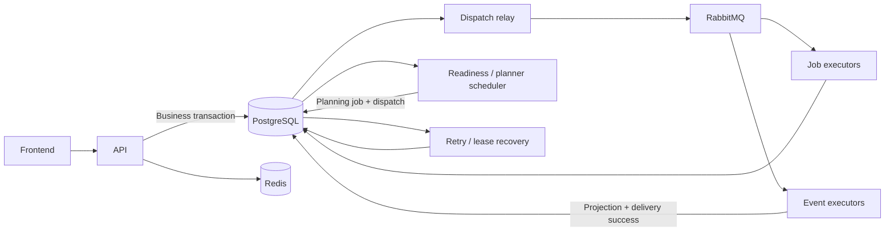

# Kế hoạch triển khai RabbitMQ, Redis và cá nhân hóa theo người dùng

Ngày cập nhật: 2026-09-09. Baseline code: `86816de`. Lựa chọn đã chốt: **RabbitMQ + Redis**. Đây là tài liệu triển khai; chưa thêm dependency, migration hoặc thay đổi runtime.

## 1. Mục tiêu và phạm vi

Mỗi sự kiện học tập cập nhật dữ liệu của đúng người, từ đó chọn hoạt động tiếp theo theo lịch ôn, lỗi sai, mục tiêu và thời gian của họ. Đánh giá bằng kết quả ở lần luyện tiếp theo, không chỉ số message xử lý.

Hai mốc bàn giao riêng:

- **H — Hạ tầng:** RabbitMQ phân phối email, AI, event và maintenance; Redis cache có fallback; retry/recovery/fencing được kiểm thử.
- **P — Cá nhân hóa:** evidence theo user, version đầu vào, planner, API/UI và bài luyện phù hợp; event trùng hoặc job chậm không làm sai kết quả.

H không đồng nghĩa P hoàn thành. Remediation/target assessment/daily plan còn thiếu phải triển khai theo dependency ở mục 11, dùng chung ownership/schema với `MIMIC-PERSONAL-LEARNING-LOOP-IMPLEMENTATION-PLAN.md`.

Các con số concurrency/TTL/tải là cấu hình khởi điểm cần đo, không phải benchmark đã có. Image patch/digest, cấu hình máy production và năng lực provider được xác minh trong PR hạ tầng. Kafka, Redis làm auth store, fine-tune model riêng cho mỗi user và analytics streaming nằm ngoài phạm vi.

## 2. Hiện trạng và khoảng trống đã xác minh

Đường dẫn Java dưới đây tính từ `backend/src/main/java/com/dev/heymimic/`.

| ID | Bằng chứng | Công việc |
|---|---|---|
| B01 | `backend/pom.xml`: Java 21, Boot 4.1.1; Compose chỉ có PostgreSQL | Thêm AMQP/Redis; client theo Boot BOM |
| B02 | Migration V1 tạo platform; mới nhất hiện V20 | Thêm migration sau V20, đánh lại số khi rebase nếu cần |
| B03 | `JdbcJobStore`: unique `(type,resource_id)`, SKIP LOCKED, lease generation | Giữ identity; thêm claim đúng ID và dispatch generation |
| B04 | `PlatformJobWorker.poll` execute tuần tự | Batch 10 không phải concurrency 10; tách executor khỏi poller |
| B05 | `ClaimedJob` chưa có lease owner; workerId lấy từ config | Execution context phải mang jobId/workerId/generation; ID duy nhất mỗi process boot |
| B06 | `SpeakingEvaluationWorkflow` và repository ghi transcript/result/fail không nhận generation | Job-table fencing chưa bảo vệ đầy đủ domain writes; sửa trước scale worker |
| B07 | Heartbeat mất lease chỉ log; final callback lỗi bị log rồi job vẫn final | Chặn stage sau khi mất lease; bảo đảm final callback + job transition cùng hoàn tất |
| B08 | `PlatformEventWorker` commit projection + DB delivery success cùng transaction | Giữ nguyên; broker ACK chỉ sau commit |
| B09 | `PlatformOutboxService` lấy registry từ EventConsumer beans trên producer | API phải giữ registry; consumer mới cần backfill |
| B10 | `ProgressQueryService`: overdue word → active mistake → first topic | Chưa có persistent planner/input revision |
| B11 | SelfAssessedLevel truyền thẳng vào topics, trong khi topics nhận A2-B1/B1-B2/B2+ | Thêm PracticeLevelResolver và regression test |
| B12 | Review rate/undo có audit, chưa phát event; profile update cũng chưa phát | Event/context invalidation phải nằm trong transaction mutation |
| B13 | Activity ledger là duration; feedback là correction, chưa có target assessment thành công | Không suy luận mastery từ completed hoặc không có correction |
| B14 | Cleaner order: Platform 100, Study 275, Progress 300 | Dispatch/context dependencies và plan/evidence phải dọn đúng FK order |
| B15 | Frontend dùng `src/service/`; Dashboard có client recommendation fallback | Chuyển flow mới sang server plan/reasons, tránh hai thuật toán |

Đối chiếu ADR 0002/0003/0008/0016/0018/0021/0022/0023/0025/0029/0030. Target schema/checkbox trong plan khác không phải bằng chứng code đã tồn tại.

## 3. Kiến trúc và transaction



| Thành phần | Trách nhiệm |
|---|---|
| PostgreSQL | Business, job/delivery lifecycle, retry/checkpoint, outbox/dispatch, quota/budget, evidence/plan |
| RabbitMQ | Thông báo thực thi, phân phối workload, buffering, ACK/confirm |
| Redis | Cache tái tạo được; không giữ bản duy nhất của context/trigger |
| Platform | Transport, fencing, outbox và generic context revision/dependency primitives |
| Progress | Evidence, mistake/learning-target projection và lịch luyện target |
| Learner | Profile/goal/level tự khai/timezone |
| Study | Snapshot, planner, daily plan và orchestration qua public ports |

Transaction chuẩn:

1. **T1 Request:** authorize → mutation → quota nếu cần → job/outbox + dispatch → context change nếu có → commit. Trả 202 sau commit; không gọi AMQP/provider trong T1.
2. **T2 Relay claim:** khóa dispatch due, tăng relay lease, commit. Publish ngoài transaction. **T3** cập nhật dispatch theo relay fence sau confirm.
3. **T4 Worker claim:** validate type/generation/dueAt/budget, khóa đúng target, cấp execution lease và commit.
4. **T5 Checkpoint/result:** kiểm tra execution fence cùng transaction domain write. Provider chạy giữa các transaction, không giữ connection/lock trong lúc gọi ngoài.
5. **T6 Event:** projection writes + fenced delivery success + outbox sinh thêm commit cùng transaction; broker ACK theo sau.
6. **T7 Retry:** FAILED_RETRYABLE + nextAttemptAt + tăng dispatch generation + dispatch mới commit atomic; ACK message cũ sau đó.

At-least-once: publisher confirm và consumer ACK không tạo transaction chung với PostgreSQL. [RabbitMQ confirms](https://www.rabbitmq.com/docs/confirms)

## 4. Transport contract, schema và fencing

### 4.1 Envelope

JSON tối đa 4 KiB, không Java serialization:

```json
{"messageId":"<dispatch UUID>","schemaVersion":1,"targetKind":"JOB","targetId":"<target UUID>","dispatchGeneration":1,"traceId":"<opaque trace ID>"}
```

TargetKind chỉ JOB/EVENT_DELIVERY. AMQP messageId = dispatch ID, application/json, persistent. Không đưa transcript/token/email/signed URL/API key lên broker. Worker lấy type/resource/owner/payload từ DB, kiểm tra phù hợp queue. Browser không chọn userId/routing key/lease.

### 4.2 Migration transport

Thêm `dispatch_generation bigint not null default 0` vào jobs và deliveries. Nó độc lập execution lease generation.

Bảng mới `platform_broker_dispatches`:

| Cột | Constraint |
|---|---|
| id | UUID PK, messageId |
| job_id / delivery_id | Nullable UUID FK, ON DELETE CASCADE; CHECK đúng một cột khác null |
| dispatch_generation | BIGINT > 0 |
| routing_key / schema_version | VARCHAR(150) do server chọn / INT > 0 |
| status | PENDING/PUBLISHING/PUBLISHED/OBSOLETE/QUARANTINED |
| available_at | TIMESTAMPTZ, due publish/transport backoff |
| publish_attempts | INT >= 0, độc lập job attempts |
| lease_owner / lease_until / lease_generation | Relay lease; owner/until chỉ tồn tại ở PUBLISHING |
| published_at / last_error_code / created_at / updated_at | Operational metadata |

Partial unique `(job_id,dispatch_generation)` và tương tự delivery. Partial due index `(available_at,id)` WHERE PENDING; lease index `(lease_until,id)` WHERE PUBLISHING; FK indexes cho purge.

Enqueue ON CONFLICT lấy target ID, khóa target, chỉ tạo initial generation nếu chưa có. HTTP replay không tăng generation. Tạo dispatch cả khi transport postgres; relay lọc type bật MQ, legacy executor obsolete dispatch khi target terminal. Existing backfill bounded: nonterminal chưa có dispatch, giữ dueAt/checkpoint/attempts; bỏ qua RUNNING lease còn hợp lệ. Terminal không backfill để chạy lại. Hiện V21 còn trống, nhưng migration số kế tiếp xác định lúc merge.

### 4.3 Contracts cần thêm/sửa

- `ExecutionLease(jobId,workerId,leaseGeneration)`; Claim kết quả mang đúng owner. Worker ID UUID mỗi process boot, không dùng chung local/hostname.
- `JobQueue.claimById(id,expectedDispatchGeneration,allowedTypes,workerId,lease)` và EventDeliveryQueue tương ứng; Jdbc stores có query riêng.
- Claim result typed: CLAIMED/NOT_DUE/ALREADY_RUNNING/TERMINAL/STALE_DISPATCH/MISSING/WRONG_ROUTE/FINALIZATION_REQUIRED. Không gom thành Optional.empty rồi ACK vô điều kiện.
- `PlatformJobExecutor`, `PlatformEventExecutor` dùng chung cho poller/listener. Return outcome xác định: COMPLETED/RETRY_COMMITTED/FINAL_COMMITTED/LEASE_LOST; lỗi DB chưa rõ phải propagate.
- `JobExecutionFence` public port: lock/check job lease + resource/owner và thực hiện domain writes trong transaction hiện tại. Check lease ở transaction riêng rồi ghi domain không đủ.
- Ports `DispatchStore`, `BrokerPublisher`; services `BrokerDispatchService`, `BrokerRecoveryService`; AMQP nằm trong infrastructure.

### 4.4 Hardening bắt buộc trước nhiều worker

Speaking workflow/service/handler phải nhận ExecutionLease cho prepare/saveTranscript/complete/failFinal. Làm tương tự ContextAnalysisWorkflow, email token preparation và deletion checkpoint/finalizer. Tách worker contract khỏi HTTP contract; client không gửi lease.

Kiểm tra fence cùng domain transaction, clock nhất quán cho lease; recheck trước provider stage tiếp theo. Heartbeat fail làm execution context lease-lost, chặn bước sau/commit; cancel HTTP nếu adapter hỗ trợ. Không hứa thu hồi request provider đã nhận.

Final callback thuần DB + failFinal commit cùng terminal service; callback fail không đánh dấu job đã xử lý xong. Khi max attempts đã đạt nhưng worker chết, claim FINALIZATION_REQUIRED mà không tăng provider-attempt budget/gọi provider lại. Trước finalization-only phải reconcile domain terminal: kết quả đã commit thì job SUCCEEDED, chỉ fail resource chưa thành công. Finalization retry vận hành riêng có alert. Event delivery hết attempts được final theo DB fence; không gọi consumer lần thứ 6.

Domain result commit rồi chết trước job success: retry đọc domain terminal và finish job, không gọi provider lại. Email hiện chưa có receipt bảo đảm exactly-once: giữ at-least-once, thêm provider idempotency/receipt nếu adapter hỗ trợ; không lưu token thô. Provider usage có đường best-effort: thêm metric/reconciliation cho receipt thiếu, giữ reservation/UNKNOWN. Fencing DB không bảo đảm không tính phí trùng ở provider.

## 5. RabbitMQ topology, confirm, retry và replay

### 5.1 Topology

Vhost riêng mỗi environment. Durable direct exchange `heymimic.work.v1`, durable direct DLX `heymimic.dead.v1`. Quorum queues cho workload/DLQ, topology/policies declarative trong repo, production provision trước producers.

| Routing key | Queue | Handler/consumer | Concurrency / prefetch mỗi process thử nghiệm |
|---|---|---|---|
| job.email | heymimic.email.v1 | SEND_VERIFICATION_EMAIL, SEND_PASSWORD_RESET_EMAIL | 2 / 1 |
| job.speaking | heymimic.speaking.v1 | SPEAKING_EVALUATION | 2 / 1 |
| job.vocabulary | heymimic.vocabulary.v1 | VOCABULARY_CONTEXT_ANALYSIS | 2 / 1 |
| job.planning | heymimic.planning.v1 | BUILD_DAILY_PLAN mới, rule-only | 1 / 1 |
| job.maintenance | heymimic.maintenance.v1 | DELETE_ACCOUNT | 1 / 1 |
| event.progress | heymimic.events.progress.v1 | Ba consumer progress hiện tại | 2 / 4 |
| event.study | heymimic.events.study.v1 | Chỉ khai báo khi Study consumer mới thật sự cần event | 1 / 1 |

Mỗi queue có `<queue>.dlq` và DLX binding riêng. Một event nhiều consumer: producer tạo nhiều delivery/dispatch; competing workers xử lý một delivery. Thêm consumerName/delivery riêng khi thêm notification/analytics. Tổng concurrency là tổng mọi process, không vượt DB pool/provider rate/budget. Tách email/planning khỏi AI, không tạo queue mỗi user. Chưa cần priority/delayed-message plugin hay sharding.

### 5.2 Publish/confirm protocol

Bật correlated publisher confirms, returns, mandatory. PENDING → PUBLISHING trong T2; send ngoài transaction; T3 chỉ PUBLISHED khi confirm ACK và không returned message. Spring CorrelationData cung cấp return trước khi future confirm hoàn tất. Correlation chứa dispatch ID + relay generation để callback cũ không sửa lần publish mới. [Spring AMQP template](https://docs.spring.io/spring-amqp/reference/amqp/template.html)

Timeout/NACK/channel close/NO_ROUTE: lưu error, backoff dispatch; không đổi business attempts. Broker ACK rồi relay chết trước T3: resend cùng messageId, target claim/dedup xử lý. Giới hạn in-flight confirms; không claim batch rồi chờ tuần tự tới hết lease.

Config thử: relay poll 250 ms, batch 25, max in-flight 25, publish lease 30 giây, confirm timeout 5 giây; transport backoff từ 1 tới 60 giây có jitter. Chốt bằng benchmark, không giữ transaction DB chờ confirm.

### 5.3 ACK decision table

| Kết quả | AMQP action | Ràng buộc |
|---|---|---|
| Success/final/retry đã commit | ACK một delivery | Retry có dispatch mới bền vững |
| Terminal/missing/stale generation | ACK bỏ qua + metric | Không tái tạo resource đã xóa |
| RUNNING còn lease | ACK duplicate | DB recovery luôn hoạt động |
| Tới sớm | ACK chỉ khi xác nhận dispatch/recovery lịch dueAt còn bền vững | Không sleep trong listener |
| Lease mất | ACK sau DB xác nhận ownership mới/lịch recovery | DB không đọc được thì xử lý outage |
| DB claim/commit lỗi, kết quả chưa rõ | Không ACK; pause container/backoff, đóng channel khi cần redelivery | Không hot requeue |
| Envelope sai/schema chưa hỗ trợ/wrong route | Reject không requeue sang DLQ | Mark dispatch QUARANTINED nếu xác định được; repair không phát poison vô hạn |

ACK đúng channel/delivery tag lần nhận, không publisher connection. Event DB-only dùng transaction timeout ngắn hơn lease; rebuild dài thành job riêng. Manual ACK chỉ sau transaction trả thành công.

### 5.4 Retry/recovery

Business retry giữ 10 giây → 30 giây → 2 phút → 10 phút, tối đa 5 execution attempts. FAILED_RETRYABLE + nextAttemptAt + generation + dispatch mới atomic. Không tạo lịch retry thứ hai bằng TTL queues.

Recovery mỗi 15 giây, batch 100, SKIP LOCKED và multiple-replica safety:

1. Publish lease hết: retry cùng dispatch ID.
2. Execution lease hết: khóa target, kiểm tra budget, cấp dispatch generation mới; scanner không chạy handler hoặc claim execution.
3. Target due thiếu dispatch: repair không tăng job attempts.
4. PUBLISHED quá 120 giây chưa claim: xem backlog rồi republish có cooldown, chỉ một generation hiện hành. Queue lag thì hạn chế republish; alert sau 3 repair chưa tiến triển.
5. QUARANTINED/FAILED_FINAL không tự replay. Terminal/missing target → OBSOLETE. Update target generation và obsolete lượt cũ trong cùng transaction.

Nếu tới max attempts dùng finalization-only recovery. MQ mode mà recovery tắt là config invalid.

DLQ transport tách FAILED_FINAL business. Chọn at-least-once dead-lettering, reject-publish overflow, DLX và explicit delivery-limit thử 20; xác minh policy trên image pin. Quorum mặc định không tự bảo đảm at-least-once DLX. [RabbitMQ quorum dead-lettering](https://www.rabbitmq.com/docs/quorum-queues)

Malformed metadata/quarantine có reason/queue/dispatch ID nếu hợp lệ, không log raw body. Audit repair sau khi sửa schema/producer; không shovel/purge để replay paid job. Event replay giữ ID và audit ADR 0025, thêm dispatch generation trong transaction replay. Consumer backfill là command riêng: cursor, dry-run, INSERT delivery ON CONFLICT + dispatch, rate limit. Rebuild dùng generation mới/atomic swap, không xóa dedup rồi chạy vào projection live.

## 6. Cấu hình và runtime roles

Thêm `spring-boot-starter-amqp`, `spring-boot-starter-data-redis`, cache support nếu dùng; Testcontainers RabbitMQ và Redis GenericContainer tương thích baseline 2.0.5. Client version theo Boot BOM. Pin image patch/digest tại PR hạ tầng, không latest.

| Config mới | Default / hành vi |
|---|---|
| JOBS_TRANSPORT / EVENTS_TRANSPORT | postgres ban đầu; rabbitmq sau canary |
| RABBIT_JOB_TYPES / RABBIT_EVENT_CONSUMERS | Allowlist canary rỗng ban đầu |
| BROKER_RELAY_ENABLED | false |
| BROKER_RECOVERY_ENABLED | false; bắt buộc true nếu bất kỳ type dùng rabbitmq |
| AMQP_LISTENERS_ENABLED | false; per-role queue allowlist |
| REDIS_CACHE_ENABLED | false |
| PERSONALIZATION_ENABLED | false, chỉ bật khi readiness/evidence/planner đúng |
| PERSONALIZATION_REFRESH_ENABLED | false, điều khiển durable scheduler |
| SPRING_RABBITMQ_* | Host/port/vhost/credentials/TLS |
| SPRING_DATA_REDIS_* | Host/port hoặc URL, credentials/TLS/timeouts |

Quy tắc effective transport: global postgres + allowlist chọn riêng type/consumer sang rabbitmq; global rabbitmq chuyển toàn bộ registered type/consumer có route. Legacy poller dùng phần bù chính xác. Bật relay/recovery trên platform-runtime và listeners ở worker tương ứng, không yêu cầu mọi process đều chạy recovery. Startup kiểm tra cấu hình deployment/role tương thích và registry đầy đủ.

Giữ JOBS_ENABLED/EVENTS_ENABLED tương thích khi refactor nhưng chỉ bật poller legacy; executor/registry không gắn vào flag poller.

| Role | HTTP | Legacy poll | AMQP | Relay/recovery | Cleanup scheduler |
|---|---|---|---|---|---|
| local all-in-one | API | Type postgres | Queue đã bật | Khi bật MQ | Có |
| api | API | Không | Không | Không | Không |
| worker-email / worker-ai / worker-planning | Private management | Không | Allowlist workload | Không | Không |
| worker-events | Private management | Không | Event queues | Không | Không |
| platform-runtime | Private management | Type postgres lúc migration | Maintenance nếu bật | Có | Có |

Cùng artifact, API giữ EventConsumer/JobHandler registry đầy đủ để tạo delivery. Đợt đầu worker vẫn servlet runtime/private ingress vì Security/OpenAPI beans hiện chưa thiết kế non-web; không chỉ đặt web-application-type=none rồi giả định boot được. Mỗi scheduler có flag/role; EnableScheduling không tự cô lập role.

Compose thêm Redis/RabbitMQ, healthcheck, RabbitMQ named volume; local ports bind localhost. Local quorum một node không chứng minh HA; staging cần ba node/quorum tương đương. Management UI/metrics production qua network vận hành.

Giữ job lease 120 giây, heartbeat tối đa mỗi 40 giây. Consumer timeout lớn hơn worst-case job duration đã đo + shutdown margin. Drain: ngừng nhận mới, chờ tối đa 120 giây thử nghiệm; quá hạn để lease recovery, không ACK việc chưa commit. DB pool dành capacity cho heartbeat/claim/terminal; không tăng replica vượt provider rate/budget.

## 7. Redis cache

| Cache | Key | TTL thử nghiệm | Invalidation/fallback |
|---|---|---|---|
| Topic catalog | env/schema/catalogRevision/category/level | 15 phút ±10% jitter | Bump catalogRevision khi catalog/deploy đổi; lỗi đọc DB |
| Learning snapshot | env/userId/inputVersion/snapshotSchema | 60 giây | DB chọn current version, snapshot immutable |
| Daily plan DTO | env/userId/planId/planVersion | 30 giây | Auth/current/version check DB; mutation bump version |
| Progress overview/daily | Chưa bật trong H | — | Chỉ thêm sau benchmark/dependency audit |

Catalog cache ở decorator SpeakingTopicStore/query component sau filter normalize/validate; không cache cả SpeakingSessionService hay trông chờ self-invocation annotation. PracticeLevelResolver policy v1: beginner/elementary → A2-B1; intermediate → B1-B2; unspecified → A2-B1 với fallback reason; không suy ra B2+ từ intermediate. Đây là policy khởi điểm, không đánh giá khách quan level.

Serializer JSON DTO explicit, không polymorphic tùy body; key versioned; no null cache vô hạn. CacheErrorHandler/breaker có metric; get/put fail không rollback business. Bulk eviction SCAN prefix theo batch, không KEYS. Spring Redis defaults cần được override cho TTL/serialization/eviction. [Spring Redis cache](https://docs.spring.io/spring-data/redis/reference/redis/redis-cache.html)

Config thử: command timeout 150 ms, connect 1 giây; breaker sau 5 lỗi/10 giây, thử lại sau 30 giây. Refill bounded concurrency, TTL jitter; @Cacheable(sync=true) không được coi là distributed lock. Cache-only Redis có maxmemory/eviction phù hợp, kiểm thử cold start. User cache luôn authorize trước lookup.

Quota/budget/authVersion/refresh/session/rate limiter giữ PostgreSQL; không cache token/signed URL/raw transcript. Account deletion purge prefix/index key theo user và chặn late refill bằng DB guard. Redis offline không thể cam kết purge vật lý tức thì: TTL giới hạn dữ liệu còn lại, mọi read bị account guard chặn; reconcile purge trước khi mở cache lại. Redis không giữ bản duy nhất của learning memory/pending trigger.

## 8. Event catalog và freshness theo user

### 8.1 Event contracts

| Event | Nguồn / hiện trạng | Payload DB tối thiểu | Dependency trước planner |
|---|---|---|---|
| VocabularyReviewCompleted v1 | Có: VocabularyReviewSessionService.complete | sessionId,userId,completedAt,timezoneSnapshot,acceptedDurationSeconds,ruleVersion | progress-activity-ledger-v1 |
| SpeakingSessionCompleted v1 | Có: SpeakingSessionService.complete | sessionId,userId,evaluatedAttemptIds,acceptedDurationSeconds,timezoneSnapshot,ruleVersion | progress-speaking-session-ledger-v1 |
| SpeakingEvaluationCompleted v1 | Có: SpeakingEvaluationService.complete | evaluationId,userId,taxonomyVersion,feedbackItems | progress-mistake-projection-v1 |
| VocabularyReviewRatingRecorded v1 | Mới: rateFresh sau recordRating | reviewEventId,sessionId,wordId,userId,wordVersion,rating,beforeState,afterState,occurredAt | Không nếu đọc word DB; evidence consumer có dependency riêng khi bật |
| VocabularyReviewRatingUndone v1 | Mới: undoFresh | originalReviewEventId,wordId,wordVersion,userId,restoredState,occurredAt | Tương tự rating |
| VocabularyWordChanged v1 | Mới: save/update/cleanup thay candidate set | wordId,userId,wordVersion,changeKind | Không, đọc word public queries |
| LearnerProfileChanged v1 | Mới: update/onboarding thành công | userId,profileVersion,changedFields; không cần email/name | Không, đọc profile DB |
| MistakeStatusChanged v1 | Mới: status update | userId,patternId,patternVersion,status | Không; resolved không tạo evidence đúng |
| LearningTargetEvidenceRecorded v1 | Mới: sau target-assessment/evidence write | userId,targetId,evidenceId,targetVersion,outcome,sourceEvaluationId | Target projection commit trước event sẵn sàng |

Giữ event v1 hiện có tương thích. Target assessment dùng event mới hoặc v2 với reader tương thích, không đổi shape v1 âm thầm. Metadata event DB gồm eventId/owner/aggregate/occurredAt/schemaVersion có sẵn; sourceVersion bổ sung trong payload mới. AMQP vẫn là delivery reference. Schema tests kiểm tra owner/aggregate/time/enum/độ dài/version. requiredConsumers được cấu hình theo event catalog trong application, không do browser gửi; record phải xác minh cause event thuộc đúng user và mỗi required delivery thuộc chính event đó.

### 8.2 Revision ngay trong source transaction

Nếu chỉ bump context khi consumer nhận event, có khoảng source đã đổi nhưng message chưa tới. Chốt: mutation ảnh hưởng học tập bump generic user-context revision trong transaction gốc; readiness chờ các delivery bắt buộc thành công.

Platform public port mới `UserContextChanges.record(userId,contextKey,causeEventId,requiredConsumers)` và query `UserContextRevisions`; contextKey v1 = learning. Module source gọi sau domain writes và outbox.publish; không gọi trực tiếp Study planner. Platform không quyết định bài học.

| Bảng mới | Cột / constraint |
|---|---|
| platform_user_context_versions | user_id/context_key composite PK, revision BIGINT >=0, updated_at |
| platform_user_context_changes | id,user_id,context_key,revision,cause_event_id,created_at; unique user/context/revision và user/context/causeEventId |
| platform_context_change_deliveries | change_id FK,delivery_id FK, composite PK; giữ dependency tới khi readiness checkpoint |
| platform_context_change_receipts | user_id,context_key,cause_event_id composite PK,revision,recorded_at; dedup marker sống qua compaction |
| study_planning_state | user_id PK,published_input_version,last_requested_version,dirty_since,next_refresh_at,active_request_id nullable,version |

Record lock context row, tạo revision một lần/causeEventId, resolve delivery IDs đúng event/consumer. Missing required consumer phải fail config/transaction, không coi ready. Source không có projection dependency ready sau commit. Onboarding replay/no-op không tạo fake event/revision.

Ready(V): không còn required delivery chưa SUCCEEDED trong change chưa compacted có revision <=V. FAILED_FINAL làm context blocked tới audited repair. Readiness checkpoint chỉ advance qua prefix đã hoàn tất; thêm `ready_checkpoint_revision` vào context-version row để compact changes đã ổn định. Không xóa dependency pending; retention/outbox cleanup phải tôn trọng checkpoint. Khi compact, giữ platform_context_change_receipts với unique constraint tới khi source event hết replay window và được purge; không trông chờ unique trên row vừa bị xóa. Duplicate/replayed cause cần dedup marker retained theo idempotency/backfill policy; compaction không được làm cause cũ bị hiểu là mutation mới.

Planner đọc revision V và các public queries trong transaction ngắn với consistent snapshot, chỉ khi Ready(V). Khi publish phải kiểm tra lại revision=V, readiness và account active; mismatch → SUPERSEDED rồi schedule lại. Profile đổi lúc AI chạy bump V ngay, nên kết quả cũ không trở thành current dù event chưa giao.

Checklist source coverage: profile/onboarding; word add/update/rating/undo/cleanup; speaking feedback; completed activity; mistake status/evidence. Nếu task P01 chưa bao phủ một source thì không bật cache/planner freshness guarantee cho source đó.

Thời gian tự trôi không sinh mutation: tính `validUntil = min(nextFutureDueTransition,nextLocalMidnight,policyExpiry)`. nextFutureDueTransition chỉ lấy mốc tương lai; từ đã quá hạn là candidate hiện tại, không làm validUntil nằm trong quá khứ. Policy expiry v1 là 15 phút từ snapshot. Scheduler/POST compose/plan start kiểm tra expiry, catalogVersion và plannerVersion. Không coi plan fresh chỉ vì user revision chưa đổi.

Không đòi FIFO mọi event của user. Append/dedup + sourceVersion giải quyết out-of-order; snapshot lấy state đã commit. Delta có dependency thiếu phải lưu chờ/reconcile, không bỏ. Context revision biểu diễn invalidation commit, không thay source version/thời gian sự kiện.

Lock-order contract cần kiểm chứng trong concurrency tests: account guard khi cần → execution job fence → Study planning mutex nếu thao tác plan → domain rows → context-version row cuối transaction. Không gọi domain khác sau context lock. Producers không khóa Study planning state. Planner publish/start serialize qua planning mutex, kiểm tra context cuối trước commit; nếu version đổi rollback toàn bộ plan/child writes. Read snapshot không giữ các khóa này trong lúc gọi provider.

### 8.3 Bootstrap/backfill/rebuild

Existing user chưa có context row: batch bootstrap revision 0 từ dữ liệu thật, không dựng success evidence từ việc thiếu correction. GET không bootstrap write; scheduler/admin bootstrap/POST compose mới tạo state bằng transaction explicit.

Đăng ký consumer trước producer. Backfill outbox còn retention bằng cursor/idempotent delivery; rating lịch sử chưa có event thì đọc review audit và tạo stable logical-source key. Phân biệt snapshot từ legacy với assessment thật. Rebuild chỉ dựa evidence retained, giữ historical timestamp/timezone; loại account đã xóa. Event replay không gọi AI để giả tái tạo quá khứ.

## 9. Planner, daily plan và nội dung cá nhân hóa

### 9.1 Scheduling bền vững

Scheduler scan context mới hơn published/requested version hoặc plan hết validUntil; poll 1 giây, batch 100. Dirty_since đặt lúc bắt đầu đợt, không reset mọi event; debounce 3 giây, maximum wait 15 giây sau prerequisites ready. Chờ projection ở scheduler, không claim AI job rồi tiêu retry budget.

Bảng `study_plan_requests`: id UUID,user_id,requested_input_version,state PENDING/RUNNING/COMPLETED/SUPERSEDED/FAILED,job_id,first_dirty_at,not_before,error_code,timestamps. Partial unique user_id WHERE PENDING/RUNNING. BUILD_DAILY_PLAN resource_id=request UUID; không dùng mãi userId vì job unique `(type,resource_id)`.

Một active request/user. Bổ sung settings_version và request_settings vào study_planning_state cho goalMinutes/sourceBriefId do POST chọn; áp dụng tới cuối local day trừ khi user đổi lại. Snapshot/final CAS so sánh cả inputVersion và settingsVersion; background refresh dùng lại settings còn hiệu lực, không tự ghi đè bằng default profile. Event mới nâng context revision; request terminal rồi revision mới hơn thì tạo lượt kế tiếp có kiểm soát. Periodic sweep phục hồi lost wakeup; Redis không quyết định request có tồn tại hay không. Job finalization phải đồng thời terminal planning request để partial unique không kẹt. Planner bị superseded không tiêu quota AI vì BUILD_DAILY_PLAN rule-only.

### 9.2 Policy v1 có thể kiểm thử

1. Có Study/review/speaking active → resume action, giữ bài đang học.
2. Resolve level/goal/language/timezone và capabilities; unknown có fallback reason rõ.
3. Candidate từ word due, learning target due, topic phù hợp; đúng owner, loại locked/unavailable/ignored theo policy.
4. Chốt thứ tự thuần trong `DailyPlanPolicyV1`: overdue trước, độ trễ lớn trước; tiếp theo goal match, thời điểm luyện cũ hơn; tie-break stable ID. Không phụ thuộc thứ tự DB không ORDER BY hoặc random.
5. Budget 5/10/15 phút; tối đa 3 steps và tối đa 2 remediation targets/ngày theo learning loop plan. EstimatedSeconds có version, tổng không vượt budget; duration thực học vẫn do nguồn hiện tại ghi.
6. Đa dạng hoạt động nếu budget cho phép; cooldown cho target vừa luyện/skip được cấu hình trong policy và test. Skip là preference signal, không phải fail evidence.
7. Reasons code+params+evidence refs: OVERDUE_WORDS, RECURRING_PATTERN, GOAL_MATCH, LEVEL_FALLBACK, INSUFFICIENT_EVIDENCE.

V1 chọn thứ tự bằng rule, không cần LLM. AI tạo brief/nội dung sau khi target đã chọn qua job/quota/budget riêng của learning loop plan. Không gọi model mọi event. Rules về evidence là policy sản phẩm thử nghiệm, không phải chứng nhận năng lực.

### 9.3 Schema và snapshot

Dùng tên của learning loop plan, không tạo duplicate recommendation aggregate:

- `study_daily_plans`: id,user_id,local_date,timezone_snapshot,goal_minutes,plan_version,state READY/STARTED/COMPLETED/EXPIRED,is_current,input_snapshot,recommendation_reasons,planner_version; thêm input_version,valid_until,catalog_version. Unique user/date/timezone/plan_version; partial unique current theo user/date/timezone.
- `study_daily_plan_steps`: id,plan_id,position,kind VOCABULARY/SPEAKING,practice_mode,target_refs,estimated_seconds,preparation_status,brief_id nullable; unique plan/position. Compose không tạo child session.
- Snapshot gồm profileRevision,inputVersion,target/source revisions,time/date,policy/catalog versions,evidence refs và capability snapshot. Quyền/quota kiểm tra lại ở start/generate.
- Stale result không current. STARTED giữ snapshot; còn session active trả resume, chưa swap active plan; sau hoàn tất mới đề xuất kế hoạch tiếp.

### 9.4 Evidence/practice prerequisites

Correction hiện có giúp phát hiện lỗi lặp, chưa chứng minh user có cơ hội dùng target và dùng đúng. P đầy đủ cần slice learning loop: `progress_learning_targets`, `progress_learning_evidence`, brief target snapshot, evaluation targetAssessments, outcome/assistance/context do server ghi.

Phân biệt active/resolved/ignored với evidence stage. No correction, bấm resolved hoặc completed không tự tạo evidence đúng. Undo đảo đúng source và giữ audit; uncertain/no-opportunity không ghi fail. Không hạ evidence chỉ vì user skip.

Bật remediation sau khi brief/evaluation thật hoạt động. Trước đó chỉ gợi mistake detail hoặc speaking topic khả dụng với capability/reason; không hứa chữa đúng lỗi nếu prompt chưa chứa target. LAZY Study/start plan phụ thuộc mục 11.

## 10. API và frontend contract

Namespace `/api/v1`, dùng daily-plan API từ learning loop plan, không tạo next-action API song song.

| Endpoint | Hành vi |
|---|---|
| POST /study/daily-plans | Auth+CSRF+Idempotency-Key; goalMinutes 5/10/15; sourceBriefId chỉ khi capability có. Rule-only compose; 201 nếu Ready(V), serialize với background publication qua per-user planning mutex; 409 LEARNING_CONTEXT_UPDATING nếu dependency chưa ready, 409 LEARNING_CONTEXT_CHANGED nếu final CAS thua |
| GET /study/daily-plans/today | Read-only, owner từ JWT; 200 envelope `{plan,refreshStatus,retryAfterSeconds}`; plan nullable, refreshStatus IDLE/UPDATING/BLOCKED. Không enqueue/gọi AI |
| POST /study/daily-plans/{id}/start | Idempotency-Key+expectedVersion; 201 Study LAZY khi lifecycle có; stale 409 DAILY_PLAN_STALE, active conflict theo contract hiện có |
| Existing create/poll job APIs | Hạ tầng giữ 202/Location/Retry-After và ownership |

Freshness tách state của plan. Envelope GET là làm rõ/bổ sung contract target trước code; cập nhật learning loop plan/API docs cùng PR P04 vì plan trước mô tả current plan/null. Không tự đổi endpoint đã tồn tại: daily-plan hiện chưa có trong code.

GET không create: scheduler/bootstrap hoặc POST tạo. Poll 2 giây khi updating, backoff tới 10 giây; dừng khi ready/blocked/logout/page change, sau 60 giây cho retry thủ công và giữ hoạt động hiện có. Quota/AI không bị gọi lại do polling.

File frontend: `src/service/studyService.ts`, `src/service/generated/api-schema.d.ts`, type definitions trong `src/type`, `src/pages/Dashboard.tsx`, `src/components/dashboard/TodaySessionFocus.tsx`, `src/pages/Progress.tsx` nếu cần. Rà `src/store/slices/createProgressSlice.ts`/getDailyRecommendation: server plan là quyết định chính của flow mới, fallback ghi rõ source/reason.

States: new user/insufficient evidence, updating/ready/stale/blocked, quota exhausted, resume active, unavailable target và API error. Logout/user switch clear old requests/UI cache. A/B phải thấy targets/reasons của chính họ. Không đưa broker/generation kỹ thuật vào copy sản phẩm. Khi code UI dùng design system/skill phù hợp của repo.

Export OpenAPI từ controllers, generate TypeScript và drift check trong cùng PR contract. Response example/schema tests phải gồm reason params, planVersion, freshness, validUntil và target availability, không chỉ happy path.

## 11. Work breakdown và dependencies

Mỗi task chỉ hoàn thành khi code/test/evidence đáp ứng gate. Tên class mới là đề xuất, không phải file đã có.

| Task / PR | File/module chính | Deliverable | Gate |
|---|---|---|---|
| H01 Baseline + ADR | docs/adr mới; load-tests; metrics | Đo queue wait/API p50/p95, throughput/type, query rate; ADR transaction/fencing/transport | Recorded fake-provider baseline |
| H02 Execution fence | PlatformJobWorker,ClaimedJob,JobQueue; speaking/vocabulary workflows; identity workers | Executor dùng chung, execution context, domain fencing, heartbeat-loss gate, finalization recovery | T06/T08, không gọi provider quá budget |
| H03 Dispatch persistence | Migration mới,JdbcJobStore,JdbcOutboxStore,PlatformJobService/OutboxService | Schema/claimById, atomic enqueue/retry, generation/backfill | PostgreSQL IT rollback/concurrency |
| H04 Broker/Redis wiring | compose.yml,pom.xml,.env.example,application*.yml,infrastructure/config | Clients, topology/policies, roles, startup validation | Flags-off boot, Testcontainers topology |
| H05 Relay/listeners/recovery | platform/infrastructure/messaging; BrokerDispatchService/RecoveryService | Confirm/return, manual ACK, recovery, quarantine, metrics | T01–T12 |
| H06 Event/replay/deletion | Event worker/replay service,cleaners | Projection+delivery atomic, audited replay, cleanup FK, deletion races | T13–T15/T27 |
| H07 Cache/level fix | SpeakingTopicStore decorator,PracticeLevelResolver,Redis config | Catalog cache/fallback, normalized level, metrics | T16/T17 |
| H08 Operations/rollout | runbooks,scripts,profiles | Capacity limits, alerts, restore/deploy/rollback | Recorded staging drill, H exit |
| P01 Event/context coverage | Source services mục 8,UserContextChanges,migrations | Source-TX revision, required-delivery readiness, bootstrap/compact | T18/T19; coverage checklist đầy đủ |
| P02 Evidence/target | Progress targets/evidence,Speaking assessment/brief slices | Outcome có evidence, dedup/undo, public target queries | Không suy mastery từ no correction/resolved |
| P03 Planner | StudyPlanningState/PlanRequestStore,DailyPlanPolicyV1,BUILD_DAILY_PLAN handler | Coalescing,validUntil,immutable snapshot,CAS,reasons | T21–T23/T26 |
| P04 Plan API | Study controller/DTO/publicapi,OpenAPI | Compose/today envelope, freshness/errors | T24, owner/CSRF/idempotency |
| P05 Personalized execution | Study LAZY lifecycle,practice brief/session | Activate child đúng lúc, target snapshot vào bài | Active/refresh/retry không tạo child đôi |
| P06 UI/outcome validation | studyService,Dashboard,TodaySessionFocus,generated types | Server reasons,poll/resume/fallback,next evidence | E2E T25/T28, account switch |

Trình tự: H01 → H02 → H03 → H04 → H05 → H06/H07 → H08. P01 bắt đầu sau H03. P03 cần P01, target-aware mode cần P02. P04 cần P03; P05 cần remediation/LAZY lifecycle; P06 đóng vòng sau P04/P05. Không bật P chỉ vì H green.

Tận dụng backlog learning loop: M2 learning targets/brief/evidence, M5 daily plan/PracticeLevelResolver/Study LAZY. Plan này không tự bao gồm toàn bộ dialogue/TTS/content ingestion trong learning loop; chỉ kéo những dependency thực sự cần để bài chữa lỗi hoạt động.

Schema progression dự kiến theo nhóm migration: (a) dispatch/fencing metadata; (b) user-context versions/changes/dependencies; (c) planning state/requests; (d) daily plans/steps + LAZY Study constraints; (e) target/evidence nếu chưa được learning loop slice tạo. Kiểm tra tồn tại trước mỗi migration để tránh trùng bảng/constraint từ nhánh khác; không dùng IF NOT EXISTS để che schema mismatch.

ArchUnit mở rộng: Study chỉ dùng publicapi của Learner/Progress/Speaking/Vocabulary; source modules không import Study implementation; AMQP/Redis client không xuất hiện trong domain/business DTO. EventConsumer hiện mỗi bean một eventType; thêm adapters tên riêng khi một logical workflow nhận nhiều event, không trùng consumerName gây startup error.

Estimate để lập lịch, không cam kết: H khoảng 12–18 ngày công gồm hardening đã thấy; P01/P03/P04/P06 rule-based khoảng 7–12 ngày; P02/P05 estimate riêng sau khi tách backlog remediation/evidence/LAZY. Sau H01/H02 cập nhật estimate bằng task thực tế. Không gộp thành một ngày hoàn tất giả khi product dependencies còn thiếu.

## 12. Test matrix

Đây là tests cần viết/chạy khi triển khai, chưa chạy trong lượt lập plan. Unit dùng Clock kiểm soát; IT dùng PostgreSQL/RabbitMQ/Redis qua Testcontainers. Provider fixture block/resume được để dựng race; không dùng API trả phí trong test thường xuyên.

| ID | Scenario | Assert |
|---|---|---|
| T01 | Rollback sau quota/job/outbox | Không mutation/dispatch/quota/context revision mồ côi |
| T02 | Enqueue đồng thời cùng resource | Một target/initial dispatch; HTTP replay đúng |
| T03 | Broker confirm nhưng relay chết trước DB mark | Resend an toàn, một domain effect |
| T04 | Missing binding/exchange,NACK,timeout | Không mark published; không tăng job attempts |
| T05 | Two replicas,old generation,wrong route | Một lease hợp lệ; wrong route không chạy handler |
| T06 | A hết lease,B claim,A trả transcript/result/fail | A không sửa domain/quota/plan, B giữ checkpoint đúng |
| T07 | Domain commit rồi chết trước job success | Không gọi provider lại khi domain terminal |
| T08 | Crash tới max attempts/final callback fail | Không gọi provider lần 6; finalization retry/alert |
| T09 | DB down lúc claim/ACK/retry commit | Không mất work/hot requeue, concurrency bounded |
| T10 | runAt/retry tương lai,early message | Không chạy sớm; due dispatch vẫn được xử lý |
| T11 | Malformed/schema sai,DLQ target down | Quarantine bền vững; không repair poison vô hạn |
| T12 | Broker restart/failover/shutdown | Recovery; HA drill tách single-node IT |
| T13 | Event nhiều consumer,một consumer fail | Delivery độc lập, success không replay side effect |
| T14 | Replay/backfill/rebuild | Dedup đúng scope; rebuild generation không double count live |
| T15 | Delete account khi job/event/plan/refill chạy | Commit guards,cleaner không FK error,no resurrection |
| T16 | Redis slow/down/eviction/serialization fail | Fallback đúng, không rollback business/cạn pool |
| T17 | Profile level mismatch,no topics | Không truyền enum sai, fallback reason xác định |
| T18 | Goal đổi nhưng event chưa consume | Revision đã tăng; old plan không publish |
| T19 | Required delivery FAILED_FINAL | Context blocked tới audited repair |
| T20 | Rating duplicate/undo/out-of-order | Không mastery đôi; undo đúng source; delta thiếu được reconcile |
| T21 | A/B khác goal/evidence | Targets/reasons/budget đúng, không cross-user data |
| T22 | Event liên tục lúc planner chạy | Một active request/user, supersede stale, eventual newest plan |
| T23 | Midnight/DST/nextDueAt/policy đổi | validUntil/version invalidation đúng |
| T24 | GET lặp,POST/start retry | GET không write/AI; idempotent POST; child không đôi |
| T25 | STARTED plan rồi profile/evidence đổi | Session giữ snapshot, next plan cập nhật đúng lúc |
| T26 | Scheduler restart,Redis mất,user ngừng thao tác | Dirty work vẫn tiến, không phụ thuộc key Redis |
| T27 | DB restore,broker còn message mới hơn backup | Quiesce/reconcile,missing/terminal bỏ,không paid replay mù |
| T28 | Plan → targeted practice → assessment → new plan | Evidence thật ảnh hưởng lần chọn tiếp, không chỉ đổi title |

Lệnh lúc triển khai:

- Cwd backend: `./mvnw.cmd verify` (Docker cho IT); Surefire/Failsafe/Spotless theo pom.
- Export contract bằng `backend/scripts/export-openapi.ps1` theo README khi HTTP đổi.
- Cwd frontend: `yarn generate:api`, `yarn check:api`, `yarn test`, `yarn build`, `yarn lint` cho phần thay đổi.
- Không rerun/broaden tests nếu không có thay đổi/failure mới; load/failure drills lưu evidence riêng.

H exit: T01–T17/T27 green, measured baseline comparison, rollback drill, HTTP job contract ổn định. P exit: T18–T26/T28 green + evidence/practice capabilities thật; fixture AI không được trình bày là chất lượng học thật production.

## 13. Capacity, metrics và failure policy

Load fixtures thử mức 1/5/20 job create mỗi giây để tìm saturation, không coi là nhu cầu production đã biết. Provider latency 1/10/30 giây và lỗi 0/5/20%; steady 10 phút, burst 60 giây, broker/Redis outage. Ước lượng in-flight = arrival rate × service time; chọn concurrency theo measured DB/provider capacity.

Đo riêng queue wait dueAt→claim, execution duration, publish delay, provider latency. Metrics mới: unpublished age,confirm NACK/return/timeout,repair/quarantine,ready/unacked/DLQ,lease lost,finalization pending,context dirty/blocked age,stale result discard,planner wait,cache hit/miss/error/fallback/eviction. Job/user ID không làm metric labels.

Mục tiêu thử nghiệm: email claim p95 <2 giây khi còn capacity; oldest due <5 phút; event lag <60 giây; plan fresh trong 15 giây sau dependency ready ở tải cam kết; API p95 không tệ hơn baseline >10% cùng workload. Đây là mục tiêu, PR H01/H08 phải ghi measured results và giải thích điều chỉnh.

Admission control: chốt hard limits theo benchmark, max nonterminal paid jobs/user và global cap. Atomic check/reserve DB trước quota/job; idempotent replay trả committed response trước cap mới. Full → 503 WORK_CAPACITY_EXCEEDED + Retry-After, cập nhật contract/client khi thêm. Không nhận vô hạn khi broker outage; dirty context vẫn ghi để defer planner, email/deletion có capacity riêng.

Liveness phản ánh process; API readiness cần DB/capacity, Redis cache outage không làm API down. Worker thiếu DB/broker thì dừng nhận. Management/metrics trên ingress vận hành. Dung lượng queue/outbox/dispatch/context dựa measured message size/rate/retention, không chỉ số account.

## 14. Rollout, rollback, retention và deletion

### 14.1 Rollout

1. Additive schema + executor tương thích, transport postgres, cache/personalization off; đây là rollback baseline.
2. Provision RabbitMQ/Redis/policies, thử missing binding, bounded dispatch backfill, validate registry trên API.
3. Bật Redis catalog, thử outage trước user cache.
4. Canary email → vocabulary → speaking → events → deletion. Effective mapping nhất quán mọi replica, poller dùng phần bù; overlap ngắn vẫn an toàn bằng claim/fence.
5. Bật context/revision/readiness shadow, so sánh plans chưa đổi UI; chạy A/B/stale races.
6. Bật plan API/UI theo user allowlist sau evidence/practice gates; đo rồi mở rộng.

### 14.2 Rollback

- MQ: stop listeners/relay cho type, drain hoặc chờ lease, bật legacy poller phiên bản có fence/schema mới; giữ dueAt/attempts/checkpoint. Không quay binary trước H02/H03, không purge broker. Re-enable reconcile generations.
- Redis: tắt cache, đọc DB; serializer đổi thì namespace version mới, không FLUSHALL.
- Planner: tắt publication/UI flag, giữ revisions/evidence cho recovery; fallback rule đã sửa level. STARTED session giữ snapshot, không reset quota/history.

### 14.3 Retention / account deletion

Dispatch terminal giữ đề xuất 7 ngày; failed/quarantined tới audited resolution; không xóa active target. Outbox/evidence retention theo sản phẩm, độc lập dispatch TTL. Context readiness dependency checkpoint/compact trước outbox purge; dedup source retained đủ cho replay window.

Platform cleaner order 100 dọn context dependencies/changes/receipts/revisions rồi outbox, dispatch FK cascade với targets. Study 275 dọn requests/state/daily steps/plans/session links đúng FK; Progress 300 dọn evidence/targets trước patterns/activity. Cross-module references dùng UUID/public ports khi phù hợp, tránh FK/JPA association ngược tạo cleanup cycle. Giữ deletion job để hoàn tất; broker chỉ còn ID.

DELETING user ngừng new work, drain/thu hồi expired RUNNING bằng fencing; cleaner không chờ RUNNING chết vô hạn. AccountWorkGuard hiện chỉ canStartWork: thêm commit guard trong transaction worker writes nhạy cảm, test race với requestDeletion. Recheck giữa stages; provider request đã gửi có thể còn chạy nhưng không được hồi sinh dữ liệu.

Restore drill quiesce API/relay/listeners, restore DB, reconcile dispatch/outbox/leases và provider receipts/budget UNKNOWN rồi resume. Broker message newer-than-backup không tạo resource missing hoặc reserve quota lại. Restore không tự xử lý duplicate external email/charges.

## 15. Checklist trước khi code

- [ ] H01 đọc lại AGENTS/ADR và baseline commit nếu repo đổi.
- [ ] Migration numbers sau migration cuối lúc merge, không giữ cứng V21.
- [ ] Pin image patch/digest/tested client matrix, topology/policies/env examples.
- [ ] Viết T06/T08/T18 trước thay concurrency/freshness tương ứng để bắt lỗi đã thấy.
- [ ] Mỗi PR có code/test/docs evidence, không chỉ tick plan.
- [ ] Chốt remaining evidence/brief/LAZY tasks của learning loop trước estimate P đầy đủ.
- [ ] Report phân biệt measured/unverified và hạ tầng/chất lượng cá nhân hóa.

### 15.1 Fixture nghiệm thu cá nhân hóa cụ thể

Các fixture là dữ liệu test, không tuyên bố dữ liệu người dùng thật. Tất cả dùng cùng Clock/timezone/catalog để kết quả tái lập.

| Fixture | Đầu vào | Expected |
|---|---|---|
| A — lỗi quá khứ | 3 correction cùng taxonomy key ở các evaluation khác; target due, không vocab overdue; goal speaking, 10 phút | Remediation target đúng pattern khi capability bật; reason RECURRING_PATTERN với evidence của A |
| B — quên từ công việc | 5 word work overdue, không target remediation due; 5 phút | Vocab review theo due order của B; không có evidence/target của A |
| C — mới onboarding | Không activity/evidence, level unspecified | Intro/topic fallback, INSUFFICIENT_EVIDENCE và LEVEL_FALLBACK; không gán mastery |
| D — stale race | Planner lấy V10, profile commit V11 trước publish | Kết quả V10 không current; lượt mới theo V11 dù broker event bị giữ |
| E — đang học | Plan STARTED, thêm feedback/profile changes | Resume session snapshot cũ; next plan cập nhật sau khi session terminal |
| F — undo | Rating R làm word due đổi, undo R trước event consumer chạy | Snapshot phản ánh restored word state; evidence R không được tính như rating còn hiệu lực |

Fixture policy dùng candidate limits rõ: lấy tối đa 100 due words và 50 due learning targets theo thứ tự ở mục 9; tổng count riêng phục vụ reason, không load toàn bộ lịch sử vào prompt. Public query trả next future due transition riêng để tính validUntil đúng ngoài candidate window. Policy skip cooldown tới cuối local day; target vừa thành công theo lịch nextReviewAt do evidence policy quyết định, không áp cooldown mâu thuẫn với lịch đã có. Cùng input snapshot/settings/policy phải tạo cùng ordered steps.

### 15.2 Tài liệu bàn giao bắt buộc

- ADR transport/fencing/context freshness với sơ đồ transaction và lý do giữ PostgreSQL làm nguồn trạng thái.
- Topic/queue bindings, DLX policies, config defaults và role matrix được kiểm tra trên pinned images.
- Schema/migration notes: backfill, indexes, cleanup/retention và rollback-compatible binary.
- API schema + generated frontend types + examples đủ ready/updating/blocked/stale.
- Report H: measured capacity, failure drill/restore/rollback; report P: fixture/E2E và giới hạn evidence còn thiếu.
- Runbook: broker down, Redis down, expired lease, FAILED_FINAL, poison/DLQ, context blocked và account deletion stuck.


## 16. Tr?ng th?i tri?n khai 2026-09-09

?? c? code cho execution fence, dispatch V21, RabbitMQ topology/relay/listeners/recovery, Redis topic cache v? level resolver. Xem [ADR0031](../docs/adr/0031-rabbitmq-dispatch-and-redis-cache.md) v? [runbook](../docs/runbooks/message-queue-and-redis.md).

C?c ?i?u ch?nh c? th? so v?i thi?t k? ban ??u: dispatch m?t row/target v?i generation t?ng ??n ?i?u; SQL trigger b?o ??m invariant cho m?i enqueue/retry/replay trong c?ng transaction; cache catalog TTL5 ph?t v? breaker5 gi?y. ADR gi?i th?ch trade-off. Kh?ng xem nh?ng l?a ch?n tuning n?y l? benchmark.

Functional baseline v? unit/integration suite ?? ???c ch?y; k?t qu? cu?i c?ng v? l?nh t?i l?p ghi trong runbook. H01 load baseline v? H08 staging HA/restore/capacity drill ch?a c? b?ng ch?ng production, kh?ng ??nh d?u nghi?m thu to?n b? H. P01?P06 v?n l? backlog ri?ng: ch?a th?m user-context revision, target/evidence, daily-plan API hay UI; c?c feature flag c? nh?n h?a gi? t?t.

Nghi?m thu local cu?i: `verify` BUILD SUCCESS ? 120 unit/architecture/OpenAPI + 31 integration tests; RabbitMQ13 b?i g?m listener th?t cho hai user v? ph?c h?i DLQ m?t binding. Chi ti?t v? gi?i h?n ? runbook.

## 17. Implementation status update

As of 2026-09-10, the implementation includes H02-H07 infrastructure, P01 user-context revisions/readiness, and the P03 rule-only daily-plan slice. P01 covers profile/onboarding, vocabulary mutation/review/undo, speaking completion/evaluation, and mistake status changes. V22 stores source revisions, required delivery dependencies, dedup receipts, and contiguous ready checkpoints. V23 stores planning state, requests, immutable plan snapshots, ordered steps, reasons, valid-until, and current-plan uniqueness.

The daily-plan API is POST /api/v1/study/daily-plans with owner-scoped idempotency and GET /api/v1/study/daily-plans/today with IDLE, UPDATING, and BLOCKED refresh status. Composition is deterministic and rule-only. It performs a final context revision/readiness check before publishing; a race returns 409 LEARNING_CONTEXT_CHANGED. Source briefs are intentionally rejected until target/brief capability is implemented.

The full verification run on 2026-09-09 completed with 122 unit/architecture/OpenAPI tests and 35 integration tests; the latest unit suite after planner hardening passed 129 tests. The background planner scheduler and BUILD_DAILY_PLAN RabbitMQ handler are now implemented with request coalescing, debounce and rule-only composition. A Testcontainers rerun on 2026-09-10 was blocked by Docker availability in that shell. H01 capacity evidence, H08 HA/restore drills, P02 target/evidence remediation, P04 frontend integration, P05 Study start/LAZY lifecycle and P06 feedback loop remain open.
