# HeyMimic — Kế hoạch triển khai vòng học cá nhân hóa

Ngày: 09/09/2026. Trạng thái: **đang triển khai theo milestone; M0-B02, M0-F01, M0-F02, M1-B01, M1-F01, M1-B03 và phần core của M1-B02/M1-B04 (usage + budget)/M1-F02, cùng phần contract của M0-Q01 đã hoàn thành**.

Phạm vi: thiết kế backend, frontend, dữ liệu, API, nhà cung cấp, triển khai và nghiệm thu cho 5 tính năng đã thống nhất: chữa lỗi bằng nói lại; nội dung cá nhân thành bài luyện; hội thoại AI; bài học hôm nay; nghe trước/sau và tiến bộ theo lỗi.

Đọc nhanh: [công nghệ cần dùng](#3-dùng-những-công-nghệ-và-dịch-vụ-nào), [dữ liệu và migration](#5-thiết-kế-dữ-liệu-và-migration), [frontend](#8-thiết-kế-frontend), [backlog theo mốc](#12-backlog-triển-khai-theo-mốc), [thông tin cần chuẩn bị](#14-thông-tin-cần-chuẩn-bị-khi-bắt-đầu-thực-hiện).

Đọc cùng: [đánh giá đối thủ](../docs/COMPETITIVE-REVIEW-2026-09-09.md), [kiến trúc backend hiện có](MIMIC-BACKEND-MODULAR-MONOLITH-PLAN.md), [đặc tả trang hiện có](MIMIC-TASKS-AND-PAGE-SPECS.md), [backend README](../backend/README.md). Plan này là phần mở rộng; không đánh dấu các công việc cũ hoặc mới là hoàn thành thay cho kiểm chứng.

## 1. Quyết định sản phẩm

### 1.1 Kết quả cần đạt

Người học có thể thực hiện một buổi học khoảng 10 phút:

1. Đưa nội dung công việc vào app hoặc dùng một chủ đề có sẵn.
2. Ôn 3–5 từ/cụm thật sự cần dùng.
3. Nói về tình huống đó.
4. Nhận tối đa 2 lỗi ưu tiên, hiểu cách sửa và nói lại.
5. Gặp lại cấu trúc/cụm đó trong bài mới vào ngày sau.
6. Nghe lại bản ghi và xem bằng chứng thay đổi của chính mình.

Ngách thử nghiệm: người Việt làm công nghệ/sản phẩm cần họp, giải thích vấn đề, phỏng vấn; hỗ trợ bài mức A2–B2 trước. Đây là giả thuyết sản phẩm để kiểm chứng bằng sử dụng thực tế, không phải kết luận thị trường.

### 1.2 Phạm vi bản đầu

| Mã | Tính năng | Bản đầu phải có | Để sau |
|---|---|---|---|
| F1 | Chữa lỗi và nói lại | Chọn 1–2 lỗi, giải thích, bài nói mới, đánh giá có bằng chứng, lịch kiểm tra lại | Chấm âm vị, suy luận đã thành thạo từ một lần luyện |
| F2 | Nội dung thành bài luyện | Dán văn bản, chọn chunks, giữ nguồn, tạo brief nói | Import URL tự động, PDF/OCR, extension, toàn bộ YouTube |
| F3 | Roleplay | 5 tình huống đầu, audio theo lượt, hint, kết thúc và feedback toàn phiên | WebRTC, ngắt lời, avatar 3D, gọi người thật |
| F4 | Bài học hôm nay | Kế hoạch 5/10/15 phút, lý do chọn bài, tiếp tục phiên, tạo từng bước khi cần | Tự động lập giáo trình dài hạn bằng nhiều agent |
| F5 | Bằng chứng tiến bộ | Nghe trước/sau, sửa lỗi qua đề mới, cụm dùng đúng, số lượt và khoảng thời gian | Chứng nhận CEFR, điểm phát âm khi chưa có bộ chấm audio |

Ưu tiên triển khai: nền thật → F1 → F2 → F4 bản đầu → F3 → F4 đầy đủ + F5. F5 thu thập dữ liệu ngay từ F1, hoàn thiện màn hình sau; không chờ đến cuối mới thiết kế dữ liệu bằng chứng.

### 1.3 Nguyên tắc nghiệm thu

- Một tính năng hoàn thành khi người học mới đi hết luồng frontend → backend → provider thật → mở lại dữ liệu được.
- Bài học không gọi là thành công chỉ vì có controller, trang demo hoặc JSON hợp lệ.
- Điểm số, duration, tiến độ và số lần học do server tính. UI không tự cộng thành tích.
- Phân biệt nhận biết câu đúng, tự nói đúng và dùng đúng ở ngữ cảnh mới.
- Bài nói ngắn, một hành động chính mỗi màn hình; không bắt người dùng hiểu worker, model hay queue.

## 2. Điểm xuất phát và phần cần sửa trước

| Hiện trạng xác minh | Tác động | Việc cần làm |
|---|---|---|
| Java 21, Spring Boot modular monolith, PostgreSQL/Flyway; React/TypeScript/Vite/Tailwind/Zustand | Đã đủ cho phạm vi này | Giữ stack, chưa tách microservices |
| Có queue/outbox, idempotency, quota, CSRF/JWT, account deletion và audio retention | Có nền để vận hành việc AI tốn phí | Mở rộng cùng cơ chế, không tạo scheduler/queue song song |
| `DevelopmentSpeakingEvaluationAdapter`, `DevelopmentAudioObjectStorage`, extraction giả, email in-memory | Luồng học thật còn phụ thuộc provider | Viết adapter production và test hợp đồng |
| `speaking_sessions.topic_id` đang NOT NULL; session chỉ khởi tạo từ topic | Brief cá nhân/chữa lỗi không vừa contract | Thêm nguồn prompt và mode theo mục 5; không nhét đề cá nhân vào catalog toàn cục |
| Một speaking session active/user; Study tạo sẵn mọi child, tối đa 2 bước | Hai bước nói trong cùng buổi sẽ xung đột | Study mới materialize từng bước, giữ tương thích luồng legacy |
| Backend mistake status: `active/resolved/ignored`; frontend dùng `needsPractice/improving/mastered` | Gửi `improving` bị từ chối; dữ liệu status thật bị map sai | Dùng enum wire chuẩn và tách evidence stage riêng |
| `MistakeOccurrenceView` có evaluationId; frontend gán speakingSessionId rỗng | Không mở đúng bản ghi gốc được | Bổ sung liên kết attempt/session và availability trong API đọc |
| Profile tự đánh giá: `beginner/elementary/intermediate/unspecified`; topic level: `A2-B1/B1-B2/B2+` | Recommendation cần mapping rõ ràng | Thêm `PracticeLevelResolver`, không truyền thẳng profile level vào filter topic |
| Video shadowing lưu `score: 93` cố định, roleplay mở lượt soạn sẵn | Có nguy cơ hiểu demo là kết quả đo | Gắn trạng thái demo/chưa có chấm thật; chỉ bật roleplay thật sau nghiệm thu |
| Tài liệu PROJECT vẫn mô tả giai đoạn frontend mock | Dễ triển khai theo giả định cũ | Cập nhật bảng capability và liên kết plan này khi bắt đầu thực hiện |

Baseline từ lượt đánh giá trước: 35/35 frontend tests qua; TypeScript và build qua; lint 119 warnings, 0 errors. Sau khi bắt đầu triển khai, frontend hiện có 39 tests qua; backend suite hiện có 112 tests qua; usage receipt/provider parsing đã có targeted coverage. Claude/Deepgram client và S3 versioned audio core đã có test giả lập; provider smoke thật, orphan cleanup và browser smoke vẫn là gate của M1+.

## 3. Dùng những công nghệ và dịch vụ nào

### 3.1 Lựa chọn đề xuất

| Nhu cầu | Chọn cho bản đầu | Tích hợp ở đâu | Cần chuẩn bị |
|---|---|---|---|
| API và nghiệp vụ | Spring Boot hiện có | Các module hiện tại + `content` mới | Java 21, Maven wrapper, cấu hình dev/test/prod |
| Dữ liệu | PostgreSQL hiện có | JPA/JDBC + Flyway | Database local, DB staging, backup/restore |
| AI ngôn ngữ | Claude API qua adapter | Extraction, feedback, brief, roleplay | API key backend, model ID được benchmark và pin, ngân sách |
| STT | Deepgram prerecorded API | `SpeakingTranscriptionPort` | Key backend; tập audio tiếng Anh của người Việt để đánh giá |
| TTS tiếng Anh | Deepgram TTS qua adapter riêng | Mẫu câu, câu trả lời roleplay | Voice ID cố định và kiểm tra tên riêng/thuật ngữ |
| Audio storage | AWS S3 có versioning | `AudioObjectStorage` | Bucket private tách dev/staging/prod; IAM và CORS đúng origin |
| Email auth | Resend | `IdentityEmailSender` | Domain gửi đã xác minh, API key, mẫu verify/reset |
| Web | React/Router/Tailwind/Zustand hiện có | Route/page/component/service | Giữ API client hiện tại, type sinh từ OpenAPI |
| Kiểm tra audio | `ffprobe`/FFmpeg đóng gói trong worker image | Adapter kiểm định media | Chốt bản binary và kiểm tra định dạng browser thực dùng |
| E2E | Playwright + axe cho kiểm tra tự động hỗ trợ accessibility | `frontend/e2e/` | `@playwright/test`, `@axe-core/playwright`; browser CI |

Đây là cấu hình triển khai hiện tại; key và smoke test trả phí vẫn cần staging. Claude model và Deepgram model đã có default ID dạng pin trong env, còn voice và ngân sách cụ thể phải được benchmark rồi ghi vào ADR trước khi bật rộng.

Claude hỗ trợ đầu ra theo schema; backend vẫn phải kiểm tra ý nghĩa và giới hạn nội dung. [Tài liệu structured outputs](https://platform.claude.com/docs/en/build-with-claude/structured-outputs). Deepgram có API nhận file âm thanh và TTS; đây là cơ sở chọn thử nghiệm, không phải bằng chứng tốt nhất cho mọi giọng Việt. [STT](https://developers.deepgram.com/docs/pre-recorded-audio), [TTS](https://developers.deepgram.com/docs/text-to-speech).

S3 hỗ trợ presigned URL và versioning, phù hợp contract lưu `objectVersion` hiện có. [Presigned URL](https://docs.aws.amazon.com/AmazonS3/latest/userguide/using-presigned-url.html), [Versioning](https://docs.aws.amazon.com/AmazonS3/latest/userguide/Versioning.html). Không thay bằng một dịch vụ “S3-compatible” nếu chưa kiểm chứng version/read/delete semantics.

### 3.2 Dependencies cần bổ sung

- Backend: AWS SDK for Java 2.x module s3, hiện pin 2.31.29 trong Maven; cập nhật qua ADR sau kiểm tra tương thích.
- Dùng Spring `RestClient` và DTO/Jackson hiện có cho Claude, Deepgram, Resend; tách client theo provider, cấu hình HTTP timeout thật. [Spring REST clients](https://docs.spring.io/spring-framework/reference/integration/rest-clients.html).
- Chưa cần thêm LangChain, Spring AI, Redis, Kafka, vector database hoặc graph database cho phạm vi này.
- Frontend chưa cần thêm UI framework, chart library hay state library. Native audio + hook hiện có đáp ứng bản đầu; bảng và SVG đơn giản đáp ứng báo cáo nhỏ.
- Dev dependencies mới: Playwright và axe; giữ Vitest/Testing Library. Dùng package manager/lockfile Yarn hiện có, không sinh thêm package-lock.
- Không cần SDK provider phía browser. Mọi secret đặt backend.

### 3.3 Cấu hình phải có

Các tên dưới là **biến cấu hình mới đề xuất**, chỉ có tác dụng sau khi thêm validated configuration properties; không coi chúng đã được app hỗ trợ.

| Nhóm | Cấu hình đề xuất |
|---|---|
| AI | `ANTHROPIC_API_KEY`, `ANTHROPIC_MODEL`, `AI_CONNECT_TIMEOUT`, `AI_REQUEST_TIMEOUT`, `AI_MAX_OUTPUT_TOKENS` |
| Speech | `DEEPGRAM_API_KEY`, `STT_MODEL`, `TTS_VOICE`, `STT_REQUEST_TIMEOUT`, `TTS_REQUEST_TIMEOUT` |
| Storage | `AUDIO_S3_BUCKET`, `AWS_REGION`, credentials qua IAM role; `AUDIO_INSPECTION_TIMEOUT`, `AUDIO_RETENTION_DAYS` |
| Email | `RESEND_API_KEY`, `IDENTITY_EMAIL_FROM`, `PUBLIC_APP_URL` |
| Budget | `AI_DAILY_BUDGET_MICRO_USD`, quota từng operation; rate card version dùng tính chi phí |
| Feature | `FEATURE_REMEDIATION`, `FEATURE_CONTENT_PRACTICE`, `FEATURE_DAILY_PLAN`, `FEATURE_DIALOGUE`, `FEATURE_LEARNING_EVIDENCE` |

Giữ nguyên các biến JWT/DB/CSRF/origin và fake flags hiện có. Prod phải fail startup nếu bật capability nhưng thiếu provider/config; dev/test cho phép fake rõ nguồn. Thêm `GET /api/v1/me/capabilities` và `/me/usage` để frontend biết quyền dùng và quota còn lại, không tự suy ra từ environment client. Mọi endpoint vẫn thực thi guard riêng.

## 4. Kiến trúc backend

### 4.1 Ranh giá»›i module

| Module | Trách nhiệm sau mở rộng |
|---|---|
| `identity` | Email thật, verification UI contract, auth/recovery và deletion hiện có |
| `learner` | Mục tiêu học, bối cảnh công việc, mức bài luyện được chọn; thay đổi cấu hình bằng version |
| `content` — mới | Văn bản nguồn riêng tư, revision, segment, xóa nguồn; không điều khiển phiên học |
| `vocabulary` | Từ/chunk đã lưu, nguồn ví dụ, extraction, review session; không tự chấm speaking |
| `speaking` | Cả monologue, remediation và dialogue; chung session/attempt/audio, brief, turn, evaluation |
| `study` | Kế hoạch ngày, thứ tự bước, materialize/advance/complete/abandon, điều phối public APIs |
| `progress` | Sổ lỗi, lịch luyện mục tiêu, evidence và projection; không gọi provider trong consumer |
| `platform` | Queue/outbox, idempotency, quota, provider usage, guards và metrics dùng chung |

Không thêm module media chung ngay: toàn bộ bản ghi trong phạm vi này thuộc Speaking. Mẫu TTS cũng do Speaking quản lý. Các adapter transport chung không được biến thành nơi chứa nghiệp vụ học.

Module chỉ gọi `application.publicapi` của module khác; không import repository/entity chéo module. FK cơ sở dữ liệu được cân nhắc theo precedent hiện tại nhưng không tạo cross-module JPA association. Event payload có schemaVersion và ID ổn định.

### 4.2 Luồng dữ liệu chính

```mermaid
flowchart LR
    UI[React app] --> API[Spring API]
    API --> C[Content và Vocabulary]
    API --> S[Speaking]
    API --> D[Study]
    D --> C
    D --> S
    C --> Q[PostgreSQL jobs]
    S --> Q
    Q --> P[Claude / Deepgram / S3]
    P --> R[Kết quả đã kiểm tra]
    R --> O[Outbox]
    O --> G[Progress: lỗi và bằng chứng]
    G --> D
```



Khi worker gọi provider, không giữ transaction database mở. Claim → gọi provider → validate → commit kết quả + usage/quota + outbox bằng lease fencing. Retry ở bước feedback không gọi lại STT đã checkpoint thành công.

### 4.3 Các public port cần thêm/mở rộng

- `ContentSources`: create/read owned revision, list, delete; `ContentSourceSnapshot` chỉ trả nội dung của đúng owner.
- `VocabularyContextAnalysis`: nhận thêm optional sourceId/sourceRevision, vẫn hỗ trợ input text cũ.
- `SpeakingPractice`: thêm startFromBrief và startDialogue; giữ start(topicId) cho legacy.
- `PracticeBriefs`: yêu cầu tạo brief, đọc trạng thái; loại `content` hoặc `remediation`.
- `DialogueSessions`: submit turn, hint, finish, restore; `SpeechSynthesis` cho audio mẫu và lượt AI.
- `LearningTargetQueries`: mục tiêu đến hạn và snapshot pattern/chunk; không mở repository Progress sang Speaking.
- `LearningEvidenceQueries`: kết quả có nguồn, so sánh attempt, điều kiện đủ dữ liệu.
- `DailyStudyPlans`: compose/get/start; `StudySessions` mở rộng activate step cho flow mới.
- `ProviderUsageRecorder`: một bản ghi/call attempt, usage thật hoặc trạng thái chưa biết; không giả định quota học bằng phí provider.

## 5. Thiết kế dữ liệu và migration

Tên bảng/field dưới đây là thiết kế đích. Tất cả dữ liệu cá nhân có userId, createdAt/updatedAt; aggregate ghi đồng thời có `version`. DTO dùng camelCase, DB dùng snake_case. Timestamp lưu UTC; ngày học dùng timezone snapshot của phiên.

### 5.1 Nội dung và từ/cụm

| Bảng | Field quan trọng | Ràng buộc/index |
|---|---|---|
| `content_sources` | id, user_id, title, source_type=`pasted_text`, current_revision, lifecycle=`ACTIVE/DELETING`, version | Index user/created_at/id; title ≤200 |
| `content_source_revisions` | source_id, revision, body_text, content_hash, detected_language, created_at | PK source/revision; text 50–10.000 ký tự bản đầu; immutable |
| `content_segments` | id, source_id, revision, position, text, start_offset, end_offset | Unique source/revision/position; offset UTF-16 half-open trên text đã chuẩn hóa newline |
| Mở rộng `vocabulary_context_analyses` | nullable source_id/source_revision, extraction_version | Nội dung snapshot phục vụ job; vẫn giữ expiry hiện có |
| Mở rộng `vocabulary_words` | item_kind=`WORD/CHUNK`, optional usage_note | Giữ semantic identity user/language/normalized_word/sense_key; không phá các review cũ |
| `vocabulary_source_links` | id, word_id, source_id/segment_id nullable, source_revision, example_snapshot, example_origin=`SOURCE/GENERATED`, offsets | Một từ/chunk có nhiều nguồn; check origin và offset; index word_id |

Sửa source tạo revision mới; analysis/brief đã tạo vẫn gắn revision cũ. Save 3–5 chunks dùng upsert từ vựng hiện có. Analysis 7 ngày có thể hết hạn mà từ đã lưu và nguồn còn tồn tại. Không lưu tài liệu quan trọng chỉ trong record analysis tạm.

Xóa source: chặn job mới, hủy job đang đợi, worker đang chạy phải recheck trước commit; xóa revision/segment/analysis/brief chưa học chứa nguồn. Dialog xác nhận nêu rõ các từ/cụm đã chủ động lưu được giữ như ghi chú riêng, liên kết nguồn đổi thành “Nguồn đã xóa”; có lựa chọn xóa cả ví dụ sao chép từ nguồn. Transcript do người học đã nói được quản lý theo lịch sử Speaking. Account deletion xóa toàn bộ những dữ liệu này, không giữ ngoại lệ.

### 5.2 Speaking dùng chung ba mode

Mở rộng `speaking_sessions`:

- `mode`: `MONOLOGUE` mặc định cho dữ liệu cũ, `REMEDIATION`, `DIALOGUE`.
- `prompt_origin`: `CATALOG`, `BRIEF`, `SCENARIO`; thêm nullable `brief_id`, `scenario_id`; topic_id và topic_revision chỉ nullable cho nguồn không phải CATALOG.
- Check đúng một nguồn: CATALOG có topic; BRIEF có brief; SCENARIO có scenario; prompt_snapshot và prompt_revision luôn có.
- `targets_snapshot` JSON, `rubric_version`, `evaluation_schema_version`, optional `baseline_attempt_id`, `coaching_mode`.
- Giữ một session IN_PROGRESS/user cho cả ba mode.
- Giữ lifecycle hiện có `IN_PROGRESS/COMPLETED/ABANDONED`; trạng thái xử lý AI nằm ở resource job/evaluation riêng.

| Bảng | Field quan trọng | Quy tắc |
|---|---|---|
| `speaking_practice_briefs` | id, user_id, kind, source_ref, origin_occurrence_id nullable, baseline_attempt_id nullable, status, revision, prompt_json, targets_json, generation_job_id, provider/model/prompt_version | PENDING/READY/FAILED; brief READY immutable; regenerate tạo revision/resource mới |
| `speaking_scenarios` | id, revision, title, level_band, roles, objectives_json, opener, turn_limit, duration_budget_seconds, archived_at | Nội dung seed có phiên bản; phiên chụp snapshot |
| `speaking_transcriptions` | id, attempt_id, raw_text, word_timings_json, provider/model, source, confidence nullable | Một transcript STT chuẩn/attempt; trường cũ vẫn được trả tương thích |
| `speaking_transcript_amendments` | id, transcription_id, user_id, corrected_text, created_at | Không ghi đè raw STT; evidence có amendment không đủ cho nhận xét phát âm |
| `speaking_dialogue_turns` | id, session_id, ordinal, speaker, attempt_id nullable, text, processing_status, reply_to_turn_id, hint_used, created_at | Unique session/ordinal; unique reply_to_turn_id cho câu AI đáp; một lượt user đang xử lý/session |
| `speaking_synthesized_audio` | id, user_id, session_id hoặc brief_id, turn_id nullable, text_hash, voice/model, object_key/version, status, expires_at | Audio riêng tư theo owner; không cache xuyên user cho nội dung cá nhân |
| `speaking_session_evaluations` | id, session_id, status, result_json, schema/rubric/prompt/model versions, job_id, quota_reservation_id | Một final evaluation/dialogue session; checkpoint và unique session_id |
| `speaking_feedback_reports` | id, user_id, evaluation_ref, feedback_item_id, reason_code, optional note | Cho báo phản hồi sai; không tự xóa occurrence lịch sử |

`speaking_attempts` vẫn là nguồn sự thật cho audio upload/seal/duration/retention. Một lượt user trong dialogue tham chiếu một attempt thuộc đúng session; không lưu blob, signed URL hoặc bản sao audio trong bảng turn.

Dialogue không gọi chấm toàn bài cho từng turn. STT phục vụ tạo reply; final evaluation chạy một lần sau finish. Extend feedback store/event với evaluation scope `ATTEMPT/SESSION`, không tạo ID attempt giả cho final evaluation. Giữ contract attempt evaluation cũ; đưa phần evaluate transcription/targets dùng chung vào service nội bộ.

Monologue/remediation complete vẫn chọn attempt đã chấm theo contract cũ. Dialogue complete dùng endpoint riêng, không yêu cầu selectedAttemptId; chỉ hoàn thành sau final evaluation thành công. Worker gọi domain finalizer được bảo vệ version/lease; không cho client tự gán completed.

### 5.3 Evidence và lịch chữa lỗi

| Bảng | Field quan trọng | Ràng buộc/index |
|---|---|---|
| `progress_learning_targets` | id, user_id, target_kind=`PATTERN/CHUNK`, pattern_id hoặc word_id, taxonomy_version, next_due_at, evidence_stage, schedule_version, version | Unique owner/kind/ref/taxonomy; index user/next_due_at |
| `progress_learning_evidence` | id, target_id, source_evaluation_id, evaluation_scope, feedback_item_id nullable, session_id, attempt_id nullable, outcome, context_key, practice_phase, hint_used, transcript_amended, rubric_version, occurred_at | Unique target/evaluation/scope/phase; append-only; index target/occurred_at |
| `progress_attempt_comparisons` | id, user_id, baseline_attempt_id, followup_attempt_id, target_snapshot, comparison_kind, comparability, reason_codes, result_json nullable, rubric_version | Unique user/pair/rubric; owner kiểm tra cả hai attempts |

Outcome: `CORRECT`, `INCORRECT`, `NOT_OBSERVED`, `UNCERTAIN`. `NOT_OBSERVED` không phải đúng: người học có thể tránh dùng cấu trúc. `UNCERTAIN` không làm giảm hoặc tăng thành tích. Backend kiểm tra bằng chứng trích từ transcript thực; không lấy self-reported boolean từ frontend.

Tách hai loại trạng thái:

- **Sổ lỗi** giữ `active/resolved/ignored` để người học quản lý danh sách. Bấm “Đã xử lý” chỉ đổi trạng thái sổ, không tạo evidence.
- **Mức bằng chứng** mới: `not_practiced`, `practicing`, `improving`, `demonstrated`. Server tính từ evidence; UI không PATCH trực tiếp.
- Quy tắc v1: `improving` sau một lần tự nói đúng không hint; `demonstrated` sau ít nhất hai lần đúng ở hai context khác nhau, hai ngày khác nhau và có một lần kiểm tra chậm ít nhất 24 giờ. Đây là quy tắc sản phẩm, không khẳng định đã thành thạo ngôn ngữ.
- Ngày luyện lại: sau bài đầu +1 ngày, sau lượt đúng kế tiếp +3, rồi +7; sai quay +1; uncertain/no opportunity không phạt. Có tối đa 2 mục tiêu chữa lỗi/ngày. Schedule v1 độc lập SRS của từ vựng.
- Khi đã demonstrated mà xuất hiện lỗi mới, evidence_stage quay practicing; giữ lịch sử thay vì xóa thành tích cũ.

### 5.4 Daily plan và Study

| Bảng/thay đổi | Field quan trọng | Quy tắc |
|---|---|---|
| `study_daily_plans` | id, user_id, local_date, timezone_snapshot, goal_minutes, plan_version, state, input_snapshot, recommendation_reasons, planner_version | Unique user/local_date/timezone/plan_version; partial unique user/local_date/timezone WHERE is_current=true; READY/STARTED/COMPLETED/EXPIRED |
| `study_daily_plan_steps` | id, plan_id, position, kind, practice_mode nullable, target_refs, estimated_seconds, preparation_status, brief_id nullable | Unique plan/position; không tạo child session tại đây |
| Mở rộng `study_sessions` | nullable daily_plan_id; execution_mode=`LEGACY_EAGER/LAZY` | Dữ liệu cũ default LEGACY_EAGER |
| Mở rộng `study_steps` | execution_status=`PENDING/ACTIVE/COMPLETED/SKIPPED/ABANDONED`, specification_json, practice_mode nullable, activated_at | Bước PENDING/SKIPPED chưa kích hoạt được phép chưa có child |

Giữ `kind=VOCABULARY/SPEAKING`; chữa lỗi/dialogue là `practice_mode` của Speaking, không dựng thêm child aggregate trùng audio. Thay constraint child của V11 bằng constraint mới: PENDING không child; ACTIVE/COMPLETED đúng một child phù hợp kind; SKIPPED chưa kích hoạt không child; ABANDONED có hoặc không child nhưng nếu có phải đúng kind. Unique reference cho mỗi child vẫn giữ.

API create Study cũ tiếp tục chỉ nhận các tổ hợp legacy hiện có, tối đa 2 bước và eager semantics. API start daily plan mới dùng LAZY tối đa 3 bước. Không đổi ngầm semantics cũ. DTO trả mode/status mới theo kiểu bổ sung; cập nhật frontend đọc được trước khi bật flow LAZY.

### 5.5 Migration strategy

- Repo hiện đã có V16 đang trong working tree. Khi triển khai lấy số migration tiếp theo thực tế, không mặc định chiếm V17 hoặc sửa migration đã chạy.
- Nhóm migration theo feature: capability/usage → prompt origin & evidence → content & source links → lazy Study → dialogue & final evaluation → comparison indexes.
- Expand trước: field nullable/default, backfill dữ liệu cũ theo batch, kiểm tra, rồi thêm constraint. Không để legacy topic snapshot biến thành brief rỗng.
- Vocab cũ có `interval_days <=30`; nếu triển khai FSRS ở giai đoạn sau phải thay constraint, dữ liệu scheduler và undo snapshots cùng nhau. FSRS không thuộc critical path của 5 tính năng.
- Daily/activity ledger cũ không backfill điểm tốt từ mastery/streak. Dữ liệu thiếu evidence hiển thị “Chưa có dữ liệu so sánh”.
- Test upgrade từ snapshot schema V16 và khởi tạo database rỗng. Không dùng `ddl-auto=update`.

## 6. Luồng nghiệp vụ chi tiết

### 6.1 F1 — Sửa lỗi rồi nói lại

1. Sau speaking evaluation, UI hiện tối đa hai correction có ý nghĩa; mỗi correction có feedbackItemId, occurrenceId, bản ghi/câu gốc.
2. Người học chọn “Luyện lỗi này”. Backend xác minh owner, lỗi còn dùng được, reserve quota, tạo brief generation job. Nếu phiên gốc còn active, phải hoàn thành/abandon qua flow rõ ràng trước khi tạo phiên remediation; tạo brief thì được phép.
3. Worker tạo giải thích tiếng Việt ngắn, câu mẫu và câu hỏi mới bắt buộc tạo cơ hội dùng cấu trúc. Không tạo distractor bằng thay chuỗi máy móc.
4. UI cho đọc/nghe mẫu; bắt đầu remediation session từ brief đã READY.
5. Người học nói 10–45 giây, upload, STT, evaluation theo target. Có hint thì lưu hintUsed, không tính lượt đó là tự dùng độc lập.
6. Kết quả chỉ rõ câu bằng chứng, đúng/sai/chưa quan sát được và một việc cần làm tiếp. Thử lại tạo attempt mới; không xóa attempt trước.
7. Complete session phát event duration một lần; evaluation phát evidence một lần. Progress lên lịch lần sau, không tính lại khi event replay.

### 6.2 F2 — Từ tài liệu tới bài nói

1. Form nhận title, văn bản và mục tiêu “Tôi cần nói điều gì?” tối đa 500 ký tự; preview nội dung sẽ gửi AI.
2. Tạo source revision, gọi extraction hiện có với source ref; polling khôi phục được sau refresh.
3. AI gợi ý tối đa 8 items; mặc định chọn 3, cho chọn tối đa 5; có nghĩa, câu gốc, giải thích vì sao hữu ích.
4. Người học chỉnh nghĩa/ví dụ rồi lưu qua vocabulary semantic upsert; nhiều nguồn không tạo nhiều bản từ cùng sense.
5. Yêu cầu tạo content brief có 1 mục tiêu giao tiếp, 3–5 chunks, gợi ý dàn ý và rubric. Backend chỉ nhận wordIds đã lưu, tự đọc nội dung thuộc owner.
6. Khi READY: “Ôn cụm từ rồi luyện nói” tạo kế hoạch gồm vocabulary → speaking từ brief. Nếu đang có phiên active, tiếp tục hoặc kết thúc phiên đó trước.
7. Feedback xem cụm dùng đúng nghĩa/cấu trúc/ngữ cảnh; không đánh giá chỉ bằng substring match. Nội dung AI tạo được gắn là ví dụ gợi ý, không nhận là câu trích tài liệu.

### 6.3 F3 — Roleplay theo lượt

Seed đầu: standup, xin lùi deadline, giải thích bug, phỏng vấn bản thân, phản biện trong họp. Mỗi scenario có role, mục tiêu, mức độ, opener, tiêu chí kết thúc và phiên bản.

```mermaid
sequenceDiagram
    participant U as Người học
    participant A as API
    participant W as Worker
    participant P as STT / LLM / TTS
    U->>A: Tạo dialogue session
    A-->>U: Session + opener
    U->>A: Tạo attempt và xác nhận upload
    U->>A: Submit turn (attemptId, version, idempotency)
    A-->>U: 202 + turn resource
    W->>P: STT audio đã seal
    W->>W: LÆ°u checkpoint transcript
    W->>P: Tạo reply theo history và objectives
    W->>W: Commit reply text
    W->>P: Sinh audio cho reply đã commit
    U->>A: Poll lượt hiện tại
    A-->>U: Transcript, reply, audio state
    U->>A: Finish dialogue
    W->>P: Chấm toàn phiên
    W->>W: Finalize + outbox
    A-->>U: Summary khi polling hoàn thành
```



- Mặc định 3–5 phút, tối đa 8 lượt user, tối đa 60 giây/lượt; server enforce cả turn count và verified duration budget. Browser timer là trợ giúp.
- Một lượt user pending xử lý/session; request tiếp theo trước khi reply hoàn tất trả `409 TURN_IN_PROGRESS`.
- Duy nhất một reply được commit cho replyToTurnId, kể cả retry/lease expired.
- Checkpoint STT → reply → TTS. TTS thất bại vẫn hiển thị text reply; cho “Thử phát lại” với resource/key riêng, không gọi lại LLM.
- Chế độ guided: hint tối đa hai lần/lượt. Chế độ simulation: không hiện sửa lỗi giữa câu; feedback cuối phiên.
- Opener dùng text seed, TTS có thể tạo trước cho nội dung catalog công khai. Audio phát cần tương tác người dùng; không hứa tự autoplay khi browser chặn.
- Finish khi có lượt pending trả 409 và hướng dẫn chờ; sau khi submit finish thành công, khóa nhận turn mới bằng finish state. Retry finish trả cùng evaluation, không chấm lần nữa.
- Final evaluation trả task achievement theo từng objective, grammar/chunk evidence và tối đa hai correction ưu tiên. Không tạo “điểm phát âm” từ transcript.
- Khi final evaluation lỗi cuối, giữ session chưa complete và transcript; cho retry bằng command rõ ràng, hoặc abandon. Không mất cuộc hội thoại.

### 6.4 F4 — Bài hôm nay và materialize từng bước

Planner v1 dùng rule có phiên bản; không cần gọi LLM để quyết định thứ tự:

1. Có Study hoặc Speaking/Vocab độc lập active: trả tiếp tục phiên đó trước.
2. Chọn từ/chunk đến hạn tối đa 5 items, khoảng 2 phút.
3. Chọn tối đa 1 brief chữa lỗi đến hạn, khoảng 2 phút.
4. Chọn 1 content brief hoặc scenario theo mục tiêu, khoảng 3–5 phút.
5. Cắt theo budget: 5 phút gồm tối đa 2 bước; 10/15 phút tối đa 3 bước. Budget là ước lượng, không đồng nghĩa credit phút học.
6. Nếu không có từ/lỗi/nội dung, dùng scenario/bài nói catalog phù hợp; không yêu cầu có data mới học được.

Default level mapping: beginner/elementary → A2-B1; intermediate → B1-B2; unspecified → A2-B1 kèm chọn dễ hơn/khó hơn. Thêm preference levelBand riêng nếu cần B2+; không sửa self-assessment thành chứng nhận. Mọi mapping có test và version.

Plan READY chỉ tham chiếu brief đã READY; planner không gọi provider trong transaction. Khi chưa có brief, dùng bài có sẵn và có thể chuẩn bị brief qua job riêng; không để toàn dashboard đợi AI.

Start plan: lock theo user + check cả Study/review/speaking active; tạo parent và step specs, chỉ activate step 0 trong transaction. Concurrent start phải serialize ở cùng advisory lock transaction cho cả API Study mới và start phiên độc lập; unique indexes là lớp bảo vệ cuối.

Activate next: lock parent, validate version và child hiện tại completed; tạo child tiếp theo qua public port bằng deterministic key từ parentId/stepId; cập nhật currentStep trong cùng transaction. Nếu fail, rollback không để child mồ côi. Refactor toàn bộ đường start/complete/abandon theo thứ tự lock thống nhất user → parent → child để tránh deadlock.

Không tự gắn phiên độc lập vào Study. Bước chưa activate chưa giữ review lock/audio quota. Skip chỉ được phép cho bước PENDING, ghi lý do người dùng chọn và không credit duration. Complete parent khi tất cả bước COMPLETED hoặc SKIPPED và ít nhất một child COMPLETED; không phát thêm event phút học. Abandon parent giữ completed children, abandon active child, đánh dấu pending abandoned.

Refresh đọc server state; phiên qua nửa đêm tiếp tục với timezone snapshot cũ. Khi đổi timezone, ưu tiên active session; chỉ plan mới dùng timezone mới. Kiểm tra lại dữ liệu lúc activate: từ đã xóa hoặc brief không còn hợp lệ → đề nghị thay bước trước khi tạo child, không lặng lẽ đổi đề của phiên đang học.

### 6.5 F5 — Nghe trước/sau và tiến bộ

- Same-task comparison: hai attempt của cùng remediation/brief revision và rubric; nghe A/B, xem transcript, target outcomes. Dán nhãn “Luyện lại cùng bài”, không coi là khả năng chuyển ngữ cảnh.
- Transfer comparison: cùng target/taxonomy, khác context và ngày, có delayed test; hiện “Dùng lại trong tình huống mới”. Không trừ hai điểm overall nếu rubric/model khác nhau.
- Source links: occurrence → evaluation → attempt/session; tất cả truy vấn owner-scoped. DTO trả audioAvailability và expiresAt, không trả signed URL cố định trong projection.
- Bản ghi hết retention: giữ phần evidence/transcript theo chính sách, hiện “Bản ghi đã hết thời gian lưu”; vẫn so sánh văn bản. Không tự kéo dài retention vì mở comparison.
- Một audio player phát tại một thời điểm; đổi A/B pause player trước, xin grant 60 giây khi cần.
- Metric tuần: correct opportunities / assessable opportunities; mẫu số chỉ gồm CORRECT + INCORRECT, loại hints/uncertain/no opportunity khỏi chỉ số độc lập. Hiện số lượt và số ngày, không chỉ phần trăm.
- Dưới 5 cơ hội trong cửa sổ: hiện số lượt và “Chưa đủ dữ liệu để kết luận xu hướng”; ngưỡng này là quy tắc hiển thị sản phẩm, không phải kiểm định thống kê.
- Thời gian học tiếp tục từ immutable activity ledger. Chỉ duration audio của người học được xác minh và được lifecycle chấp nhận; không tính TTS, thời gian chờ AI hay parent Study lần nữa.

## 7. Thiết kế API và hợp đồng frontend/backend

### 7.1 Quy Æ°á»›c chung

- Prefix `/api/v1`. Các API dưới đây là thiết kế đích, chưa tồn tại trừ nơi ghi có sẵn.
- Browser mutation dùng Bearer + CSRF hiện có. UserId luôn lấy từ JWT; kiểm tra owner cho tất cả ID đầu vào.
- Command tạo resource hoặc gọi AI dùng `Idempotency-Key: UUID`, scope user/operation/key và hash payload. Retry mạng giữ nguyên key; cùng key khác payload trả 409. Hành động mới dùng key mới.
- Aggregate mutable dùng expectedVersion. Conflict trả 409 và code ổn định; UI refetch trước khi thử lại. Resource không thuộc owner trả 404.
- 201 cho tạo đồng bộ; 202 cho async kèm Location, Retry-After và resourceId/status. Không trả kết quả giả trong lúc pending.
- DTO dùng enum lowercase có schema rõ. Pagination default 20/max 100; date window max 366 ngày. Không tải toàn transcript lên dashboard.
- OpenAPI code-first: thêm enum/schema hữu hạn thay cho string tùy ý; regenerate frontend, không sửa tay generated file.
- Giữ resource status cũ: context analysis pending/completed/failed; evaluation queued/running/stage. Service frontend chuyển sang shared AsyncResource nếu cần, không đổi wire contract ngầm.

### 7.2 API đích

| Endpoint | Request chính | Kết quả/quy tắc |
|---|---|---|
| `GET /me/capabilities` | — | Feature availability/reason và limits, không secret |
| `GET /me/usage` | — | Quota remaining/resetAt theo operation |
| `POST /auth/verify-email`, `/auth/resend-verification` — có sẵn | Theo DTO hiện tại | UI mới gọi contract hiện có; expired/used/rate limit |
| `POST /content/sources` | title, text, learningGoal | 201 source/revision; chưa gọi AI |
| `GET /content/sources` | page, size | Danh sách excerpt ngắn |
| `GET /content/sources/{id}` | revision optional | Source + segments thuá»™c owner |
| `PUT /content/sources/{id}/revisions` | title, text, expectedVersion | 201 revision má»›i |
| `DELETE /content/sources/{id}` | expectedVersion, purgeSavedExamples | 202 deletion resource, lifecycle DELETING |
| `GET /content/deletions/{id}` | — | Pending/completed/failed, owner-scoped |
| `POST /vocabulary/context-analysis` — mở rộng | InputText legacy hoặc sourceId/sourceRevision, không cả hai | 202 theo resource hiện tại; quota một lần |
| `GET /vocabulary/context-analyses/{id}` — có sẵn | — | Thêm source refs và suggestion evidence |
| `POST /vocabulary/words` — mở rộng | Suggestion selection + source link | Semantic upsert, trả wordIds thật |
| `POST /speaking/practice-briefs` | kind, sourceRef hoặc occurrenceId, selectedWordIds, goal | 202 generation; backend đọc lại nguồn/target |
| `GET /speaking/practice-briefs/{id}` | — | Pending/ready/failed; prompt khi ready |
| `POST /speaking/practice-briefs/{id}/retry` | expectedVersion | 202 cùng logical brief, execution mới có giới hạn |
| `POST /speaking/sessions` — có sẵn | topicId | Giữ monologue legacy |
| `POST /speaking/practice-sessions` | briefId, coachingMode | 201 session mode từ brief, không nhận target tùy ý |
| `POST /speaking/sessions/{id}/attempts` — có sẵn | mimeType, sizeBytes | Upload grant theo contract hiện tại |
| `POST /speaking/attempts/{id}/upload-complete` — có sẵn | Checksum/version theo DTO cũ | Kiểm định audio thật trước AVAILABLE |
| `POST /speaking/attempts/{id}/evaluate` — mở rộng | Giữ request cũ | Dispatch theo mode, targets server snapshot |
| `GET /speaking/attempts/{id}/evaluation` — có sẵn | — | Thêm targetAssessments/evidence; giữ field cũ |
| `POST /speaking/attempts/{id}/evaluation/retry` | expectedVersion | Chỉ trạng thái cho phép retry; giữ transcript checkpoint |
| `POST /speaking/practice-sessions/{id}/hints` | targetId, practicePhase, expectedVersion | 202 hint remediation; server ghi assistance trước khi trả gợi ý |
| `POST /speaking/feedback-reports` | evaluationRef, feedbackItemId, reasonCode, note | 201 report, không tự đổi điểm |
| `GET /speaking/scenarios` | levelBand/category/page/size | Catalog roleplay |
| `POST /speaking/dialogue-sessions` | scenarioId, coachingMode | 201 Speaking mode dialogue + opener |
| `GET /speaking/dialogue-sessions/{id}` | afterOrdinal optional | Session/turns/evaluation/nextAction phục vụ restore |
| `POST /speaking/dialogue-sessions/{id}/turns` | attemptId, expectedVersion, clientTurnId UUID | 202 turn; chống duplicate clientTurnId |
| `GET /speaking/dialogue-sessions/{id}/turns/{turnId}` | — | Stage/transcript/reply/TTS status |
| `POST /speaking/dialogue-sessions/{id}/hints` | replyToTurnId, expectedVersion | 202 hint; server ghi đã cung cấp trợ giúp |
| `GET /speaking/hints/{id}` | — | Pending/ready/failed; tối đa 2 gợi ý |
| `POST /speaking/dialogue-sessions/{id}/finish` | expectedVersion | 202 final evaluation; khóa nhận lượt mới |
| `POST /speaking/dialogue-sessions/{id}/evaluation/retry` | expectedVersion | 202 cùng logical evaluation và transcript |
| `POST /speaking/synthesized-audio` | briefId hoặc turnId, purpose | 202; backend tự lấy text, không proxy TTS tùy ý |
| `GET /speaking/synthesized-audio/{id}` | — | Status/audioAvailability |
| `POST /speaking/synthesized-audio/{id}/retry` | expectedVersion | 202 cùng text resource, không gọi lại LLM, có quota/budget guard |
| `GET /speaking/synthesized-audio/{id}/audio` | — | Grant 60s, no-store, owner check |
| `POST /study/daily-plans` | goalMinutes 5/10/15, sourceBriefId optional | 201 plan/reasons; compose không gọi AI |
| `GET /study/daily-plans/today` | — | Current plan hoặc null; GET không tạo resource |
| `POST /study/daily-plans/{id}/start` | expectedVersion | 201 Study LAZY, activate bước đầu |
| `POST /study-sessions/{id}/steps/{stepId}/activate` | expectedVersion | 200 child/current step, retry không tạo trùng |
| `POST /study-sessions/{id}/steps/{stepId}/skip` | expectedVersion, reason | Chỉ pending; update pointer nguyên tử |
| `GET /study-sessions/{id}` — mở rộng | — | Steps array status/mode/spec/child refs/nextAction |
| `POST /study-sessions/{id}/complete`, `/abandon` — mở rộng | expectedVersion | Dispatch theo LEGACY_EAGER/LAZY |
| `GET /progress/mistakes/{id}` — mở rộng | page,size | Status wire đúng + evidenceStage riêng; attempt/session refs |
| `GET /progress/learning-targets` | dueBefore/kind/page/size | Target do server lập lịch |
| `GET /progress/learning-targets/{id}/evidence` | page,size | Timeline outcome/assistance/context |
| `GET /progress/learning-evidence/summary` | from,to | Counts/mẫu số/insufficientData/projectedThrough |
| `POST /progress/attempt-comparisons` | baselineAttemptId,followupAttemptId | 201 metadata từ kết quả cũ, không gọi AI lại bản đầu |
| `GET /progress/attempt-comparisons/{id}` | — | Comparability/target differences/audio availability |

Read API tiếp tục hoạt động khi hết quota. Retry không được bypass quota hoặc biến thành job mới không giới hạn. Chốt DTO thực tế và thêm tất cả controller vào OpenApiContractTest trước khi viết service frontend.

DELETE source truyền expectedVersion/purgeSavedExamples qua query parameters đã validate để không phụ thuộc DELETE body qua proxy. Create/retry/start/finish đều dùng Idempotency-Key theo quy ước chung.

### 7.3 Ví dụ DTO và validation

Tạo brief chữa lỗi:

```json
{
  "kind": "remediation",
  "occurrenceId": "11111111-1111-4111-8111-111111111111",
  "goal": "Diễn đạt sự đồng ý trong một cuộc họp"
}
```

Server tra occurrence → evaluation → attempt gốc → taxonomy. Client không gửi overallScore hoặc câu sửa để server tin làm kết quả.

Phần bổ sung vào evaluation:

```json
{
  "schemaVersion": "learning-feedback.v1",
  "source": "provider",
  "assessedFrom": "audio_transcription",
  "rubricVersion": "workplace-speaking.v1",
  "targetAssessments": [
    {
      "targetId": "22222222-2222-4222-8222-222222222222",
      "outcome": "correct",
      "evidenceQuote": "I agree with the proposed deadline.",
      "explanationVi": "Bạn đã dùng agree trực tiếp, không thêm am.",
      "assistance": "none"
    }
  ],
  "pronunciation": null
}
```

Kiểm tra targetId nằm trong snapshot, evidenceQuote có thật trong transcript, category hợp lệ. Source value phải map có chủ đích với validators hiện có trước khi thêm giá trị wire mới. Không tự coi JSON đúng schema là feedback chính xác.

Study step má»›i:

```json
{
  "id": "33333333-3333-4333-8333-333333333333",
  "position": 1,
  "kind": "speaking",
  "practiceMode": "remediation",
  "status": "pending",
  "title": "Luyện cách diễn đạt sự đồng ý",
  "estimatedSeconds": 120,
  "reviewSessionId": null,
  "speakingSessionId": null,
  "canSkip": true
}
```

Activate trả cùng stepId với child ref và status active. Frontend phải dùng steps array, không một speakingSessionId duy nhất cho cả buổi có hai bước nói.

Summary bằng chứng cần trả: from/to, correctOpportunities, assessableOpportunities, hintedOpportunities, uncertainOpportunities, distinctPracticeDays, insufficientData, projectedThrough. Ví dụ3/4 lượt đúng trong 2 ngày phải hiện chưa đủ dữ liệu nếu threshold 5, không tự suy thành 75% cải thiện.

### 7.4 Lỗi và cách phục hồi

| Trường hợp | API | Hành vi UI |
|---|---|---|
| Email chưa xác minh | 403 | Verify/resend banner, giữ draft |
| ACTIVE_SESSION_EXISTS | 409 | Tiếp tục phiên; lựa chọn kết thúc gọi command thật |
| Version conflict | 409 | Refetch, không overwrite |
| Quota hết | 429 + resetAt | Hiện khi nào dùng tiếp; đọc bài cũ được |
| TURN_IN_PROGRESS/finish đã bắt đầu | 409 | Poll resource đang chạy, khóa gửi thêm |
| Audio không hợp lệ | 400/422 thống nhất với audio contract ở M0 | Hướng dẫn thu lại, không chấm giả |
| STT không rõ | Resource uncertain/failed | Nghe lại/thu lại, không tự tạo transcript |
| Provider timeout/unavailable | Resource retryable | Nút thử lại đúng stage và logical resource |
| Provider auth/model invalid | Resource terminal | Thông báo tạm chưa dùng được; requestId cho vận hành |
| TTS lỗi | Audio failed | Giữ reply text, cho thử phát lại |
| Source/brief bị xóa hoặc hết hạn | 404/410 theo contract | Đổi bài, không làm mất input chưa gửi |
| Projection chậm | 200 + pendingProjection | Dùng kết quả source session trước; ghi Đang cập nhật |
| Audio hết retention | 410 + availability | Transcript/evidence vẫn đọc được |

## 8. Thiết kế frontend

### 8.1 Điều hướng và route

Điều hướng chính: Hôm nay, Luyện nói, Từ & Cụm, Tiến bộ. Nội dung của tôi có entry trong Từ & Cụm và CTA ở Hôm nay. Roleplay là tab Luyện nói và vẫn có deep link. Peer/video/writing demo vào nhóm Khám phá có trạng thái rõ; không tự xóa trang cũ.

| Route | Màn hình/file đích |
|---|---|
| `/verify-email` | Má»›i `pages/marketing/VerifyEmail.tsx`, token/expired/resend |
| `/dashboard` | Sá»­a Dashboard/TodaySessionFocus: plan/resume/reasons |
| `/content` | Má»›i `pages/ContentLibrary.tsx` |
| `/content/new` | Má»›i `pages/ContentCapture.tsx` |
| `/content/:sourceId` | Mới `pages/ContentDetail.tsx`: nguồn/chunks/brief |
| `/practice/remediation/:briefId` | Má»›i `pages/RemediationPractice.tsx`: prepare/session/result |
| `/speaking` | Giữ Speaking, thêm entry brief và tab mode |
| `/speaking/dialogue` | Sửa SpeakingDialogue thành scenario catalog thật |
| `/speaking/dialogue/:sessionId` | Má»›i `pages/DialogueSession.tsx`: turns/restore/summary |
| `/study/:studySessionId` | Má»›i `pages/StudyRunner.tsx`: steps array |
| `/session/:sessionId/summary` | Giữ SessionSummary với đúng Study session contract |
| `/speaking/history/:sessionId` | Sá»­a SpeakingSessionDetail cho ba mode |
| `/progress/mistakes/:mistakeId` | Sá»­a MistakeDetail: status/evidence/CTA remediation |
| `/progress/comparisons/:comparisonId` | Má»›i `pages/AttemptComparison.tsx` |
| `/progress` | Sá»­a Progress: evidence, counts, delayed transfer |

URL chỉ chứa resource ID, không transcript, văn bản nguồn hay signed URL. Trang verify loại token khỏi URL sau xử lý, không log token, dùng no-referrer. Các route mới khai báo trong routePaths/AppRoutes, protected/onboarding guard nhất quán.

### 8.2 Ngôn ngữ thiết kế và responsive

Nguồn sự thật: `frontend/src/styles/index.css`, với Plus Jakarta Sans, nền sáng lạnh/charcoal tối, primary cyan và accent cam đất. Tra cứu design-system chung trả phong cách trẻ em không phù hợp nên đã loại; giữ thiết kế repo. Kết quả tra cứu React async/error states phù hợp được dùng cho plan.

- Desktop content tối đa khoảng 1120px; vùng luyện 640–720px và aside 280–320px khi đủ chỗ. Trang chữa lỗi có một vùng chính rõ.
- Tablet: aside thành disclosure. Mobile 360–430px một cột, padding 16px, CTA dễ chạm, chừa safe area và bàn phím ảo.
- Body 16px, metadata 14px, line-height1.5–1.7; heading 24–32px. Không dùng chữ12px cho hướng dẫn chính.
- Spacing 4/8/12/16/24/32; radius 16px vùng lớn, 12px control. Không chia mọi đoạn thành card giống nhau.
- Dùng class study-* và token hiện có. Thêm component aliases như `--recorder-action-bg`, `--practice-evidence-bg`, `--practice-focus-ring` trỏ vào semantic layer; không thêm raw hex vào page.
- Đo contrast từng cặp; nếu foreground hiện có chưa đạt thì bổ sung semantic foreground phù hợp, không thay toàn palette.
- Một CTA accent/màn hình; đúng/sai luôn có icon và chữ. Diff chỉ nhấn phần thay đổi cần học.
- Target tối thiểu 44×44px, mic chính 56px trở lên; focus rõ; disabled có lý do gần control.
- Motion 150–200ms để phản hồi trạng thái; reduced-motion tắt waveform động và hiệu ứng không cần. Không cần animation library mới.

### 8.3 F1 — Màn hình chữa lỗi

```text
Quay lại bài nói                             Bước 1/3
Luyện cách diễn đạt sự đồng ý
Bạn vừa nói: I am agree with this.           [Nghe lại]

Giải thích ngắn + câu sửa                    [Nghe mẫu]

Thử trong tình huống mới:
Đồng nghiệp đề xuất dời buổi họp. Hãy đồng ý và nêu lý do.

                    [Bắt đầu nói]
                    Gợi ý cách nói
```

Ba bước: hiểu lỗi → tự nói → xem kết quả. Trong lúc thu, ẩn đáp án đầy đủ mặc định; mở hint được ghi nhận. Kết quả có evidence quote, giải thích và CTA thử lại/hoàn thành; nghe A/B khi có hai attempts. Không coi chọn đúng trắc nghiệm là evidence tự nói.

States phải thiết kế: generating/failed/ready; mic denied; recording; reviewing recording; uploading; evaluating; correct/incorrect/not observed/uncertain; completed/resume; source deleted. Mỗi trạng thái lỗi có hành động phục hồi.

### 8.4 F2 — Nội dung và chunks

Capture: title, textarea, bộ đếm ký tự, mục tiêu nói; CTA Tìm cụm từ hữu ích. Cấu hình nâng cao thu gọn, không ép chọn hàng loạt CEFR/tone trước lần thử đầu.

Detail desktop: nguồn highlight bên trái, tối đa 8 suggestions bên phải. Mobile: nguồn thu gọn rồi danh sách; chọn cụm mở câu nguồn tương ứng. Checkbox có label; số Đã chọn 3/5 và CTA Lưu cụm và tạo bài nói.

Mỗi suggestion có cụm, nghĩa Việt, câu nguồn, lý do chọn, nhãn trích nguồn/AI gợi ý. Sửa meaning/example được, không sửa quote mà vẫn nhận là nguyên văn. Không tìm được cụm: đổi văn bản hoặc dùng bài có sẵn.

States: empty/saving/analysing/selecting/saving words/generating brief/ready; duplicate merged; analysis expired; deletion pending/error. Lưu từ thành công nhưng brief lỗi: giữ wordIds và retry brief, không chạy lại extraction toàn bộ.

### 8.5 F3 — Hội thoại

Setup: scenario, vai hai bên, 2–3 objectives, duration, guided/simulation; CTA Bắt đầu hội thoại. Trong phiên: mục tiêu thu gọn, câu AI mới nhất và lượt user gần nhất là trọng tâm; lịch sử mở disclosure. Control bar nghe lại/ghi âm/dừng/hint; kết thúc là secondary.

```text
loading → ready → recording → review-recording → uploading
        → transcribing → thinking → reply-text-ready → speaking/ready
        → finishing → evaluating-session → completed
```

Có error/retry ở từng async stage. Tách sessionStatus/turnStatus/ttsStatus, không một isLoading toàn trang. TTS lỗi vẫn đọc câu AI được. Không hiển thị transcript user soạn sẵn trước STT. Kết quả final có objective checklist, evidence và tối đa 2 lỗi ưu tiên với CTA luyện tiếp.

### 8.6 F4 — Hôm nay và StudyRunner

```text
Hôm nay                              [5 phút] [10 phút] [15 phút]
Luyện cho cuộc họp tiếp theo
Bạn có 3 cụm đến hạn và một lỗi cần kiểm tra lại.

1. Ôn 3 cụm từ                         khoảng 2 phút
2. Luyện nói về việc hôm qua          khoảng 2 phút
3. Daily standup                     khoảng 4 phút

[Bắt đầu buổi học]
Hoặc đưa nội dung của bạn vào
```

Active session thay CTA bằng Tiếp tục bước 2/3, không che bằng plan mới. Người mới thấy bài mẫu/đưa nội dung vào, không dashboard toàn số 0. Kết thúc nêu học được gì và lịch luyện lại.

Runner đọc steps array và kind/mode; step pending chưa có child. Activate qua mutation do người dùng, không tạo job trong useEffect mount. Next/retry dùng version mới nhất; tab khác đã chuyển bước thì refetch và resume theo server. Phân biệt thời lượng dự kiến với phút học đã được tính.

### 8.7 F5 — So sánh và progress

Desktop hai cột trước/sau; mobile hai tab Lần trước/Lần này. Mỗi bên có ngày, đề, hỗ trợ đã dùng, audio availability và transcript. Một player phát tại một thời điểm; xin grant ngắn hạn khi bấm nghe.

Bên dưới: target outcome, evidence quote, cùng bài/bài mới, lý do không so sánh được nếu rubric khác. Hết audio chỉ khóa playback, không khóa trang. Progress nhỏ dùng biểu đồ đơn giản kèm bảng counts; không vẽ trend từ một điểm.

Copy mẫu: Dùng đúng 3/4 lần có cơ hội, trong 2 ngày. Không đổi thành Bạn đã cải thiện 75%. Dưới threshold có Chưa đủ dữ liệu và gợi ý bài kiểm tra kế tiếp.

### 8.8 Component, hook và service

| Nhóm | Tận dụng | Bổ sung/sửa |
|---|---|---|
| Audio | useAudioRecorder/useAudioPlayer/RecordButton/AudioPlayerBar/Waveform | PracticeRecorder, MIME negotiation, upload retry, useExclusiveAudioPlayback |
| Async | apiClient/ApiErrorNotice | useAsyncResourcePolling, AbortController, Retry-After và visibility-aware polling |
| Remediation | SentenceDiffCard/FeedbackCard/MistakeDetail | TargetEvidenceCard, RemediationPrompt, PracticeOutcome, HintButton |
| Content | ContextCapture/VocabList | SourceTextPanel, ChunkSuggestionRow, SelectedChunkTray, PracticeBriefPreview |
| Dialogue | SpeakingDialogue/transcript components | DialogueTurnList, DialogueComposer, ObjectiveChecklist, DialogueSummary |
| Study | TodaySessionFocus/studyService | DailyPlan, StudyStepList, StudyRunner, ActiveSessionNotice |
| Progress | Progress/MistakeDetail | AttemptABPlayer, EvidenceTimeline, LearningEvidenceSummary |
| Services | auth/vocab/speaking/progress/study | contentService, practiceBriefService, dialogueService, capabilityService |

Tách component theo lifecycle hoặc tái sử dụng, không bắt mọi đoạn nhỏ thành file riêng. Component không gọi provider trực tiếp.

### 8.9 State và vòng đời browser

- Server sở hữu session/step/quota/transcript/evidence. Zustand giữ UI preferences và resource refs cần chia sẻ, không giữ bản sao authoritative của cả API.
- Thay mapper Study đang lấy một speakingSessionId bằng typed steps array; unknown enum phải được xử lý rõ, không default về vocab/grammar.
- Mistake status map đúng wire; evidenceStage riêng. Bỏ PATCH improving/mastered. Tests dùng giá trị backend thực trả.
- Poll theo Retry-After, khoảng 1–2s khi active, backoff tối đa 5s; pause khi tab hidden, refetch khi focus, abort unmount. Hiện stage thay cho phần trăm giả.
- useEffect chỉ đọc/subscribe; StrictMode remount không tạo job tốn phí. Command giữ key đến khi xác nhận; timeout đọc lại resource hoặc retry cùng key.
- Blob/object URL chỉ in-memory, revoke khi thay/unmount; stop mic tracks. Reload trước upload có thể cần thu lại, phải nói rõ. Audio đã seal khôi phục từ server.
- Không persist source text/transcript/audio trong localStorage dùng chung tài khoản. Bản đầu draft in-memory + cảnh báo rời trang; lưu draft riêng opt-in để sau.
- Logout/account switch abort requests, reset store; kết quả trả muộn của user trước không được gán vào user mới.
- Render AI text bằng text node, không dangerouslySetInnerHTML.

### 8.10 Accessibility và kiểm tra thực tế

- Label/aria-describedby và error summary; focus đúng field khi lỗi. Mic/play controls có accessible name theo trạng thái.
- Announce upload/kết quả/AI reply bằng live region; không announce timer mỗi giây hoặc waveform.
- Dialog giữ/trả focus, Escape hợp lý; sticky footer không che focus hoặc input khi mở bàn phím.
- Test keyboard, zoom 200%, light/dark, contrast, reduced-motion. axe chỉ hỗ trợ, không thay kiểm tra thủ công.
- E2E Chromium; kiểm tra WebKit/Firefox và thực tế iOS Safari/Android Chrome cho mic, codec, interruption và playback. [Playwright](https://playwright.dev/docs/intro), [Accessibility testing](https://playwright.dev/docs/accessibility-testing).


## 9. AI, audio, chi phí và vận hành

### 9.1 Trách nhiệm từng lời gọi AI

| Operation | Input có giới hạn | Output phải kiểm tra | Ghi nhận |
|---|---|---|---|
| Vocabulary extraction | Source revision, mục tiêu, level band, tối đa 10.000 ký tự | Tối đa8 suggestions, nguồn chính xác, nghĩa/chunk/sense; quote và offsets hợp lệ | sourceHash, promptVersion, model, usage |
| Practice brief | Target snapshot, lỗi/nguồn liên quan, tối đa 5 chunks | Một nhiệm vụ có cơ hội dùng target, mẫu câu/giải thích, contextKey mới | briefRevision, source refs, rubricVersion |
| Attempt feedback | Transcript STT, verified duration, prompt và targets | Corrections tối đa 2 ưu tiên, target outcomes + evidence quote; null nếu không đánh giá được | STT provider/model, evaluator model, rubric/schema versions |
| Dialogue reply | Scenario snapshot, tối đa 8 lượt, objectives và tình trạng hiện tại | Reply đúng vai, câu hỏi tiếp theo, finish suggestion; text có giới hạn | Turn refs, checkpoint, hint usage |
| Dialogue summary | Transcript có speaker, objectives, hint usage, targets | Task achievement và evidence; không bịa phát âm/tâm lý/trình độ | Một final evaluation/session |
| TTS | Text đã lưu từ brief hoặc reply, voice cố định | Bytes audio hợp lệ và metadata | synthesizedAudioId, voice/model, char count |

Prompt templates đặt trong `backend/src/main/resources/prompts/` theo feature/version; schema result được kiểm tra bằng DTO và validator. Provider response body có giới hạn kích thước. Hết max output hoặc từ chối sinh là failure rõ ràng, không parse một phần thành kết quả thành công.

Dữ liệu nguồn/transcript là nội dung học, không phải chỉ dẫn hệ thống. Mẫu chứa “ignore previous instructions” không được thay đổi rubric, owner hay gọi công cụ. Bản đầu không cấp tool gọi URL/code/email cho LLM. Chỉ gửi ngữ cảnh cần thiết và ID opaque; bỏ email/tên người dùng khỏi prompt nếu không cần.

STT raw transcript giữ nguyên; user sửa transcript tạo amendment riêng. Điểm ngữ pháp sau amendment phải ghi assessedFrom=user_corrected_transcript và không đủ để kết luận khả năng tự nói. Word timestamps là dữ liệu hỗ trợ playback nếu provider trả, không tự xem là đo phát âm chuẩn.

### 9.2 Kiểm định audio và S3

1. Client chọn MIME bằng kiểm tra hỗ trợ MediaRecorder; bản đầu kiểm tra WebM/Opus và MP4/AAC trên browser mục tiêu, không ép tất cả browser dùng một codec.
2. Backend sinh object key, upload grant 10 phút theo contract cũ; giới hạn 20 MiB. Client upload trực tiếp bucket với header đúng grant, không đưa AWS secret vào browser.
3. Completion adapter đọc metadata, lấy versionId cụ thể, đọc đúng version đó để tính SHA-256, xác định MIME và đo duration bằng ffprobe. Không dùng ETag làm SHA-256, không tin duration/MIME do browser khai báo.
4. Seal lưu version đã kiểm tra; version xuất hiện sau đó không thay đổi attempt đã seal. Audio chưa seal không được STT/playback/progress dùng.
5. Giới hạn monologue theo contract 2–180 giây; remediation 2–60 giây, đề gợi ý 10–45 giây; dialogue 2–60 giây/lượt và tổng budget. Nếu người dùng chỉ trả lời dưới 2 giây, UI nhắc mở rộng câu theo contract thay vì âm thầm chấp nhận khác backend.
6. ffprobe chạy bằng argv riêng, timeout, hạn chế tài nguyên và thư mục tạm; không ghép filename/user input vào shell. Cleanup temp trong finally. Việc đọc/kiểm định ngoài transaction, commit ngắn sau recheck session/attempt version.
7. URL playback60 giây, no-store; metadata có expiresAt/availability. Không lưu signed URL vào DB/localStorage/log; frontend xin lại khi hết hạn.
8. Retention xóa đúng version đã seal. Bổ sung cleanup upload bỏ dở và các version không được tham chiếu sau khi grant hết hạn; không để presigned URL tái dùng tạo version thừa tồn tại vô hạn.
9. Lifecycle storage phải phối hợp DB worker để metadata phản ánh hết hạn; staging kiểm thử overwrite sau seal, checksum mismatch, mất object và retry delete.

Default đề xuất giữ audio người học 30 ngày và TTS cá nhân 7 ngày; phải đối chiếu retention policy/config hiện có ở M0 và ghi thành một nguồn cấu hình duy nhất trước khi bật. UI hiển thị thời hạn thật từ server, không hard-code30 ngày. Gia hạn comparison không tự gia hạn audio.

### 9.3 Jobs và idempotency

Giữ jobs hiện có `VOCABULARY_CONTEXT_ANALYSIS`, `SPEAKING_EVALUATION`; thêm `PRACTICE_BRIEF_GENERATION`, `DIALOGUE_TURN_RESPONSE`, `DIALOGUE_SESSION_EVALUATION`, `SPEECH_SYNTHESIS`, `CONTENT_SOURCE_DELETION`. Tên enum/key thực tế phải được nối vào handler registry/quota map/tests.

Các record phụ cần triển khai cùng resource, không để chỉ tồn tại trong memory:

- `speaking_hints`: id, user_id, session_id, reply_to_turn_id nullable, target_id nullable, practice_phase nullable, status, text, hint_ordinal, job/quota refs, createdAt. Dialogue cần reply_to_turn_id; remediation cần target_id/practice_phase. Partial unique indexes theo hai loại và ordinal; server ghi assistance trước khi trả hint.
- Dialogue extension của session: `finish_state=OPEN/REQUESTED/EVALUATING/FAILED/FINALIZED`, version; không đổi aggregate status thành completed trước khi finalize.
- `content_deletion_requests`: user/source refs, status, checkpoints, errorCode; lưu ngoài row source để đọc kết quả sau purge.
- `platform_provider_calls`: operationId, stage, executionAttempt, provider/requestId, status, tokens/audioSeconds/characters, estimatedCost/actualCost, rateCardVersion, timestamps; unique operation/stage/executionAttempt.
- Content source lưu learningGoal; learner preferences có jobContext và preferredPracticeLevelBand bằng validation/version; không đưa mọi context cá nhân vào JSON không kiểm soát.

Khi lỗi mạng ở provider, có thể provider đã xử lý dù client không nhận response. Checkpoint và idempotency nội bộ bảo đảm một kết quả/event được chấp nhận, không bảo đảm tuyệt đối chỉ bị provider tính tiền một lần. Ghi call status UNKNOWN, giữ budget dự phòng và giới hạn retry; đối soát nếu provider hỗ trợ requestId. Không tự giải phóng hết ngân sách của một call chưa rõ kết quả.

TTS retry giữ text đã commit, STT retry không chạy nếu transcript checkpoint hợp lệ, feedback retry không tạo lại recording. Resource terminal muốn retry cần explicit command và giới hạn số execution; không lặp vô hạn từ frontend polling.

Resend có idempotency key với thời hạn lưu 24 giờ. [Tài liệu Resend](https://resend.com/docs/dashboard/emails/idempotency-keys). Trong một delivery attempt chỉ reuse key cho payload bất biến. Worker hiện sinh token và chỉ lưu hash: nếu crash làm mất payload/token, tạo delivery revision mới và key mới, có thể gửi lại email; không tái dùng key cũ với token mới. ADR phải ghi rõ hành vi này và rate limit; không đưa raw verification token vào job payload/log để cố đạt exactly-once.

### 9.4 Budget và quota

Tách quota người dùng và phí nhà cung cấp. Với mỗi operation: reserve user quota + global estimated budget trong transaction → gọi provider có usage receipt → commit consume/release phần còn lại. Failure không có kết quả học có thể hoàn user quota nhưng phí đã phát sinh vẫn ghi nhận, không reset bằng retry.

Quota alpha đề xuất, có thể điều chỉnh bằng config:

| Operation | Giới hạn/user/ngày UTC | Giới hạn trong session |
|---|---:|---|
| Context analysis |10| Một resource đang xử lý/nguồn revision |
| Brief generation |10| Không tự regenerate khi refresh |
| Monologue/remediation evaluation |20| Tối đa3 attempts cho bài chữa lỗi bản đầu |
| Dialogue session start |5| Má»™t speaking active/user |
| Dialogue user turns |40| Tối đa8 user turns/session |
| Hints |10| Tối đa2/turn |
| TTS synthesis |Theo char budget và cache owner| Một resource/text+voice+version, retry có kiểm soát |

Đây là config đề xuất thay cho default hiện tại, không phải quảng cáo gói giá. Khi finish dialogue, dành quota/budget final evaluation từ lúc start để tránh học xong mới biết không đủ quota chấm. Chỉ reserve phần session cần thiết, trả lại phần chưa dùng khi abandon/complete. Trường hợp budget không đủ để bắt đầu cho biết ngay trước ghi âm.

Công thức tính chi phí/phiên: LLM input tokens × rate input + output tokens × rate output + STT minutes × rate STT + TTS characters × rate TTS + storage/request charges. Rate card có ngày/version; kế hoạch chưa gán giá giả định. Báo cáo internal theo số phiên hoàn tất, không chỉ tổng request.

Bật báo động budget ở 80% và chặn việc tốn phí mới ở 100% của mức cấu hình; đây là chính sách đề xuất, budget số tiền cụ thể chọn trong ADR M0. Hoạt động đọc, review không gọi AI và playback đã có tiếp tục dùng được.

### 9.5 Metrics và mục tiêu chất lượng

- Đo p50/p95 từ upload-complete đến feedback; turn submit đến reply text/audio; final finish đến summary; stage failure, retry count, queue age, budget usage và orphan audio.
- Mục tiêu alpha ban đầu: reply text p95≤8s cho câu trả lời user≤20s; feedback bài nói≤90s có p95≤20s. Đây là mục tiêu phải benchmark ở môi trường/region thật, không cam kết provider.
- Worker batch/pool cho dialogue cần tránh chờ sau job nền lâu; thêm job priority hoặc lane có concurrency budget vào queue hiện tại sau đo thử. Không đổi polling 200ms toàn queue hoặc dựng queue thứ hai thiếu fencing.
- Concurrency limit provider được cấu hình, tôn trọng Retry-After; transaction pool không bị giữ trong lúc gọi AI.
- Metrics tags chỉ loại operation/model đã cho phép/status; không đặt userId/transcript/source text thành tag có cardinality cao.
- Request logging che credentials, token email, signed URLs, source text và recordings. Feedback report giữ note riêng theo owner, không đưa vào log thông thường.

## 10. Ranh giới phụ thuộc, sự kiện và xóa dữ liệu

### 10.1 Tránh dependency cycle khi nối chữa lỗi

Dependency compile-time đích:

```text
study → progress.publicapi / speaking.publicapi / vocabulary.publicapi / content.publicapi
progress → speaking.publicapi / vocabulary.publicapi / learner.publicapi
speaking → learner.publicapi / platform.publicapi
vocabulary → content.publicapi / learner.publicapi / platform.publicapi
content → platform.publicapi
```

Các phụ thuộc nền identity/platform hiện có giữ theo ArchUnit baseline. Sơ đồ mục4 thể hiện luồng dữ liệu, không cho phép module import ngược mọi mũi tên.

**Speaking không import Progress để đọc lỗi.** `PracticeBriefCoordinator` thuộc Study đọc learning target/source qua public ports rồi gọi Speaking với snapshot đã validate. Controller URL `/speaking/practice-briefs` có thể thuộc lớp API orchestration Study; URL không quyết định ownership Java package. Command public không cho browser tự đưa snapshot giả vào. Cách này tránh vòng Progress → Speaking → Progress.

`ContentDeletionCoordinator` cũng thuộc Study: đánh dấu source DELETING qua Content, dừng/purge derived work qua Speaking/Vocabulary, cuối cùng purge Content; lưu checkpoint và retry idempotent. Không để Content gọi repository Speaking hoặc giữ FK vòng để cascade toàn app.

### 10.2 Event và chống tính trùng

| Sự kiện | Producer | Consumer/tác dụng |
|---|---|---|
| SpeakingEvaluationCompleted — mở rộng version | Speaking | Progress tạo mistake occurrence và target evidence từ attempt evaluation |
| DialogueEvaluationCompleted — mới | Speaking | Progress nhận final session feedback theo scope SESSION, không giả attempt |
| SpeakingSessionCompleted — giữ event chuẩn | Speaking mọi mode | Một activity ledger entry/session, duration tổng hợp theo mode |
| VocabularyReviewCompleted — hiện có | Vocabulary | Tiếp tục ledger/review evidence đúng contract |
| PracticeBriefReady — nếu cần chuẩn bị plan | Speaking | Study làm mới readiness, không tự activate phiên |
| LearningEvidenceRecorded — nếu dùng projection riêng | Progress | Update evidence projection trong cùng module; không phát duration lần nữa |

ID dedupe gồm producer eventId và logical source ID. Một evaluation có correction và targetAssessments nhưng một cơ hội/target chỉ tạo một evidence record. Dialogue chỉ phát correction/evidence từ final evaluator; reply giữa lượt không đưa lỗi vào sổ lần nữa.

Duration: monologue/remediation theo evaluated attempts hiện được lifecycle chấp nhận; dialogue cộng distinct verified user-turn attempts có transcript hợp lệ và nằm trong final evaluation. Không cộng AI audio, orphan uploads, duplicate submit, thời gian chờ hay final session evaluation như một lượt học mới.

Source of truth cho learning evidence là persisted evaluation + immutable prompt/targets/hints snapshots. Projection rebuild phải đọc những record này để tái tạo cùng dedupe keys; không đọc trạng thái UI hiện tại. Thêm projectedThrough và pendingProjection như Progress đang có.

### 10.3 Deletion/retention

- Account DELETING từ chối mọi việc mới; mỗi worker recheck trước commit, kể cả provider vừa trả kết quả.
- Chèn cleaners mới vào thứ tự hiện có: ngừng job → Study plan/links → Progress comparisons/evidence/targets → Speaking turns/hints/feedback/TTS/attempt audio/briefs → Vocabulary source links/reviews/words → Content → Learner/Identity.
- Thứ tự chi tiết phải topo-sort theo FK thực tế; source deletion coordinator có checkpoint riêng. Không xóa metadata audio trước khi đã xử lý object version thành công.
- Dữ liệu provider usage chứa user association phải được xóa/anonymize theo policy account deletion hiện có; chỉ giữ thống kê tổng hợp không nhận dạng khi cần vận hành.
- Expired audio không làm mất sổ lỗi; metadata availability phản ánh thật. Data deletion test phải gồm job đang chạy và reply TTS đến muộn.

## 11. Kiểm thử và tiêu chí nghiệm thu

### 11.1 Ma trận test theo lớp

| Lớp | Test phải có |
|---|---|
| Unit/domain | Learning target stage/schedule, level mapping, mode/finish lifecycle, plan budget, comparability và mẫu số evidence |
| Integration PostgreSQL | Unique active session, concurrent activate, quota reservation, worker lease fencing, FK/delete checkpoints, event replay không ghi trùng |
| Provider contract | HTTP success,429/Retry-After,timeout,401,invalid model,JSON đúng shape nhưng quote/target sai, bytes audio lỗi |
| OpenAPI | Mọi controller mới, enum status thật, optional field/backward compatibility, drift check |
| Frontend service/component | Wire enum thật, stage-specific retry, active session conflict, pause polling, logout stale response, audio unavailable |
| Browser E2E | Các luồng bên dưới, codec/mic, back/reload, multi-tab; axe + keyboard manual |
| Operational | Audio cleanup/orphans, budget cap, provider timeout không chiếm DB transaction, queue metrics, backup/restore |

Fake provider dùng deterministic fixtures có nhãn để CI không tốn tiền. CI thông thường không có key production. Staging có smoke test provider thật với fixture được phép dùng và spend cap; test fake pass không thay smoke test thật.

### 11.2 Các hành trình E2E bắt buộc

1. Signup → nhận verify email → login/onboarding → tạo source → chọn chunks → nói → feedback → nói lại → mở lịch sử sau refresh.
2. Người mới không có source/từ/lỗi vẫn bắt đầu bài catalog và hoàn tất được.
3. Hai tab cùng start Study/standalone speaking: chỉ một phiên hợp lệ, tab còn lại nhận409 và resume đúng.
4. Study ba bước vocabulary → remediation → dialogue: chỉ một speaking active mỗi thời điểm; refresh ở mọi bước không mất phiên hoặc tạo child trùng.
5. Mic denied, thiết bị mất kết nối, audio quá ngắn, codec không hỗ trợ, upload grant hết hạn: giữ phần có thể giữ và hướng dẫn tiếp tục đúng.
6. STT thành công/feedback lỗi: retry không gọi lại STT; reply text thành công/TTS lỗi: retry không gọi lại LLM.
7. Double-click submit turn, response timeout và retry cùng key: đúng một user turn/reply; final summary đúng một resource.
8. Complete/finish trong lúc job pending, abandon khi provider chạy, account deletion lúc provider trả: không ghi trạng thái/evidence trái lifecycle.
9. Source sửa revision trong lúc extraction cũ chạy: kết quả gắn đúng revision; source xóa không sinh lại derived data do late worker.
10. Bấm đúng trắc nghiệm hoặc status resolved không tự tạo demonstrated; hint/no opportunity/uncertain không bị tính là independently correct.
11. Audio hết retention: comparison còn transcript/evidence, nút nghe có lý do; grant user khác không truy cập được qua API.
12. Replay event và rebuild projection cho cùng evaluation: counts/duration không đổi; ngày học đúng timezone snapshot qua nửa đêm.

### 11.3 Đánh giá chất lượng AI trước alpha

Tạo tập nhỏ được người dùng cho phép, không lấy transcript riêng tư làm fixture public:

- Khoảng30 recordings tiếng Anh với nhiều giọng Việt, gồm nói tốt, nói sai, ngập ngừng và âm thanh kém.
- Khoảng30 source texts công việc có annotations chunks/quotes; gồm input không có cụm hữu ích và prompt injection.
- Khoảng20 tình huống chữa lỗi với đáp án đúng/sai/né target/cần hint.
- Ít nhất10 roleplay scripts kiểm tra hỏi tiếp đúng câu trả lời, không vượt vai, không tự kết thúc quá sớm.
- Người review kiểm tra sửa đúng nghĩa, không đổi ý người nói, evidence tồn tại, không bịa phát âm; chấm theo rubric thống nhất. Ghi tỷ lệ và lỗi điển hình, không chỉ điểm trung bình.

M0 chốt threshold alpha dựa trên tập mẫu và mức chấp nhận thực tế. Gate tối thiểu: không có lỗi truy cập chéo user, quote bịa hoặc audio score cố định trong tập nghiệm thu; phản hồi chưa đủ chắc phải hiển thị uncertain. Tập nhỏ không chứng minh hiệu quả học dài hạn; sau alpha tiếp tục thu feedback và đánh giá.

### 11.4 Lệnh kiểm tra khi triển khai

Từ backend: `./mvnw.cmd verify` với Docker để chạy integration tests; dùng PowerShell `./scripts/export-openapi.ps1` theo README. Từ frontend: `yarn generate:api`, `yarn lint`, `yarn test`, `yarn build`; thêm scripts `test:e2e` và `test:a11y` khi cài Playwright. Regenerate contract intentional changes rồi kiểm tra diff; không để `check:api` báo pass nhờ sửa tay generated file.

Không cần chạy lại toàn test suite trong lượt chỉ viết tài liệu. Khi implementation bắt đầu, lưu log vào PR/milestone và kiểm tra browser thật cho màn hình đã thay đổi.

## 12. Backlog triển khai theo mốc

Ước lượng là ngày kỹ thuật cho một người quen repo, gồm backend/frontend/test tính năng. Chưa gồm chờ tài khoản provider, dựng tập dữ liệu lớn hoặc thời gian người dùng thử. Tổng khoảng 48–76 ngày kỹ thuật; thêm dự phòng20–30% nếu provider/codec/schema phát sinh. Có thể phát alpha sớm sau M3/M4; không phải chờ toàn bộ plan.

| Mốc | Phạm vi | Ước lượng | Phụ thuộc | Gate |
|---|---|---:|---|---|
| M0 | Contract và quyết định nền |3–5 ngày| — | Enum/mapping rõ, ADR/provider/retention/budget, feature flags |
| M1 | Provider thật và audio pipeline |8–12 ngày| M0 | Tài khoản mới nói/nhận feedback/mở lại audio được |
| M2 | Speaking modes + evidence foundation |5–8 ngày| M0,M1 | Brief origin, targets, events, migration/legacy tests |
| M3 | F1 chữa lỗi end-to-end |5–8 ngày| M2 | Nói lại tạo evidence thật, delayed schedule, UI đầy đủ states |
| M4 | F2 nội dung thành bài luyện |6–9 ngày| M2 | Source → chunk → brief → practice có trace nguồn |
| M5 | F4 plan và lazy Study bản đầu |5–8 ngày| M3,M4 | Nhiều bước có hai speaking chạy tuần tự, resume/concurrency |
| M6 | F3 roleplay và nối daily plan |9–15 ngày| M2,M5 | Theo lượt thật, checkpoint/TTS fallback/finalize đúng |
| M7 | F5 UI + hardening/release |7–11 ngày| M3–M6 | Comparison/evidence, browser matrix, load/restore/release gates |

### M0 — Chuẩn hóa trước khi mở rộng

- [ ] M0-B01: ADR provider/model/voice, ngân sách và retention; benchmark spike có kết quả, không chỉ danh sách lựa chọn.
- [x] M0-B02 (contract slice): Enum MistakeStatus trong OpenAPI; thêm capability/usage read APIs, flags server và sửa wire mapping. PracticeLevelResolver vẫn nằm ở M5-B01.
- [ ] M0-B03: Chốt schema changes, dependency DAG, event payload version và ownership của brief coordinator.
- [x] M0-F01: Sửa progressService wire statuses và test fixtures; tách evidenceStage type; không còn gửi improving/mastered tới backend.
- [x] M0-F02 (demo boundary): scoring shadowing cố định đã gắn source=demo và hiển thị rõ chưa chấm âm thanh; social proof được ghi rõ trong PROJECT.md.
- [x] M0-Q01 (contract slice): OpenAPI enum và regression mapping status đã có; mapping level/legacy Study tiếp tục là gate trước M1.

### M1 — Tài khoản mới học với provider thật

- [x] M1-B01: Resend email adapter, verification/reset delivery revision và rate limit; config prod validate.
- [x] M1-B02 (core slice): S3 signer/inspection/playback/delete đúng version, MIME/checksum/duration bằng ffprobe; orphan cleanup và reconciliation còn lại.
- [x] M1-B03: Deepgram STT, Claude feedback/extraction adapter, DTO validation, checkpoint, timeout và failure taxonomy đã có; provider smoke test thật còn ở M1-Q01.
- [x] M1-B04 (usage + budget slice): platform_provider_usage ghi receipt idempotent theo operation/stage/attempt; worker reserve estimated global budget trước provider call; SUCCEEDED có usage được RECONCILED, UNKNOWN vẫn giữ reservation; rate-card config và cap có ADR 0030. Provider smoke thật còn ở M1-Q01.
- [x] M1-F01 (auth slice): VerifyEmail page, resend flow và reset/forgot API đã nối; banner feature/quota tiếp tục hoàn thiện cùng M1-F02.
- [x] M1-F02 (core slice): Capability/quota thật được đọc từ server; Context Capture và Speaking khóa đúng thao tác khi hết lượt, hiển thị lý do/reset, retry/recovery vẫn giữ idempotent flow. Browser smoke và expose đầy đủ source/availability còn ở M1-Q01.
- [ ] M1-Q01: Smoke test thật signup → verify → vocabulary → recording → feedback → playback; kiểm tra timeout và codec mục tiêu.

### M2 — Speaking modes và dữ liệu bằng chứng

- [ ] M2-B01: Expand speaking_sessions origin/mode; backfill legacy; không còn bắt topicId cho brief/scenario nhưng có check đúng nguồn.
- [ ] M2-B02: PracticeBriefCoordinator và brief storage/generation; immutable targets/assistance snapshots.
- [ ] M2-B03: Transcription record, amendment separation, evaluation targetAssessments và deterministic feedback item IDs.
- [ ] M2-B04: Learning targets/evidence projection + schedule v1; event dedupe và rebuild source.
- [ ] M2-F01: Typed mode/evaluation union và source links từ occurrence tới session/attempt; chưa bật UI mới khi API chưa sẵn.
- [ ] M2-Q01: Migration từ V16, blank DB, ownership, ignored/resolved không tạo evidence; legacy API không regress.

### M3 — Chữa lỗi có ích ngay

- [ ] M3-B01: Remediation brief prompt/rubric và validity checks; học lại cùng đề vs context mới.
- [ ] M3-B02: Hint records/assistance attribution; target outcome và schedule/late test rules.
- [ ] M3-F01: RemediationPractice và CTA từ feedback/MistakeDetail; recorder/result/resume states.
- [ ] M3-F02: Feedback report sai, nghe lại/mẫu, nút retry attempt và hoàn thành theo lifecycle.
- [ ] M3-Q01: Thực hiện đủ correct/incorrect/not observed/uncertain/hint cases, không có duplicate evidence khi retry.
- [ ] M3-P01: Founder dùng hằng ngày ít nhất một tuần, ghi lỗi feedback và lý do bỏ dở trước mở rộng.

### M4 — Nội dung cá nhân thành buổi học

- [ ] M4-B01: Module Content, revision/segment CRUD, validation text/goal và source deletion coordinator.
- [ ] M4-B02: Extraction source reference + multi-source word/chunk links; preserve semantic upsert/review lock behavior.
- [ ] M4-B03: Content brief generation, chunks targets và task achievement rubric.
- [ ] M4-F01: ContentLibrary/Capture/Detail, chọn/sửa/lưu suggestions, retry brief độc lập.
- [ ] M4-F02: Entry từ Vocab/Dashboard; provenance labels và deleted/expired states.
- [ ] M4-Q01: Source revise/delete trong lúc job chạy, duplicate chunk, cross-user source ID và partial success.

### M5 — Ghép buổi học, không tạo trùng session

- [ ] M5-B01: Plan rule engine/version, level resolver, date/timezone/budget và fallback catalog.
- [ ] M5-B02: LAZY constraints và state machine; advisory lock user dùng chung standalone/Study; activate/skip/complete/abandon.
- [ ] M5-B03: Legacy eager compatibility và plan invalidation; expired/deleted brief có replacement rõ.
- [ ] M5-F01: Refactor studyService/type/store sang steps array, exhaustive kind/mode mapping.
- [ ] M5-F02: DailyPlan/StudyRunner/resume UI; mobile navigation và quota/active notices.
- [ ] M5-Q01: Hai speaking steps tuần tự, concurrent tabs, double activate, skip/all-skipped guard, midnight/timezone and deletion.

### M6 — Hội thoại AI thật

- [ ] M6-B01: Scenario seed 5 tình huống, turns/hints/clientTurnId constraints, finish_state.
- [ ] M6-B02: Turn STT → reply → TTS checkpoints; budget giới hạn và priority lane nếu benchmark cần.
- [ ] M6-B03: Final evaluation/session scope, correction/evidence events, duration aggregation riêng dialogue.
- [ ] M6-F01: Scenario picker, DialogueSession/composer/transcript/objectives, guided/simulation.
- [ ] M6-F02: TTS fallback, restore, pending-turn/finish failures và summary chữa lỗi.
- [ ] M6-Q01: Duplicate submit, lost response, TTS error, final retry, late worker after abandon, má»™t reply/logical turn.

### M7 — Bằng chứng tiến bộ và phát hành

- [ ] M7-B01: Comparison query owner/comparability, summary numerator/denominator, projection rebuild/version.
- [ ] M7-F01: AttemptComparison A/B, EvidenceTimeline, Progress summary; no data/expired audio/different rubric states.
- [ ] M7-Q01: Playwright flows, axe + keyboard, iOS/Android recording/playback manual; light/dark/zoom/responsive screenshots.
- [ ] M7-Q02: Provider load/budget/quota test, storage retention/deletion, backup+restore audio reconciliation và release checklist hiện có.
- [ ] M7-P01: Pilot 5–10 người trong 2 tuần; báo cáo activation, completion vòng sửa lỗi, ngày quay lại và phản hồi sai.
- [ ] M7-P02: Chỉ bật feature cho rộng hơn sau khi xử lý lỗi chặn; tắt flag dừng việc mới vẫn đọc/lưu trữ phiên đã có được.

## 13. Hạ tầng local, staging và rollout

### 13.1 Local

- Giữ compose PostgreSQL hiện tại làm default. Chưa thêm Redis/Kafka hoặc nhiều worker service để chạy được một máy.
- Dev không có key dùng fake profile rõ nguồn cho UI/contracts; staging/dev-real dùng bucket S3 riêng và provider keys thật.
- Khi cần chạy full stack bằng Compose, thêm backend build image có Java 21/ffprobe và frontend static build + reverse proxy; profile riêng, không ép thay cách chạy Maven/Vite hiện có.
- Database dùng healthcheck hiện tại; backend readiness sau migration và config validation. Không commit secrets; env example chỉ chứa tên biến/default không nhạy cảm.

### 13.2 Staging/production

- Ưu tiên frontend và API cùng origin qua reverse proxy, để cookie/CSRF flow nhất quán. Storage CORS chỉ origin được phép và headers/methods cần cho grant.
- Backend image non-root, giới hạn temp disk/CPU/timeouts cho audio inspection; worker có thể chạy cùng app với pool giới hạn trước.
- Bucket riêng theo môi trường, versioning/private access; identity gửi email đúng public URL; DB backup+object manifest có restore drill.
- Feature flags theo capability backend; rollout theo account cohort. Có dữ liệu phiên mới thì không triển khai frontend cũ không hiểu mode mới.
- Rollback bằng tắt entry/create feature, giữ read/resume/finalize cho resource đang chạy. Schema expand giữ compatibility; không rollback bằng drop bảng dữ liệu người học.
- Nếu phải rollback backend về phiên bản chỉ biết legacy, trước tiên drain/abandon flow mới có kiểm soát và xác minh compatibility; không giả định additive schema đủ cho old code đọc enum mới.

### 13.3 Chỉ số cần nhìn sau phát hành

| Câu hỏi | Chỉ số |
|---|---|
| Người mới có thấy giá trị không? | Tỷ lệ hoàn thành nói → feedback → nói lại trong phiên đầu |
| Người học có sửa được lỗi không? | Correct/assessable theo target ở context mới và ngày khác, kèm counts |
| Nội dung cá nhân có hữu ích không? | Tỷ lệ source → lưu chunks → hoàn thành bài nói; lần nhập nguồn thứ hai |
| Roleplay có dùng được không? | Session completion, số turn, latency và chỗ bỏ dở |
| Có quay lại không? | Ngày học và D7 return, không suy từ streak client |
| Có vận hành được không? | Cost/completed session, provider failures, feedback reports, orphan audio và budget |

Các event analytics tối thiểu: content_source_created, chunks_saved, practice_started, recording_uploaded, feedback_viewed, retry_attempt_started, target_evidence_recorded, dialogue_completed, study_completed. Chỉ sự kiện hành vi UI mới do client gửi; success/duration/evidence canonical lấy từ backend. Analytics không chứa nội dung tài liệu hoặc transcript.

## 14. Thông tin cần chuẩn bị khi bắt đầu thực hiện

Những mục này không chặn viết plan và không yêu cầu cài plugin:

- Tài khoản/key Claude, Deepgram, Resend; domain gửi email và public staging URL.
- AWS account/bucket versioned và credential scope phù hợp; region được chọn sau đo latency.
- Ngân sách alpha/ngày, retention audio và người nhận cảnh báo vận hành.
- Bộ audio/source mẫu được phép dùng; người review nội dung tiếng Anh.
- Năm scenario seed, rubric và copy tiếng Việt, danh sách devices/browsers nghiệm thu.
- Nếu không dùng nhà cung cấp đề xuất, thay adapter sau khi chứng minh đáp ứng cùng contract; không viết lại domain chỉ để đổi provider.

## 15. Definition of Done toàn bộ plan

- [ ] Cả5 tính năng có luồng frontend/backend hoàn chỉnh và dùng provider thật ở staging.
- [ ] F1/F2 học được độc lập; F4 nối thành buổi nhiều bước; F3 phản ứng theo audio thật; F5 dựa trên evidence đã lưu.
- [ ] Không còn điểm cố định/feedback soạn sẵn được trình bày như chấm thật trong phạm vi đã bật.
- [ ] Refresh, retry, concurrent tabs và event replay không tạo trùng turn/session/chi phí quota người dùng/evidence.
- [ ] Provider cost có receipt và unknown-call accounting; không tuyên bố đảm bảo provider chỉ thu phí một lần khi chưa có cơ chế đó.
- [ ] Audio được kiểm định/versioned, playback đúng owner; retention/account deletion/source deletion đã thử với worker đang chạy.
- [ ] Contract enum và legacy flows đã test; OpenAPI frontend được generate, không có mapper giả định mọi step là vocab hoặc một speakingSessionId.
- [ ] UI mobile/desktop/light/dark, bàn phím, mic-denied và audio-unavailable được inspect thực tế.
- [ ] Build/unit/integration/E2E/provider smoke/restore checks có log bằng chứng theo release checklist.
- [ ] Docs PROJECT, backend README, env example, ADR và capability matrix phản ánh trạng thái cuối cùng.

Ưu tiên bắt tay: M0 và M1, rồi hoàn tất M3 để có một vòng chữa lỗi thật dùng được hằng ngày. Không cần chờ roleplay, FSRS hoặc mở rộng video để kiểm chứng giá trị này.
