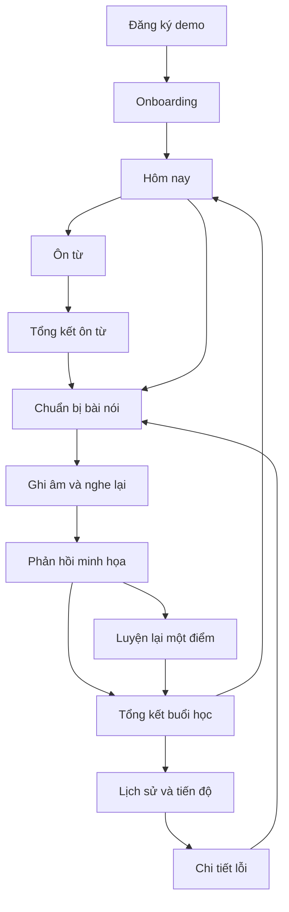

# Mimic — Backlog hoàn thiện và đặc tả chức năng, giao diện

- Ngày lập: 07/09/2026.
- Baseline commit: `299abbbb4444539881a0dd68b60064daeb777fbf`.
- Baseline bổ sung: working tree có thay đổi palette đã được người dùng yêu cầu; commit trên chưa chứa thay đổi đó.
- Trạng thái: kế hoạch đề xuất để triển khai; việc tạo file không có nghĩa các task đã hoàn thành.
- Phạm vi: frontend React/TypeScript với mock data; bao gồm thao tác học, tài khoản demo và các trạng thái cần để kiểm chứng UX.
- Không triển khai trong tài liệu này: backend, auth thật, gửi email, AI thật, thanh toán, CMS, lưu trữ âm thanh trên server.
- Cách đánh giá: đọc tài liệu và source; chưa có phiên thử nghiệm người dùng hoặc kiểm tra giao diện đã render. Các lựa chọn về bố cục cần xác nhận bằng preview khi triển khai.
- Tài liệu này là một backlog tổng hợp theo yêu cầu người dùng, không thay thế PROJECT.md. Không sửa source trong bước lập kế hoạch.

## Mục lục

1. Mục tiêu, nguồn và hiện trạng.
2. Checklist task cần hoàn thành.
3. Các mốc triển khai và phụ thuộc.
4. Sơ đồ điều hướng và hành trình người dùng.
5. Đặc tả từng page và chức năng.
6. Quy tắc dữ liệu, trạng thái và hành vi dùng chung.
7. Hệ thống giao diện và khả năng sử dụng.
8. Kịch bản nghiệm thu và bàn giao.
9. Công việc giai đoạn sau.

## 1. Mục tiêu, nguồn và hiện trạng

### 1.1 Kết quả sản phẩm cần đạt

Một người mới có thể tự chọn mục tiêu, bắt đầu buổi học, ôn từ, luyện nói, hiểu phản hồi và hoàn thành buổi học mà không cần người hướng dẫn. Người quay lại có thể tiếp tục bài dở, xem lỗi cần luyện và xem lại lịch sử của mình.

Vòng học trọng tâm:

`Ngữ cảnh cá nhân → học/ôn từ → dùng từ khi nói → xem phản hồi → luyện lại → theo dõi tiến bộ`.

Một buổi học phải có điểm bắt đầu, tiến độ, kết quả và điểm kết thúc. Việc có đầy đủ các trang rời rạc chưa đủ để coi giai đoạn UI hoàn tất.

### 1.2 Nguồn thiết kế và chủ sở hữu hiện tại

| Nguồn/owner | Vai trò và bằng chứng hiện tại |
| --- | --- |
| `docs/PROJECT.md`, mục 2, 5, 6, 9 | Phạm vi mock frontend, palette, các trang và checklist sản phẩm |
| `frontend/src/route/AppRoutes.tsx`, `routePaths.ts` | Landing ở `/`; Dashboard ở `/dashboard` và `/app`; fallback chuyển về `/` |
| `frontend/src/components/layout/AppShell.tsx`, `Sidebar.tsx` | Shell học, điều hướng desktop/mobile, theme |
| `frontend/src/pages/Dashboard.tsx` | Gợi ý hoạt động, thống kê, nhắc ôn; có số liệu và lời chào cố định |
| `frontend/src/pages/Vocab.tsx`, `components/vocab/*` | Danh sách, flashcard, kết quả bóc tách mock; nghĩa đang xuất hiện trong danh sách cạnh flashcard |
| `frontend/src/pages/Speaking.tsx`, `hook/useAudioRecorder.ts` | Thu âm trình duyệt và TTS; phản hồi lấy từ `mockResult`; lỗi mic có thể chuyển sang mô phỏng |
| `frontend/src/pages/Progress.tsx` | Thống kê, danh sách lỗi; chưa có trang chi tiết lỗi |
| `frontend/src/pages/marketing/Login.tsx`, `Signup.tsx` | Form demo; signup đi Dashboard; nút quên mật khẩu đang gọi hàm điền tài khoản mẫu |
| `frontend/src/components/shared/UI.tsx` | SectionLabel, StatusPill, ProgressBar, Streak; Streak hiện có số cố định |
| `frontend/src/store/useMimicStore.ts`, `context/AuthContext.tsx` | State UI và tài khoản demo; cần thống nhất nguồn dữ liệu giữa các màn hình |
| `frontend/src/type/index.ts`, `mocks/*`, `service/*` | Types, fixtures; tồn tại service thử gọi API rồi fallback mock |
| `frontend/src/styles/index.css` | Token thực tế: `--primary` là cyan, `--accent` trỏ `--warm` là cam; giữ mapping này khi tái sử dụng component |

Ngôn ngữ thiết kế: cyan trầm, cam đất cho hành động chính, nền trung tính; sans-serif; khu luyện tập có vùng nội dung chính rõ ràng; motion có chủ đích. Không có ngoại lệ thiết kế được ghi nhận rõ trong tài liệu.

### 1.3 Hiện trạng được xác minh

- Có nền tảng Vite/React/TypeScript, routing, shell, theme.
- Có Dashboard, Vocab, Speaking, Progress và phần lớn trang marketing.
- Chưa có route Settings, Onboarding, Forgot Password, Terms, Privacy và trang 404 thực sự.
- Chưa có màn hình kết thúc buổi ôn, chi tiết lỗi, lịch sử bài nói đầy đủ.
- Transcript và điểm của Speaking là minh họa, không được tính từ âm thanh đã ghi.
- Danh sách từ và tiến độ còn đọc mock trực tiếp; không nên suy luận rằng mọi service trong repo đang được gọi.
- Palette đã được đổi về hướng cũ; chưa nghiệm thu thị giác hoặc contrast toàn bộ UI.
- Các trang đã có cần đánh giá theo luồng sử dụng; không đánh dấu hoàn thành chỉ dựa trên sự tồn tại của file.

### 1.4 Nhãn phạm vi và mức ưu tiên

- **DOC**: yêu cầu đã có trong PROJECT.md.
- **FIX**: sửa thiếu hụt hoặc nội dung/hành vi không khớp trong triển khai hiện tại.
- **UX+**: đặc tả bổ sung đề xuất để hoàn thiện trải nghiệm; không phải tính năng đã có.
- **P0**: cần để hoàn thành một buổi học mẫu có ý nghĩa.
- **P1**: cần để sản phẩm có thể dùng lặp lại và hoàn thiện giai đoạn frontend.
- **P2**: giai đoạn sau; không cản nghiệm thu luồng học mock.

P0/P1 là thứ tự công việc, không làm thay đổi yêu cầu bắt buộc trong docs. Tất cả ô dưới đây chưa được nghiệm thu trong kế hoạch này.

## 2. Checklist task cần hoàn thành

### 2.1 Nền tảng trải nghiệm và dữ liệu demo

| Xong | ID | Ưu tiên | Nguồn | Task | Điều kiện hoàn thành | Phụ thuộc |
| --- | --- | --- | --- | --- | --- | --- |
| [ ] | F01 | P0 | FIX | Làm rõ chế độ demo | Transcript/điểm có nhãn minh họa; không giả vờ phân tích audio thật; CTA Google không giả vờ OAuth thành công | — |
| [ ] | F02 | P0 | FIX | Thống nhất dữ liệu mock | Một nguồn profile, hoạt động, từ và kết quả; không gọi backend thật trong mock mode | — |
| [ ] | F03 | P0 | UX+ | Định nghĩa buổi học | Có ID, bước hiện tại, trạng thái, kết quả và điểm kết thúc; hỗ trợ học riêng Vocab/Speaking | F02 |
| [ ] | F04 | P0 | FIX | Sửa nội dung không khớp | Quên mật khẩu không điền demo; chú giải biểu đồ đúng dữ liệu; bỏ số liệu cá nhân cố định ở component | F02 |
| [ ] | F05 | P0 | DOC | Chuẩn hóa trạng thái rỗng/lỗi | Có fixture và UI cho mới, đang tải, không kết quả, thất bại, thử lại, thành công | F02 |
| [ ] | F06 | P1 | UX+ | Giữ tiến độ demo sau tải lại | Lưu dữ liệu học dạng JSON có version; thông báo rõ audio không được giữ sau reload | F02, F03 |

### 2.2 Gia nhập và điều hướng

| Xong | ID | Ưu tiên | Nguồn | Task | Điều kiện hoàn thành | Phụ thuộc |
| --- | --- | --- | --- | --- | --- | --- |
| [ ] | A01 | P0 | DOC | Onboarding | Chọn mục tiêu, mức tự đánh giá, thời lượng; quay lại không mất lựa chọn; có bài đầu tiên | F02 |
| [ ] | A02 | P0 | FIX | Nối signup/login demo | Signup mới vào onboarding; người quay lại vào Dashboard; một trạng thái tài khoản dùng chung | A01, F02 |
| [ ] | A03 | P0 | UX+ | Dashboard theo trạng thái | Có mới/chưa bắt đầu/đang học/đã xong; CTA tiếp tục đi đúng bước | F03, A01 |
| [ ] | A04 | P1 | DOC | Settings/Profile | Xem/sửa hồ sơ, mục tiêu, theme, đổi mật khẩu demo, đăng xuất, xóa demo với xác nhận | F02, A02 |
| [ ] | A05 | P1 | DOC | Quên mật khẩu | Form email, xác nhận minh họa, đặt mật khẩu demo và kết quả; không gửi email thật | A02 |
| [ ] | A06 | P1 | UX+ | Điều hướng mobile | Bốn mục học dễ truy cập; active state đúng; không che nút ghi âm hoặc nội dung cuối trang | A03 |
| [ ] | A07 | P1 | DOC | Trang 404 | Route lạ có thông báo và hành động về khu phù hợp; không chuyển âm thầm về Landing | — |

### 2.3 Vocab

| Xong | ID | Ưu tiên | Nguồn | Task | Điều kiện hoàn thành | Phụ thuộc |
| --- | --- | --- | --- | --- | --- | --- |
| [ ] | V01 | P0 | DOC | Hoàn thiện kho từ | Tìm kiếm, chọn từ, trạng thái nhất quán; danh sách rỗng không làm lỗi flashcard | F02, F05 |
| [ ] | V02 | P0 | UX+ | Phiên ôn tập tập trung | Số thứ tự, lật thẻ, đánh giá sau đáp án, chuyển từ, hoàn tác một lượt | V01, F03 |
| [ ] | V03 | P0 | UX+ | Tổng kết ôn từ | Số đã ôn/cần gặp lại đúng thao tác; đi Speaking mang theo từ liên quan | V02 |
| [ ] | V04 | P1 | UX+ | Chọn và lưu từ từ ngữ cảnh | Chọn/bỏ chọn, báo trùng, lưu đúng số lượng; có fixture không kết quả/lỗi | V01, F05 |
| [ ] | V05 | P1 | FIX | Nghe phát âm | Nút nghe có phản hồi thật qua khả năng trình duyệt hoặc báo không hỗ trợ; không nút chết | V01 |

### 2.4 Speaking và kết thúc buổi học

| Xong | ID | Ưu tiên | Nguồn | Task | Điều kiện hoàn thành | Phụ thuộc |
| --- | --- | --- | --- | --- | --- | --- |
| [ ] | S01 | P0 | DOC | Chuẩn bị bài nói | Chủ đề, đề bài, thời lượng, nghe mẫu, gợi ý; mở được bài phù hợp từ Dashboard/Vocab | F03 |
| [ ] | S02 | P0 | FIX | Vòng đời thu âm | Xin mic đúng lúc, ghi/dừng/nghe lại/thu lại; báo lỗi; thoát giải phóng mic | S01, F05 |
| [ ] | S03 | P0 | UX+ | Tổ chức phản hồi theo ưu tiên | Một điểm tốt, tối đa hai điểm cần sửa, ví dụ cụ thể; chi tiết mở thêm; nhãn demo rõ | S02, F01 |
| [ ] | S04 | P0 | UX+ | Luyện lại theo phản hồi | Chọn câu/điểm cần sửa, nghe mẫu, ghi lần tiếp theo; không ghi đè lần đầu | S03 |
| [ ] | S05 | P0 | UX+ | Tổng kết buổi học | Tóm tắt đúng dữ liệu, kết thúc được, cập nhật Dashboard một lần | V03, S03, F03 |
| [ ] | S06 | P1 | DOC | Lịch sử Speaking | Danh sách theo ngày, trạng thái rỗng, mở chi tiết và luyện lại | S05, F06 |
| [ ] | S07 | P1 | UX+ | Chi tiết bài nói | Audio nếu còn, transcript, phản hồi, lần thử; ID không tồn tại có trạng thái phù hợp | S06 |

### 2.5 Progress và vòng sửa lỗi

| Xong | ID | Ưu tiên | Nguồn | Task | Điều kiện hoàn thành | Phụ thuộc |
| --- | --- | --- | --- | --- | --- | --- |
| [ ] | P01 | P1 | DOC | Đồng bộ Progress | Số liệu từ hoạt động demo; khoảng thời gian và chú giải đúng; không khẳng định CEFR từ fixture | F02, S05 |
| [ ] | P02 | P1 | DOC | Sổ tay lỗi | Nhóm lỗi, số lần gặp, lần gần nhất, trạng thái; dùng cùng lỗi trong phản hồi Speaking | S03, P01 |
| [ ] | P03 | P1 | UX+ | Chi tiết lỗi | Câu gốc, câu sửa, giải thích, nguồn buổi học và CTA luyện đúng lỗi | P02, S07 |
| [ ] | P04 | P1 | UX+ | Gợi ý ôn lỗi | Dashboard chỉ tới lỗi/bài cụ thể; fixture sau luyện thể hiện thay đổi có giải thích | P03, A03 |

### 2.6 Trang công khai và nghiệm thu

| Xong | ID | Ưu tiên | Nguồn | Task | Điều kiện hoàn thành | Phụ thuộc |
| --- | --- | --- | --- | --- | --- | --- |
| [ ] | M01 | P1 | DOC | Terms/Privacy | Hai route, nội dung placeholder được nhận diện; liên kết từ auth/footer | A02 |
| [ ] | M02 | P1 | FIX | Rà marketing và tài khoản | CTA có đích; mô tả đúng demo; Contact không báo đã gửi email thật; Blog slug lạ có trạng thái | F01, A07, M01 |
| [ ] | Q01 | P0 | DOC | Kiểm tra luồng học trên mobile/desktop | Hoàn thành từ onboarding đến tổng kết ở hai theme và bàn phím | A03, V03, S05 |
| [ ] | Q02 | P1 | DOC | Nghiệm thu UI toàn bộ | Contrast, focus, responsive, empty/error/loading; kiểm tra nội dung dài và route trực tiếp | Các task P1 |
| [ ] | Q03 | P1 | FIX | Đồng bộ tài liệu bàn giao | Checklist phản ánh đúng nghiệm thu; route, mapping tokens, mock/real ghi rõ | Q02 |

## 3. Các mốc triển khai và phụ thuộc

### Mốc 1 — Nền dữ liệu và bản demo trung thực

Làm F01–F05; sửa ngay liên kết quên mật khẩu khi A05 chưa xong bằng trạng thái chức năng chưa sẵn sàng, không giữ hành vi điền tài khoản mẫu. Tạo fixtures dùng được cho mốc kế tiếp.

Kết quả: người thử phân biệt rõ dữ liệu minh họa và ghi âm thật; không có request backend học trong mock mode.

### Mốc 2 — Hoàn thành lần học đầu

Làm A01–A03, V01–V03, S01–S05, Q01. Cắt theo một hành trình hoàn chỉnh, không dựng hết trang rồi mới nối thao tác.

Kết quả: người mới học được một bộ từ, ghi âm hoặc chọn xem demo có chủ đích, xem phản hồi minh họa, luyện lại và hoàn thành.

### Mốc 3 — Quay lại và luyện đúng điểm yếu

Làm F06, V04–V05, S06–S07, P01–P04. Lịch sử và sổ tay dùng cùng ID với buổi học; không tạo nhiều danh sách giả không liên quan.

Kết quả: người quay lại biết học tiếp ở đâu và xem được nguyên nhân của một đề xuất luyện tập.

### Mốc 4 — Hoàn thiện frontend

Làm A04–A07, M01–M02, Q02–Q03. Các màn hình tài khoản và trạng thái phụ không còn đường cụt.

Không ước lượng ngày công cố định trước khi kiểm tra component và browser. Dùng các tiêu chí nghiệm thu của mốc làm điều kiện chuyển việc.

## 4. Sơ đồ điều hướng và hành trình

### 4.1 Navigation

- Menu học chính: Hôm nay, Từ vựng, Luyện nói, Tiến độ.
- Menu tài khoản: Hồ sơ và cài đặt, đổi theme, đăng xuất.
- Lịch sử nằm trong Speaking. Sổ tay lỗi nằm trong Progress.
- Khi đang học tập trung: hiển thị tiến độ và đường thoát; không đưa marketing navigation vào giữa bài.
- Khi đang ghi âm: muốn rời trang phải xử lý bản ghi dở rõ ràng; không tự phát âm hoặc mở bản ghi khác.

### 4.2 Route dự kiến

| Route | Loại | Chủ sở hữu dự kiến | Ghi chú |
| --- | --- | --- | --- |
| `/` | Có | `pages/marketing/Landing.tsx` | Trang công khai |
| `/login`, `/signup` | Có | `pages/marketing/Login.tsx`, `Signup.tsx` | Demo rõ ràng |
| `/onboarding` | Mới DOC | `pages/marketing/Onboarding.tsx` | Sau signup, shell tối giản |
| `/dashboard` | Có | `pages/Dashboard.tsx` | Route chính Hôm nay |
| `/app` | Có | `route/AppRoutes.tsx` | Alias về Dashboard; không tạo hai nguồn trạng thái |
| `/vocab` | Có | `pages/Vocab.tsx` | Kho từ và nhập ngữ cảnh |
| `/vocab/review` | Mới UX+ | `pages/VocabReview.tsx` | Phiên ôn; bước hiện tại lấy từ store |
| `/speaking` | Có | `pages/Speaking.tsx` | Buổi luyện hiện tại |
| `/speaking/history` | Mới UX+ | `pages/SpeakingHistory.tsx` | Tab lịch sử |
| `/speaking/history/:sessionId` | Mới UX+ | `pages/SpeakingSessionDetail.tsx` | Chi tiết một buổi |
| `/session/:sessionId/summary` | Mới UX+ | `pages/SessionSummary.tsx` | Tổng kết buổi học, có thể chỉ học một kỹ năng |
| `/progress` | Có | `pages/Progress.tsx` | Tổng quan và sổ tay |
| `/progress/mistakes/:mistakeId` | Mới UX+ | `pages/MistakeDetail.tsx` | Chi tiết lỗi |
| `/settings` | Mới DOC | `pages/Settings.tsx` | Cài đặt |
| `/forgot-password` | Mới DOC | `pages/marketing/ForgotPassword.tsx` | Yêu cầu reset demo |
| `/reset-password` | Mới UX+ | `pages/marketing/ResetPassword.tsx` | Giao diện reset demo; token thật để sau |
| `/terms`, `/privacy` | Mới DOC | `pages/marketing/Terms.tsx`, `Privacy.tsx` | Nội dung demo |
| `/about`, `/contact`, `/blog`, `/blog/:slug` | Có | `pages/marketing/*` | Rà hành vi và trạng thái |
| `/speaking-method`, `/luyen-noi` | Có | `SpeakingMethod.tsx` và redirect | Giữ route hiện tại, nội dung đúng khả năng sản phẩm |
| `*` | Cần thay fallback | `pages/NotFound.tsx` | Không chuyển âm thầm về `/` |

Route mới ở đây là đề xuất triển khai, không khẳng định đã tồn tại. Khai báo tập trung trong `route/routePaths.ts`.

### 4.3 Luồng chính



Luồng độc lập: có thể chỉ ôn từ rồi kết thúc, hoặc vào Speaking trực tiếp. Không ép người dùng hoàn thành cả hai kỹ năng mỗi lần.
## 5. Đặc tả từng page và chức năng

Các chi tiết dưới đây là đề xuất hành vi cho frontend mock. Chủ sở hữu file hiện tại được tái sử dụng khi có; tên file mới là đích dự kiến, executor có thể tách component trong cùng phạm vi mà không đổi hành trình đã mô tả.

### 5.1 Login — `/login`

**Mục tiêu:** người quay lại vào đúng buổi học; người thử có cách mở demo rõ ràng.

**Nội dung:** tiêu đề, email, mật khẩu, hiện/ẩn mật khẩu, quên mật khẩu, CTA đăng nhập, link signup, hành động mở tài khoản mẫu có nhãn riêng.

**Hành vi:**

1. Email/mật khẩu được kiểm tra ngay trong form; lỗi đặt cạnh trường liên quan.
2. Loading khóa submit lặp nhưng vẫn giữ nội dung đã nhập.
3. Đăng nhập demo cập nhật AuthContext dùng chung, sau đó về Dashboard hoặc route học người dùng định mở trước đó.
4. Không dùng nút Quên mật khẩu để điền demo. Nút này dẫn `/forgot-password`.
5. Khi chưa có OAuth thật, nút Google không được mô phỏng thành công như đã xác thực Google; thay bằng trạng thái chưa hỗ trợ trong demo hoặc bỏ khỏi luồng chính.
6. Ghi nhớ chỉ ghi nhận lựa chọn phiên demo, không lưu mật khẩu vào localStorage.

**Trạng thái:** mặc định, email sai, thiếu mật khẩu, đang vào, lỗi demo mô phỏng, thành công, đã có phiên.

**Nghiệm thu:** tải lại sau đăng nhập phản ánh cùng hồ sơ; tên trên Dashboard/Sidebar/Settings không mâu thuẫn; Back không làm submit lại.

**Owner/reuse:** `Login.tsx`, `AuthContext.tsx`, `BrandLogo`, tokens form hiện có. Đồng bộ trạng thái với Signup, AppRoutes và Sidebar.

### 5.2 Signup — `/signup`

**Mục tiêu:** tạo hồ sơ demo với ít thao tác và đi tiếp vào bài học.

**Nội dung:** tên, email, mật khẩu, hiện/ẩn; liên kết Terms/Privacy; CTA Tạo tài khoản; link đăng nhập.

**Hành vi:**

- Không hỏi lại mục tiêu ở cả Signup và Onboarding.
- Tên được trim; email kiểm tra định dạng; quy tắc mật khẩu demo hiển thị trước khi submit.
- Thành công tạo hồ sơ demo từ dữ liệu nhập và đi Onboarding.
- Tài khoản mẫu đã có tiến độ dùng lối vào demo riêng ở Login.
- Không báo email xác minh đã gửi khi chưa có email service.

**Trạng thái:** rỗng, trường không hợp lệ, loading, lỗi fixture, đã tạo.

**Nghiệm thu:** hoàn thành form rồi quay lại không tạo hai hồ sơ; không persist mật khẩu hoặc thông tin token thật.

**Owner:** `Signup.tsx`, AuthContext; tạo một hành vi signup demo dùng chung thay cho chỉ `navigate`.

### 5.3 Onboarding — `/onboarding`

**Mục tiêu:** có đủ dữ liệu để chọn buổi học đầu, không biến onboarding thành bài khảo sát dài.

**Ba bước:**

| Bước | Nội dung | Dữ liệu |
| --- | --- | --- |
| 1 | Bạn muốn nói tiếng Anh trong tình huống nào? Công việc / phỏng vấn / hằng ngày | `goal` |
| 2 | Mô tả gần nhất với khả năng hiện tại: mới bắt đầu / nói câu đơn giản / trao đổi được nhưng thiếu tự nhiên / chưa chắc | `selfAssessedLevel` |
| 3 | Thời gian muốn dành mỗi ngày: 5 / 10 / 15 phút | `dailyMinutesGoal` |

**Bố cục:** chỉ báo bước, một câu hỏi, lựa chọn, Quay lại và Tiếp tục. Không cần sidebar đầy đủ.

**Hành vi:**

- Bước trình độ có lựa chọn chưa chắc; không tự gán đây là kết quả kiểm tra CEFR.
- Quay lại giữ lựa chọn. Reload giữ draft nếu đã làm F06.
- Bỏ qua phần tùy chọn dùng mặc định 10 phút và trình độ chưa xác định; ghi rõ có thể sửa ở Settings.
- Kết thúc hiển thị chủ đề đầu tiên và nút Bắt đầu buổi đầu; có đường về Dashboard.
- Không xin microphone trong onboarding.
- Người đã hoàn tất onboarding sửa lựa chọn trong Settings; không bị ép làm lại khi đăng nhập.

**Nghiệm thu:** chỉ dùng bàn phím vẫn chọn và chuyển bước được; bỏ qua vẫn có đề bài; nhập tên dài không làm vỡ header.

**Owner/reuse:** mới `Onboarding.tsx`; AuthContext/profile store; chọn lại tokens và input/button hiện có. Chưa cần thư viện wizard.

### 5.4 Dashboard — `/dashboard`

**Mục tiêu:** trả lời “Hôm nay nên làm gì?” và cung cấp một điểm bắt đầu rõ ràng.

**Thứ tự nội dung:**

1. Lời chào lấy từ profile và ngữ cảnh ngày hiện tại.
2. Buổi học hôm nay: chủ đề, thời lượng ước tính, lý do đề xuất một câu.
3. CTA chính Bắt đầu/Tiếp tục và tiến độ các bước.
4. Lối vào học riêng Vocab hoặc Speaking.
5. Một nhắc ôn đến hạn hoặc điểm cần luyện.
6. Nhịp học tuần và link Progress.

**Bốn trạng thái:**

- Người mới: chưa có streak/điểm giả; gợi ý bài đầu, có thể chỉnh mục tiêu.
- Chưa học hôm nay: ôn từ đến hạn trước hoặc bài nói theo fixture phù hợp mục tiêu.
- Đang học: nêu bước còn dở; Tiếp tục mở đúng phiên, không tạo phiên mới.
- Đã xong: ghi nhận kết quả và cho kết thúc; Luyện thêm là lựa chọn phụ.

**Ví dụ copy:** “Ôn 3 từ và luyện giới thiệu công việc. Khoảng 7 phút.” Lý do: “Bạn muốn tự tin hơn khi trao đổi trong công việc.”

**Hành vi:** bài nói gợi ý phải mở đúng chủ đề; Ôn ngay chỉ mở bộ đến hạn. Các chỉ số tuần, nhắc ôn và tiến độ cùng đọc dữ liệu dùng chung.

**Nghiệm thu:** đánh giá một lượt ôn rồi quay lại vẫn thấy đúng tiến độ; ngày hiện tại không mâu thuẫn giữa header và nội dung; không hiển thị phần trăm cố định.

**Owner/reuse:** `Dashboard.tsx`, AppShell, ProgressBar; đổi Streak nhận dữ liệu thay vì giữ số cố định. Giữ biểu đồ hiện tại khi đáp ứng dữ liệu tổng thời gian.

### 5.5 Vocab — `/vocab`

**Mục tiêu:** tra cứu bộ từ và chọn việc học phù hợp.

**Nội dung:**

- Tiêu đề Từ vựng; số từ cần ôn hôm nay.
- CTA Ôn từ đến hạn, kèm số từ và thời lượng.
- Tìm theo từ hoặc nghĩa.
- Bộ lọc Tất cả / Cần ôn / Mới / Đã thuộc.
- Danh sách: từ, nghĩa ngắn, trạng thái; chọn mở chi tiết.
- Chi tiết: phát âm, từ loại, nghĩa, ví dụ, dịch, nguồn ngữ cảnh nếu có.
- Khu thêm từ từ ngữ cảnh ở dưới hoặc panel mở theo thao tác.

**Quy tắc:**

- Chế độ tra cứu có thể hiển thị nghĩa; chế độ ôn không để lộ nghĩa trước đáp án.
- Không tự gán “đã thuộc” sau một lần Nhớ. Trạng thái học lâu dài và đánh giá lượt hiện tại là hai dữ liệu khác nhau.
- Nếu chưa có cơ sở tính mastery, ưu tiên trạng thái và lịch ôn thay cho phần trăm giả chính xác.
- Khi lọc mất từ đang chọn, chọn phần tử hợp lệ hoặc hiển thị hướng dẫn; không truyền `undefined` vào FlashCard.
- Không kết quả tìm kiếm có nút Xóa tìm kiếm; kho thực sự rỗng có CTA Thêm từ hoặc Dùng bộ mẫu.

**Nghiệm thu:** bộ lọc 0/1/nhiều kết quả; từ dài, câu dài; thay trạng thái trong phiên ôn được phản ánh nhất quán.

**Owner/reuse:** `Vocab.tsx`, VocabList, FlashCard, mocks/vocab, store. Tách mode tra cứu/ôn bằng dữ liệu hoặc composition thay vì nhân bản toàn bộ thẻ.

### 5.6 Thêm từ từ ngữ cảnh — bên trong Vocab

**Mục tiêu:** người dùng chọn đúng từ muốn đưa vào bộ học.

**Luồng:** nhập đoạn văn → xem kết quả minh họa → chọn từ → lưu → mở bộ đã thêm.

**Nội dung:** textarea có label, đoạn mẫu, số ký tự, nút Xem từ gợi ý; mỗi kết quả có checkbox, từ, nghĩa trong ngữ cảnh, câu nguồn và trạng thái đã có.

**Hành vi đề xuất:**

- Giới hạn demo ban đầu 5.000 ký tự; đây là giới hạn UI đề xuất, cần ghi trong helper text và dễ cấu hình.
- Chuỗi toàn khoảng trắng không submit.
- Không giả vờ đã phân tích chính xác một đoạn tùy ý: thông báo ngắn rằng kết quả đang dùng dữ liệu minh họa; có đoạn mẫu phù hợp fixture.
- Chọn/bỏ chọn từng từ; hiển thị “Thêm N từ”; N = 0 thì không submit.
- Từ trùng hiển thị “Đã có trong bộ từ”, không mặc định tạo bản sao.
- Sau lưu, đóng/mở lại panel không thêm trùng; hiện đường tới bộ từ vừa thêm.
- Lỗi giữ nguyên đoạn văn và lựa chọn để thử lại.

**Trạng thái:** chưa nhập, nhập hợp lệ, quá dài, đang tạo gợi ý demo, không kết quả, lỗi, chọn kết quả, đã lưu.

**Nghiệm thu:** số từ tăng đúng lựa chọn; bấm lưu liên tiếp không nhân đôi; bỏ qua không thay đổi bộ từ.

**Owner/reuse:** khu context trong Vocab; có thể tách `components/vocab/ContextCapture.tsx` vì có vòng trạng thái độc lập, chỉ Vocab sử dụng.

### 5.7 Phiên ôn — `/vocab/review`

**Mục tiêu:** hoàn thành một lượt ôn nhỏ, có tiến độ và phản hồi rõ.

**Nội dung:** tiêu đề phiên, “Từ 3/8”, thẻ đang học, nghe phát âm, hiện đáp án, Nhớ/Cần ôn lại, Hoàn tác lượt trước, thoát phiên.

**Hành vi:**

1. Chốt danh sách ID lúc bắt đầu phiên để bộ lọc thay đổi không làm mất lượt.
2. Chưa mở đáp án thì chưa cho đánh giá.
3. Đánh giá ghi vào phiên và chuyển thẻ tiếp theo về mặt trước.
4. Hoàn tác phục hồi thẻ, đáp án và bộ đếm của lượt trước; không âm thầm giữ kết quả đã hủy.
5. Thoát giữa chừng giữ tiến độ JSON và nêu rõ trạng thái lưu.
6. Hết lượt chuyển tổng kết; không lặp vô hạn các từ Chưa nhớ trong cùng phiên.
7. Từ cần ôn lại được đưa vào danh sách gợi ý tiếp theo theo fixture/quy tắc demo, không tự nhận là thuật toán SRS đã hoàn chỉnh.

**Trạng thái:** chuẩn bị, trước đáp án, sau đáp án, đã đánh giá, hết lượt, phiên rỗng, phiên không còn tồn tại.

**Nghiệm thu:** không thể đánh giá một lượt hai lần do double click; reload không làm tăng số từ đã ôn; không có nghĩa lộ ở panel bên cạnh.

**Owner/reuse:** mới `VocabReview.tsx`, FlashCard, ProgressBar; state phiên dùng chung thay vì chỉ boolean `isFlashcardFlipped` toàn app.

### 5.8 Tổng kết ôn từ — trạng thái cuối phiên Vocab

**Nội dung:** số từ đã xem, số Nhớ/Cần ôn lại, danh sách ngắn cần gặp lại và hành động tiếp theo.

- Buổi kết hợp: CTA Dùng các từ này để luyện nói, mang theo ID từ.
- Chỉ học từ: CTA Hoàn thành buổi học.
- Có lựa chọn quay về kho từ.
- Không dùng Nhớ = Đã thuộc; không nói người dùng đã tăng trình độ chỉ nhờ hoàn thành phiên.
- Kết quả tính từ review events, không cố định 42% hoặc số 6.

**Nghiệm thu:** bộ đếm khớp đánh giá và hoàn tác; vào lại màn tổng kết không cộng thời gian hoặc streak lần nữa.

### 5.9 Speaking — `/speaking`

**Mục tiêu:** ghi một bài nói, hiểu một vài điểm cần sửa và có thể thử lại.

#### A. Chuẩn bị

- Chủ đề, tình huống, thời lượng khuyến nghị 60–90 giây.
- Bài từ Dashboard được chọn sẵn; vẫn có cách đổi chủ đề khi chưa ghi âm.
- Nghe câu mẫu với nhãn đúng là giọng đọc mẫu của thiết bị; không cam kết luôn có giọng người bản xứ cụ thể.
- Dàn ý và từ gợi ý có thể mở thêm; từ chuyển từ Vocab xuất hiện ở đây.
- CTA Bắt đầu ghi; giải thích ngắn quyền mic và phạm vi lưu âm thanh thực tế.

#### B. Xin quyền microphone

- Chỉ gọi yêu cầu sau thao tác người dùng.
- Hiện “Đang chờ quyền microphone”; không tăng thời gian ghi trước khi bắt đầu thu.
- Nếu bị từ chối: hướng dẫn cho phép lại và nút Thử lại.
- Có lựa chọn riêng Xem bài mẫu nếu người dùng muốn thử demo không ghi âm; nhãn theo suốt luồng.

#### C. Đang ghi

- Đồng hồ, waveform/âm lượng, đề bài rút gọn, Dừng ghi.
- 60–90 giây là gợi ý, không tự cắt bài ở mốc 90 nếu chưa có quyết định giới hạn.
- Không phát TTS hoặc audio khác chồng lên microphone.
- Không chuyển chủ đề trong lúc ghi. Rời trang có lựa chọn tiếp tục hoặc bỏ bản ghi dở.
- Không dùng nhấp nháy hoặc thay đổi màu làm tín hiệu duy nhất.

#### D. Nghe lại

- Phát/dừng, tiến độ, thời lượng thực tế.
- Thu lại hoặc Xem phản hồi minh họa.
- Nếu không có audio hợp lệ thì không trình bày như đã ghi thành công.
- Không thay duration 0 bằng một thời lượng giả.

#### E. Chuẩn bị phản hồi demo

- Copy rõ đây là kết quả mẫu; delay chỉ mô phỏng trạng thái UI.
- Fixture thành công/lỗi được lựa chọn nhất quán; không dùng dữ liệu ngẫu nhiên làm kết quả thay đổi vô lý.
- Kết quả trả muộn sau khi đổi bài/thoát không được gắn vào chủ đề mới.

#### F. Phản hồi

- Tiêu đề Kết quả minh họa; lời nhắc audio đã ghi chưa được AI đánh giá.
- Một điểm làm tốt, tối đa hai điểm cần luyện trước.
- Mỗi điểm: câu mẫu gốc, bản gợi ý, giải thích ngắn và CTA Luyện câu này.
- Transcript mẫu được phân biệt với bản ghi âm thật.
- Các điểm WPM/cadence/fluency nằm trong Xem chi tiết, kèm nhãn và giải thích; có thể ẩn nếu chưa có ý nghĩa ở demo.
- Mục không đánh giá được có trạng thái Chưa có dữ liệu thay vì 0 điểm.

**Nghiệm thu:** từ chối mic không tạo bản ghi giả; audio dừng khi đổi bài/rời trang; phản hồi luôn đúng fixture chủ đề; không mất lần ghi trước khi người dùng quyết định.

**Owner/reuse:** Speaking.tsx, useAudioRecorder, TopicSelector, RecordButton, Waveform, AudioPlayerBar, FeedbackCard, SentenceDiffCard, AcousticMetrics. Sửa composition và state, không tạo một phòng luyện nói thứ hai song song.

### 5.10 Luyện lại một điểm — bên trong Speaking

**Nội dung:** điểm đang luyện, câu trước/câu gợi ý, nút nghe, ghi lại, nghe lại, hoàn tất.

- Có thể luyện một câu thay vì thu toàn bài.
- Mỗi lần thử có ID và thứ tự, giữ lần trước.
- So sánh bản ghi bằng hai nút phát, không phát đồng thời.
- Không tự khẳng định lần hai tốt hơn vì người dùng đã bấm thu lại. Nếu dùng kết quả so sánh fixture phải ghi minh họa.
- Cho Hoàn thành mà không bắt buộc thử lại; đây là lựa chọn hỗ trợ học.

**Nghiệm thu:** kết thúc luyện lại vẫn liên kết đúng buổi và lỗi; số buổi không tăng theo mỗi lần thử.

**Owner:** Speaking.tsx, SentenceDiffCard, audio player; state `attempts` thuộc một SpeakingSession.

### 5.11 Tổng kết buổi — `/session/:sessionId/summary`

**Mục tiêu:** đóng buổi học và cho thấy việc vừa hoàn thành.

**Nội dung:**

- Tiêu đề Bạn đã hoàn thành buổi học hoặc Buổi học đã kết thúc nếu dừng một phần.
- Thời gian học, số từ đã ôn, chủ đề nói nếu có.
- Một điểm đáng ghi nhận; một gợi ý lần tới từ fixture có nhãn.
- CTA Về hôm nay; link phụ Xem lại bài nói/Luyện thêm.

**Hành vi:**

- Buổi chỉ có Vocab không hiển thị số liệu Speaking bằng 0 như lỗi thiếu dữ liệu.
- Buổi bị bỏ không được ghi nhận là đã hoàn thành toàn bộ.
- Ghi hoàn thành một lần theo session ID; Back/reload không tăng streak, phút hoặc số buổi.
- Bài nói mới có đường xem lịch sử khi S06 hoàn thành.
- Không kích hoạt âm thanh hoặc tự chuyển người dùng vào bài mới.

**Trạng thái:** hoàn thành, một phần, đang đọc phiên, ID không tồn tại.

**Owner/reuse:** mới SessionSummary.tsx; dữ liệu từ study session, review session và speaking session; StatusPill/ProgressBar nếu cần.

### 5.12 Lịch sử Speaking — `/speaking/history`

**Mục tiêu:** tìm lại buổi đã học và tiếp tục một chủ đề.

**Nội dung:** tab Luyện nói/Lịch sử, nhóm theo ngày, mỗi dòng có chủ đề, thời lượng, số lần thử, trạng thái bản ghi.

**Hành vi:**

- Mới nhất trước, bấm dòng mở chi tiết.
- Bộ lọc chủ đề hoặc thời gian có thể dùng khi số bản ghi đủ nhiều; chưa cần phân trang phức tạp cho fixture nhỏ.
- Không có lịch sử: giải thích và nút Bắt đầu bài nói đầu tiên.
- Không có kết quả do lọc: nút Xóa bộ lọc.
- Bản ghi không còn audio vẫn xem được metadata và phản hồi mẫu; không hiển thị nút play hoạt động giả.

**Nghiệm thu:** bài vừa hoàn thành xuất hiện đúng một lần; tổng số buổi khớp Progress; reload không mất metadata đã persist.

**Owner/reuse:** mới SpeakingHistory.tsx, SpeakingSession type được mở rộng; AppShell.

### 5.13 Chi tiết buổi nói — `/speaking/history/:sessionId`

**Nội dung:** ngày, chủ đề, đề bài, thời lượng; chọn lần thử; player nếu audio còn; transcript/feedback minh họa; từ liên quan; link lỗi; CTA Luyện lại chủ đề.

**Hành vi:**

- Khi audio URL hết hiệu lực sau reload, thông báo “Bản ghi âm chỉ có trong phiên mở hiện tại”; metadata vẫn truy cập được.
- Luyện lại từ lịch sử tạo phiên mới có tham chiếu buổi gốc; không chỉnh sửa lịch sử cũ.
- Với ID lạ, thông báo không tìm thấy bài và về lịch sử; không crash hoặc chuyển mơ hồ về Landing.
- So sánh hai lần thử cùng buổi chỉ khi có hai lần; không thêm placeholder vô nghĩa.

**Nghiệm thu:** mở trực tiếp URL và reload; chọn nhiều lần thử không phát chồng audio; Back giữ bộ lọc lịch sử nếu có.

### 5.14 Progress — `/progress`

**Mục tiêu:** trả lời “Mình đang cải thiện gì?” và “Nên luyện gì tiếp?”.

**Nội dung đề xuất theo thứ tự:**

1. Nhận xét ngắn về hoạt động trong kỳ, dựa trên dữ liệu demo có thật trong store.
2. Điểm đang luyện và đường vào sổ tay.
3. Tổng từ đã học/ôn, số buổi, thời gian, ngày hoạt động.
4. Biểu đồ thời gian với kỳ hiển thị rõ.
5. Lịch sử hoạt động gần đây hoặc link Speaking history.

**Quy tắc:**

- Biểu đồ chỉ có tổng phút thì chú giải là Thời gian học. Muốn tách Speaking/Vocab phải có dữ liệu tách tương ứng.
- Mọi so sánh “tăng X%” phải có kỳ gốc, mẫu số và dữ liệu; chưa có thì không hiển thị.
- Không suy diễn CEFR từ số phiên. Có thể hiển thị trình độ tự chọn, ghi rõ nguồn; bỏ phần trăm đến B1 nếu chưa có phương pháp đánh giá.
- Người mới hiển thị hướng dẫn tạo dữ liệu qua buổi học đầu.
- Một ngày không học không cần cảnh báo đỏ hoặc ngôn ngữ gây áp lực.

**Nghiệm thu:** đổi kỳ cập nhật tất cả số cùng kỳ; fixture tuần không có dữ liệu vẫn hiển thị hợp lệ; không chia cho 0.

**Owner/reuse:** Progress.tsx, commonMistakes/weeklyProgress fixtures, ProgressBar; dữ liệu derived từ event/session.

### 5.15 Sổ tay lỗi — một vùng/tab trong Progress

**Nội dung:** bộ lọc Cần luyện/Đang cải thiện/Tất cả; nhóm Ngữ pháp/Dùng từ/Diễn đạt; tên dễ hiểu, số lần gặp, lần gần nhất, câu ví dụ và CTA Xem cách sửa.

- Không đưa nhóm phát âm vào như đã được chấm từ transcript; chỉ dùng fixture ghi rõ minh họa hoặc để giai đoạn có dữ liệu phù hợp.
- Một lỗi có thể có nhiều occurrence từ nhiều buổi; không tạo một “loại lỗi” mới cho mỗi lần gặp.
- Chưa có lỗi: “Sau bài nói đầu tiên, các điểm cần luyện sẽ xuất hiện ở đây.”
- Có học nhưng không phát hiện lỗi trong fixture: ghi “Chưa ghi nhận điểm cần luyện trong các bài này”, không tuyên bố người dùng nói hoàn hảo.
- Tối đa vài lỗi ưu tiên ở tổng quan, phần còn lại xem trong danh sách.

**Nghiệm thu:** số lần gặp khớp occurrence; bấm từ phản hồi Speaking tới đúng lỗi trong sổ tay.

### 5.16 Chi tiết lỗi — `/progress/mistakes/:mistakeId`

**Nội dung:** tên lỗi, trạng thái, lần gần nhất, giải thích; câu gốc/câu gợi ý; nguồn buổi; các occurrence gần đây; bài tập một câu; CTA Luyện điểm này.

**Hành vi:**

- CTA mở Speaking với đúng lỗi và chủ đề liên quan.
- Quay về giữ vị trí/bộ lọc sổ tay khi có thể.
- Không cho tự đánh dấu Đã khắc phục chỉ bằng đọc trang. Có thể ghi Đã luyện, còn trạng thái cải thiện cần quy tắc riêng.
- Dữ liệu luyện lại demo có thể minh họa xu hướng, phải có nhãn; không trình bày như đánh giá giọng nói thật.

**Nghiệm thu:** mỗi occurrence dẫn được về buổi tương ứng; lỗi không tồn tại có đường về Progress.

**Owner/reuse:** mới MistakeDetail.tsx; FeedbackCard/SentenceDiffCard dùng lại phần câu và giải thích nếu phù hợp, không sao chép toàn bộ UI phản hồi.

### 5.17 Settings/Profile — `/settings`

**Nhóm nội dung:**

| Nhóm | Trường và hành động |
| --- | --- |
| Hồ sơ | Tên, email demo; avatar chỉ hiển thị nếu đã có, chưa thêm upload ảnh |
| Việc học | Mục tiêu, mức tự đánh giá, 5/10/15 phút mỗi ngày |
| Giao diện | Sáng, tối, theo thiết bị |
| Tài khoản demo | Form đổi mật khẩu minh họa, đăng xuất |
| Quản lý dữ liệu demo | Xóa dữ liệu/tài khoản demo với xác nhận và mô tả phạm vi |

**Hành vi:**

- Lưu theo nhóm; có trạng thái Đã lưu, lỗi, thay đổi chưa lưu.
- Đổi tên phản ánh ngay tại Dashboard/Sidebar.
- Đổi mục tiêu ảnh hưởng gợi ý tiếp theo, không viết lại lịch sử đã học.
- Theme theo thiết bị phải theo thay đổi hệ điều hành khi đang mở; chọn thủ công thì không bị hệ điều hành ghi đè.
- Đăng xuất dừng audio/mic; xóa phiên demo theo quy tắc đã chốt, không chỉ đổi route.
- Xóa tài khoản demo cần dialog xác nhận, mô tả dữ liệu local sẽ mất, mặc định focus hành động hủy; không khẳng định xóa tài khoản server.
- Form đổi mật khẩu không lưu mật khẩu mới vào persistence demo; thông báo rõ thao tác minh họa.

**Nghiệm thu:** hủy không mất dữ liệu; xác nhận xóa chỉ xóa các key Mimic, không dùng `localStorage.clear()`; profile cập nhật nhất quán.

**Owner/reuse:** mới Settings.tsx; AuthContext, ThemeContext, useMimicStore. ThemeContext nếu chỉ bọc store thì tiếp tục dùng nguồn store, không tạo theme state thứ hai.

### 5.18 Forgot/Reset Password — `/forgot-password`, `/reset-password`

**Yêu cầu reset:** email, CTA Tiếp tục, link về đăng nhập; kiểm tra định dạng và loading.

**Sau submit demo:** “Đây là bản demo, email chưa được gửi”; có hành động Xem bước đặt mật khẩu mẫu. Không hiển thị một lời xác nhận gửi email thật.

**Đặt mật khẩu mẫu:** mật khẩu mới và xác nhận, hiện/ẩn, quy tắc hiển thị, submit và kết quả; link về Login.

**Fixture cần có:** email không hợp lệ, lỗi thao tác mẫu, liên kết hết hạn minh họa, thành công demo. Khi làm auth thật mới chốt token, thời hạn và gửi lại email theo backend.

**Nghiệm thu:** link Quên mật khẩu đến đúng form; không tự điền demo; các trạng thái có đường quay lại; không persist mật khẩu.

### 5.19 Terms/Privacy — `/terms`, `/privacy`

**Nội dung chung:** tiêu đề, trạng thái tài liệu demo, ngày cập nhật, các mục nội dung dễ đọc, link liên hệ và link qua lại.

- Terms placeholder mô tả phạm vi dịch vụ demo và phản hồi minh họa.
- Privacy placeholder mô tả đúng local demo, quyền mic, âm thanh trong phiên, dữ liệu profile local; phân biệt dự kiến server trong tương lai.
- Không ghi cam kết xử lý/lưu/xóa mà code chưa hỗ trợ.
- Nội dung phát hành công khai cần được chuẩn bị riêng khi đã xác định dịch vụ và nơi vận hành; không coi placeholder là nội dung pháp lý đã hoàn tất.

**Nghiệm thu:** liên kết từ Signup/footer hoạt động; đọc dài trên mobile không bị bó hẹp trong card; quay lại form không mất dữ liệu cần thiết.

### 5.20 404 và trạng thái không tìm thấy bản ghi

- Route không tồn tại: “Không tìm thấy trang này”, nút về Dashboard nếu có phiên demo, nếu không về Landing.
- Không tìm thấy session: nút về lịch sử Speaking.
- Không tìm thấy mistake: nút về Progress.
- Blog slug sai: thông báo và link về danh sách Blog.
- Không dùng redirect âm thầm làm người dùng tưởng đã mở đúng liên kết.

**Owner/reuse:** mới NotFound.tsx; AppRoutes và các page chi tiết. Dùng cùng kiểu empty/error presentation khi ngữ cảnh phù hợp, nhưng CTA theo nơi người dùng đang làm việc.

### 5.21 Rà soát các trang marketing đã có

**Landing và SpeakingMethod:**

- Nội dung nói đúng những gì demo cho phép; ví dụ phản hồi được ghi minh họa.
- CTA vào demo/signup có đích rõ; không dùng số liệu người dùng hoặc testimonial giả.
- Nếu có player/nghe mẫu, phải phát/dừng đúng và không chồng với player khác.
- Chỉ tái sử dụng palette/layout hiện tại; không redesign toàn bộ marketing trong task hoàn thiện luồng học.

**About:** câu chuyện founder và mục tiêu sản phẩm; không bịa mốc phát triển hoặc hiệu quả học.

**Contact:** label trường, validation, loading, trạng thái mô phỏng gửi; hoặc email liên hệ thực sự được chủ dự án cung cấp. Không tự invent email hỗ trợ.

**Blog index/detail:** danh sách mock rõ ràng, mở đúng slug, tiêu đề/nội dung dài đọc được, slug sai có trạng thái. CMS và tìm kiếm nâng cao để sau.

**Nghiệm thu:** không có CTA có vẻ dùng được nhưng không phản hồi; footer có Terms/Privacy/Contact hợp lệ; người dùng vào app rồi có đường quay về marketing có chủ đích.
## 6. Quy tắc dữ liệu, trạng thái và hành vi dùng chung

### 6.1 Hợp đồng dữ liệu frontend đề xuất

Đây là view/domain model cho frontend, không phải lời cam kết API tương lai trả đúng cấu trúc này. Mock adapter và API adapter sau này cùng chuyển dữ liệu vào model ổn định. Mở rộng `src/type/index.ts` hoặc tách module types khi file lớn; không đưa chi tiết màu trình bày vào hợp đồng dữ liệu server.

| Đối tượng | Trường tối thiểu | Quan hệ/ý nghĩa |
| --- | --- | --- |
| LearnerProfile | id, name, email, goal, selfAssessedLevel, dailyMinutesGoal, onboardingCompleted | Một nguồn cho Dashboard, Sidebar, Settings |
| StudySession | id, startedAt, completedAt?, status, currentStep, reviewSessionId?, speakingSessionId?, plannedSteps | Buổi học tổng; có thể chỉ một kỹ năng |
| ReviewSession | id, wordIds, currentIndex, reviews, status | Snapshot ID từ theo phiên; reviews chứa đánh giá từng lượt |
| ReviewEvent | id, reviewSessionId, wordId, rating, reviewedAt, undoneAt? | rating = remembered/needsReview; lượt bị hoàn tác không cộng thống kê |
| VocabEntry | id, word, pronunciation, meaning, partOfSpeech, example, translation, sourceContext?, status, nextReviewAt? | Một mục từ; trạng thái lâu dài tách đánh giá lượt |
| ContextSuggestion | id, word, meaning, sourceSentence, existingWordId?, selected | Kết quả chưa lưu; không trộn với bộ từ đã lưu |
| SpeakingTopic | id, title, category, prompt, recommendedDuration, outline, keyVocab, modelAnswer | Tách `mockResult` ra fixture kết quả |
| SpeakingSession | id, studySessionId, topicId, startedAt, completedAt?, attempts, feedbackResultId?, status | Một bài nói có nhiều lần thử |
| SpeakingAttempt | id, speakingSessionId, attemptNumber, durationSeconds, audioAvailability, audioUrl?, createdAt | audioUrl chỉ sống trong phiên, không persist blob URL |
| FeedbackResult | id, speakingSessionId, source, transcript, strengths, corrections, metrics? | source = demo hiện tại; không gán transcript mẫu cho audio thật |
| MistakePattern | id, category, title, explanation, status, occurrenceIds, recommendedTopicId? | Một loại lỗi lặp lại |
| MistakeOccurrence | id, patternId, speakingSessionId, original, suggested, occurredAt, source | Liên kết ngược về buổi; source minh họa được giữ |
| DailyActivity | dateKey, vocabSeconds, speakingSeconds, completedStudySessionIds | Tổng hợp từ sự kiện; không cộng thời gian idle/processing |
| DailyRecommendation | activityType, targetId, reason, estimatedMinutes, source | Target có thật trong store; lý do khớp hồ sơ hoặc fixture |

### 6.2 Quy tắc tính và hiển thị

1. **Một buổi Speaking:** chỉ đếm khi được hoàn tất theo luồng; các attempts không phải các buổi riêng.
2. **Một buổi học:** hoàn thành khi các bước trong plannedSteps đã hoàn tất hoặc người dùng chọn kết thúc theo luồng học riêng. Bỏ dở có trạng thái riêng.
3. **Từ đã ôn:** số ID từ có review hợp lệ trong khoảng thời gian; nếu cần tổng số lượt ôn thì dùng nhãn riêng.
4. **Từ đã học/đã thuộc:** không đồng nghĩa; trạng thái mastered theo fixture hoặc quy tắc được xác định riêng, không gán bằng một click.
5. **Thời gian học:** thời gian chủ động trong các bước học, không thời gian để tab mở hoặc giả lập xử lý. Dùng giây làm dữ liệu, định dạng phút khi hiển thị.
6. **Streak demo đề xuất:** một ngày có ít nhất một study session hoàn tất là ngày hoạt động; học nhiều buổi cùng ngày không tăng streak nhiều lần.
7. **Ngày:** thống nhất múi giờ thiết bị trong mock; hoạt động có timestamp, biểu đồ có dateKey cùng cách tính. Giai đoạn backend cần quy tắc timezone rõ hơn.
8. **Hoàn tất idempotent:** cùng session ID không ghi sự kiện completion hai lần khi reload hoặc back.
9. **So sánh tiến bộ:** không có kỳ gốc hoặc dữ liệu quá ít thì hiển thị Chưa đủ dữ liệu; không tạo 0% hoặc phần trăm tăng vô nghĩa.
10. **Lỗi:** tách trạng thái Đã luyện khỏi Đã cải thiện. UI không tự đánh giá cải thiện nếu không có kết quả phù hợp.
11. **Bài mẫu:** lịch sử và thống kê đánh dấu phiên demo; không trộn với kết quả AI thật ở giai đoạn sau mà mất thông tin nguồn.
12. **Gợi ý:** bắt đầu bằng quy tắc/fixture xác định, không cần Coordinator AI thật trong giai đoạn này.

Các quy tắc 4–7 là đề xuất cho bản demo cần giữ nhất quán khi triển khai; không phải thuật toán học tập đã được kiểm chứng.

### 6.3 Sơ đồ trạng thái tối thiểu

```text
Study session:
notStarted -> inProgress -> completed
                       -> partial / abandoned

Vocab review:
intro -> question -> answer -> rated -> nextQuestion -> summary
                                    -> undo -> answer

Speaking:
ready -> requestingPermission -> recording -> playback
      -> permissionDenied / unavailable          |
      -> explicitSampleMode                     v
                                      preparingDemoResult
                                             /       \
                                          result     error
                                            |
                                          retry / summary

Context capture:
editing -> loading -> suggestions -> saving -> saved
                   -> empty / error -> editing

Forms:
editing -> submitting -> success
                     -> error -> editing
```

Không dùng nhiều boolean độc lập tạo tổ hợp bất hợp lý như vừa recording vừa complete. Có thể dùng union state trong hook/store hiện có, không bắt buộc thêm state-machine library.

### 6.4 Lưu dữ liệu demo

- JSON persist: profile demo không có mật khẩu, lựa chọn học, metadata phiên, review events, theme, references tới fixture.
- Có version và fallback khi JSON hỏng; không để toàn app trắng vì localStorage parse lỗi.
- Namespace riêng `mimic_*`; chỉ xóa namespace của ứng dụng.
- Audio thực: giữ trong memory/object URL trong phiên hiện tại. Reload thì audio unavailable; hiển thị đúng giới hạn.
- Không persist blob URL như một đường dẫn có thể phát lại lâu dài.
- Khi đổi audio, rời trang hoặc logout: dừng playback, giải phóng stream/object URL theo vòng đời phù hợp.
- Lưu audio qua IndexedDB hoặc server là P2, không âm thầm thêm vào F06.
- Mật khẩu chỉ nằm tạm trong form; không log, không ghi vào localStorage hoặc fixture.

### 6.5 Danh mục fixture phục vụ nghiệm thu

| Fixture | Dữ liệu cần có | Dùng kiểm tra |
| --- | --- | --- |
| Người mới | Profile chưa onboarding, không lịch sử | Signup, onboarding, empty states |
| Người mới đã chọn mục tiêu | Không hoạt động, có gợi ý | Dashboard bài đầu |
| Đang ôn dở | 3/8 từ, một lượt đã hoàn tác | Resume, tiến độ, không đếm đôi |
| Đã hoàn thành hôm nay | Review và Speaking thuộc cùng study session | Summary, Dashboard, Progress |
| Quay lại sau vài ngày | Từ đến hạn, lỗi cũ có occurrence | Nhắc ôn, sổ tay, gợi ý |
| Không kết quả | Tìm kiếm không khớp, context không có đề xuất | Thông báo và reset |
| Lỗi có thể thử lại | Form/context/phản hồi demo thất bại | Giữ dữ liệu, retry |
| Lịch sử nhiều lần thử | Một buổi có 2–3 attempts | Không đếm attempts thành sessions |
| Mất audio sau reload | Metadata còn, audio unavailable | Lịch sử trung thực |
| Nội dung dài | Tên 60 ký tự, từ dài, transcript dài | Responsive, wrapping, overflow |
| Dữ liệu thiếu | Không metrics, không sourceContext | Hiển thị tùy chọn, không `undefined` |
| ID sai | Session/mistake/blog không tồn tại | Trang không tìm thấy theo ngữ cảnh |

Fixture được chọn qua cách phục vụ phát triển rõ ràng, không cần thêm menu kỹ thuật vào sản phẩm. Không dùng random để quyết định kết quả thành công/lỗi trong mỗi lần render.

## 7. Hệ thống giao diện và khả năng sử dụng

### 7.1 Palette và mapping cần giữ

| Vai trò | Light | Dark | Token đang dùng trong source |
| --- | --- | --- | --- |
| Nền | #F7F9FA | #12181C | `--bg` |
| Surface | #FFFFFF | #1B2329 | `--surface` |
| Chữ chính | #1A2126 | #E7EDF0 | `--text` |
| Chữ phụ | #6B7680 | #8A96A0 | `--text-muted` |
| Cyan | #0FA8B8 | #3FD4E0 | `--primary`, utility `study-primary` |
| Cyan soft | #E3F4F6 | #1E343A | `--primary-soft` |
| Cam đất | #D97A56 | #E28A63 | `--warm`; `--accent` alias warm |
| Thành công | #2FA88E | #48C2A4 | `--success` |
| Viền | #E1E6E8 | #28323A | `--border` |

PROJECT.md gọi cyan là accent, source đang gọi cyan là primary. Không đổi tên token hàng loạt trong một task page; ghi mapping này khi cập nhật tài liệu. Không thêm teal/orange hardcode mới.

### 7.2 Contrast và nội dung

- Phải đo các cặp text/background thực tế; không suy luận đạt tương phản từ tên palette.
- Đặc biệt kiểm tra chữ trắng trên cyan/cam và chữ cyan trên surface trong light mode.
- Nếu không đạt, tạo semantic foreground/text/action variant phù hợp tại owner token thay vì thay màu từng nút tùy ý; giữ màu nhận diện nền theo palette.
- Tiêu chí text theo PROJECT.md: tối thiểu 4.5:1 cho các text được dùng. Chưa coi task đổi palette trước đó là chứng nhận đạt tiêu chí này.
- Bỏ nhãn ALL-CAPS tracked-out khỏi SectionLabel và nội dung nguồn khi áp dụng task chỉnh nhãn.
- Không dùng Agent/SRS/cadence làm ngôn ngữ chính của hành trình; thuật ngữ chuyên môn có giải thích khi mở chi tiết.
- Một CTA chính theo bước hiện tại; cam đất dành cho hành động quan trọng, tránh đồng thời trang trí nhiều khu bằng cam làm mất ưu tiên.
- Dùng chữ và icon để phân biệt trạng thái; màu không phải dấu hiệu duy nhất.

### 7.3 Responsive và tập trung

- Desktop: AppShell/Sidebar hiện tại; vùng học có chiều rộng đọc hợp lý; chỉ dùng hai cột khi hai vùng hỗ trợ cùng thao tác.
- Mobile: đề xuất bottom navigation bốn mục; không dựng sidebar thứ hai nếu không cần. Chỉ một navigation chính hoạt động ở mỗi breakpoint.
- Trong recorder: điều khiển chính luôn dễ tìm; bottom navigation hoặc thanh thao tác không che player, transcript và nội dung cuối.
- Với flashcard: một thẻ là trọng tâm; tránh phải cuộn lên xuống để đánh giá từng lượt.
- Bàn phím mobile mở không che lỗi form hoặc CTA; có khoảng đệm safe area ở thanh cố định.
- Kiểm tra viewport 360, 390, 768 và 1440 px, cùng zoom 200%; không coi breakpoint có trong CSS là đã nghiệm thu.

### 7.4 Bàn phím, focus và audio

- Tất cả nút/link dùng được bằng bàn phím, focus nhìn rõ ở hai theme.
- Input có label liên kết; lỗi đặt cạnh trường và có cách thông báo khi submit.
- Dialog/drawer: focus vào đúng nơi, giữ focus trong modal, Escape theo ngữ cảnh, đóng trả focus về nút mở.
- Dialog xóa dữ liệu phải ưu tiên hành động hủy và mô tả chính xác dữ liệu mất.
- Không tự chạy audio; chỉ một player/TTS hoạt động tại một thời điểm.
- Không cập nhật live region mỗi frame waveform hoặc từng tick gây đọc liên tục; chỉ thông báo thay đổi trạng thái quan trọng.
- Reduced motion: giảm hoặc tắt các chuyển động trang/waveform trang trí; vẫn có chỉ báo Đang ghi bằng chữ.

### 7.5 Component cần tái sử dụng hoặc bổ sung

| Owner | Cách dùng |
| --- | --- |
| AppShell, Sidebar, MarketingLayout | Giữ shell, mở rộng navigation có mục đích |
| BrandLogo, SectionLabel, StatusPill, ProgressBar | Chỉnh tại owner chung nếu thay hành vi/biến thể áp dụng rộng |
| FlashCard, VocabList | Tra cứu và phiên ôn dùng composition/state phù hợp |
| TopicSelector, RecordButton, Waveform | Trạng thái recorder thống nhất |
| AudioPlayerBar, SentenceDiffCard, FeedbackCard | Dùng ở kết quả, luyện lại và chi tiết lịch sử |
| EmptyState đề xuất | Vocab, History, Progress cần cùng mẫu icon/tiêu đề/mô tả/CTA; owner shared |
| FormField/InlineFeedback đề xuất | Khi triển khai auth/settings, cần label/error/helper nhất quán; owner shared |
| Confirmation dialog đề xuất | Xóa demo và bỏ bản ghi; kiểm tra primitive đã cài trước, dùng một hệ dialog |

Không tạo component mới chỉ vì hai khối có màu giống nhau. Chỉ chia sẻ khi có cùng trách nhiệm và trạng thái. Không cài dependency trong bước lập kế hoạch; executor xem nhu cầu thực khi làm task tương ứng.

## 8. Kịch bản nghiệm thu và bàn giao

### 8.1 Checklist Definition of Done cho từng task

- [ ] Có đúng UI và trạng thái được liệt kê trong đặc tả liên quan.
- [ ] CTA thực hiện hành động hoặc nêu rõ giới hạn demo; không có nút chết.
- [ ] Back/refresh/direct URL hoạt động theo mô tả và không đếm đôi.
- [ ] Không đưa request auth/AI/backend thật vào mock mode.
- [ ] Dữ liệu nhất quán với các trang phụ thuộc.
- [ ] Có empty/loading/error/success theo ngữ cảnh; không thêm skeleton nếu thao tác không cần chờ.
- [ ] Kiểm tra nội dung dài, hai theme, mobile/desktop và bàn phím.
- [ ] Audio/mic được dừng, giải phóng khi kết thúc hoặc rời luồng.
- [ ] Ghi rõ những giới hạn còn lại; không đánh dấu xong khi chỉ dựng happy path.
- [ ] Chạy check phù hợp và ghi kết quả thực tế trong task/PR.

### 8.2 Kịch bản nghiệm thu xuyên trang

| ID | Thao tác | Kết quả mong đợi |
| --- | --- | --- |
| E01 | Signup demo → onboarding → bắt đầu | Profile đúng tên, bài theo mục tiêu, không có lịch sử giả của tài khoản khác |
| E02 | Ôn 8 từ, đánh giá và hoàn tác một lượt | Bộ đếm chính xác; có điểm kết thúc; không đánh giá trước đáp án |
| E03 | Rời phiên ôn rồi tiếp tục | Mở đúng phiên và lượt còn dở; không cộng duplicate |
| E04 | Từ Vocab sang Speaking | Chủ đề và từ liên quan được truyền; không mất kết quả ôn |
| E05 | Cho phép mic → ghi → dừng → nghe lại | Audio và thời lượng thật; chưa có lời khẳng định transcript thật |
| E06 | Từ chối mic | Có giải thích/thử lại; chỉ vào demo mẫu nếu người dùng chọn |
| E07 | Thu lại, đổi chủ đề, rời trang lúc xử lý | Không audio chồng; callback cũ không làm hoàn tất bài mới |
| E08 | Xem phản hồi demo → luyện lại → summary | Attempts cùng session; kết quả mẫu có nhãn; có thể kết thúc |
| E09 | Reload summary nhiều lần | Số buổi, thời gian, streak không tăng |
| E10 | Mở lịch sử sau reload | Metadata còn; audio mất có thông báo; play không hoạt động giả |
| E11 | Từ feedback mở lỗi rồi luyện lỗi | Liên kết hai chiều đúng ID, chủ đề luyện liên quan |
| E12 | Đổi tên/mục tiêu/theme trong Settings | Dashboard/Sidebar đồng bộ; lịch sử không bị viết lại |
| E13 | Hủy rồi xác nhận xóa demo | Hủy giữ dữ liệu; xác nhận chỉ xóa Mimic và về trạng thái hợp lý |
| E14 | Quên mật khẩu demo | Đúng flow, không điền account mẫu, không nói đã gửi email thật |
| E15 | Route/ID/slug không tồn tại | Có thông báo và đường về đúng ngữ cảnh |
| E16 | Người mới mở Vocab/Progress/History | Empty state có CTA; không crash, không số liệu giả gán cho người mới |
| E17 | Tìm từ không thấy, lưu context trùng | Xóa tìm kiếm được; không lưu trùng; số lượng đúng |
| E18 | Thử 360px, zoom 200%, chỉ bàn phím | Không tràn ngang nội dung chính, focus rõ, thao tác hoàn thành được |

### 8.3 Check repo khi triển khai

Từ thư mục `frontend/`:

```text
npm run build
npm run lint
```

- Build kỳ vọng exit 0. Lint kỳ vọng không phát sinh lỗi mới; nếu baseline đã lỗi, ghi chính xác lỗi có sẵn và phần ảnh hưởng, không nhận là pass toàn bộ.
- Preview/dev để kiểm tra trực quan các route thay đổi; không suy luận chất lượng UI chỉ từ build.
- Không thêm test chỉ để kiểm tra một màu CSS. Với state phiên và tính tiến độ, test có giá trị cho hoàn tác, completion idempotent, restore và chuyển phiên.
- Chỉ thêm kiểm thử tự động khi có harness phù hợp hoặc task triển khai quyết định cần thiết; không cài bộ test lớn trong task đổi nhãn đơn giản.

### 8.4 Thử nghiệm với người dùng đầu tiên

Cho founder hoặc một người thử mới thực hiện E01–E08 mà không giải thích trước các nút. Ghi lại:

- Có tự tìm được cách bắt đầu không?
- Có biết mình đang ở bước nào không?
- Có nhầm phản hồi mẫu là phân tích audio thật không?
- Có biết sửa câu nào sau phản hồi không?
- Có tìm được cách kết thúc và tiếp tục vào lần sau không?
- Bước nào phải quay lại hoặc cần giải thích?

Các câu trả lời này là bằng chứng UX để điều chỉnh hierarchy/copy. Chưa có baseline để đặt chỉ tiêu phần trăm chuyển đổi hoặc tuyên bố đã cải thiện retention. Nếu sau này cần analytics, chốt riêng; không tự thêm tracking/network trong giai đoạn UI.

### 8.5 Bàn giao và đồng bộ docs

Sau khi triển khai và nghiệm thu từng mốc:

1. Đánh dấu task hoàn thành, ghi ngày, file/PR liên quan và kịch bản đã chạy.
2. Cập nhật `docs/PROJECT.md` bằng task Q03: route Dashboard đúng, trạng thái task đúng, mapping primary/accent/warm đúng, phạm vi mic thật/feedback demo đúng.
3. Ghi quyết định cuối về học độc lập/học kết hợp, streak, audio persistence, trình độ tự đánh giá.
4. Ghi rõ page nào mới chỉ mock; không gộp “có UI” và “đã có backend”.
5. Nếu source thay đổi trước khi executor bắt đầu, đọc lại owner và sửa kế hoạch tương ứng thay vì làm theo đường dẫn đã lỗi thời.

### 8.6 Khi cần điều chỉnh kế hoạch

- Nếu route/component owner đã đổi, truy vết owner mới trước khi sửa.
- Nếu một tính năng đòi API thật hoặc lưu audio dài hạn, giữ UI demo và tách dependency sang P2; không tự gửi dữ liệu.
- Nếu các giả định hành vi ở đây không còn phù hợp nhu cầu người dùng, ghi quyết định thay thế và cập nhật các task phụ thuộc.
- Nếu preview không xác nhận vấn đề về bố cục, bỏ thay đổi không cần thiết; không redesign chỉ để khớp sở thích của executor.
- Không mở rộng sang leaderboard, social, thanh toán hoặc hệ thống nội dung khi hoàn thiện các task P0/P1 này.

## 9. Chức năng giai đoạn sau — P2

Các mục này là roadmap tham khảo, chưa phải yêu cầu triển khai cùng backlog frontend.

| Chức năng/page | Điều kiện trước khi làm | UI cần bổ sung khi đến giai đoạn đó |
| --- | --- | --- |
| Auth thật và xác minh email | Chọn provider, session contract, luồng lỗi thật | Verify email, resend, session hết hạn, reset token thật |
| Speech-to-text và phản hồi AI | Có backend, dữ liệu trả về, cách xử lý lỗi và độ trễ | Upload/processing thật, retry, transcript thực, nguồn đánh giá |
| Đánh giá phát âm | Có dữ liệu âm thanh và phương pháp đánh giá phù hợp | Phản hồi phát âm có căn cứ, đoạn audio liên quan, trạng thái chưa đánh giá được |
| Vocab AI và lịch ôn thật | Chốt selection/review scheduling contract | Lịch ôn và gợi ý thật, chỉnh/sửa đề xuất không phù hợp |
| Coordinator cá nhân hóa | Có lịch sử đủ và quy tắc gợi ý | Lý do đề xuất rõ, lựa chọn đổi bài, phản hồi về đề xuất |
| Audio lưu dài hạn/đa thiết bị | Chốt lưu trữ, thời hạn, quyền xóa và đồng bộ | Trạng thái upload, audio hết hạn, quản lý/xóa bản ghi |
| Contact gửi thật | Có email service và địa chỉ hỗ trợ được xác nhận | Thành công/thất bại thật, thông tin liên hệ đúng |
| Blog từ CMS/Markdown | Có nội dung và nguồn xuất bản | Loading/content missing, tác giả/ngày đúng nguồn |
| Pricing/thanh toán | Có quyết định kinh doanh và gói dịch vụ | Pricing, checkout, billing, giới hạn gói, lỗi thanh toán |
| Nhắc học | Có lựa chọn kênh và cơ chế gửi | Opt-in, giờ nhắc, bật/tắt; không tự xin notification permission |
| Đánh giá đầu vào | Có bài đánh giá và rubric được xác định | Bài kiểm tra, kết quả có giải thích; không đồng nhất với tự chọn trình độ |

Ưu tiên sau frontend là chứng minh dữ liệu thật có thể chạy qua cùng hành trình học đã nghiệm thu; không mở rộng số page trước khi vòng học hoạt động đáng tin cậy.