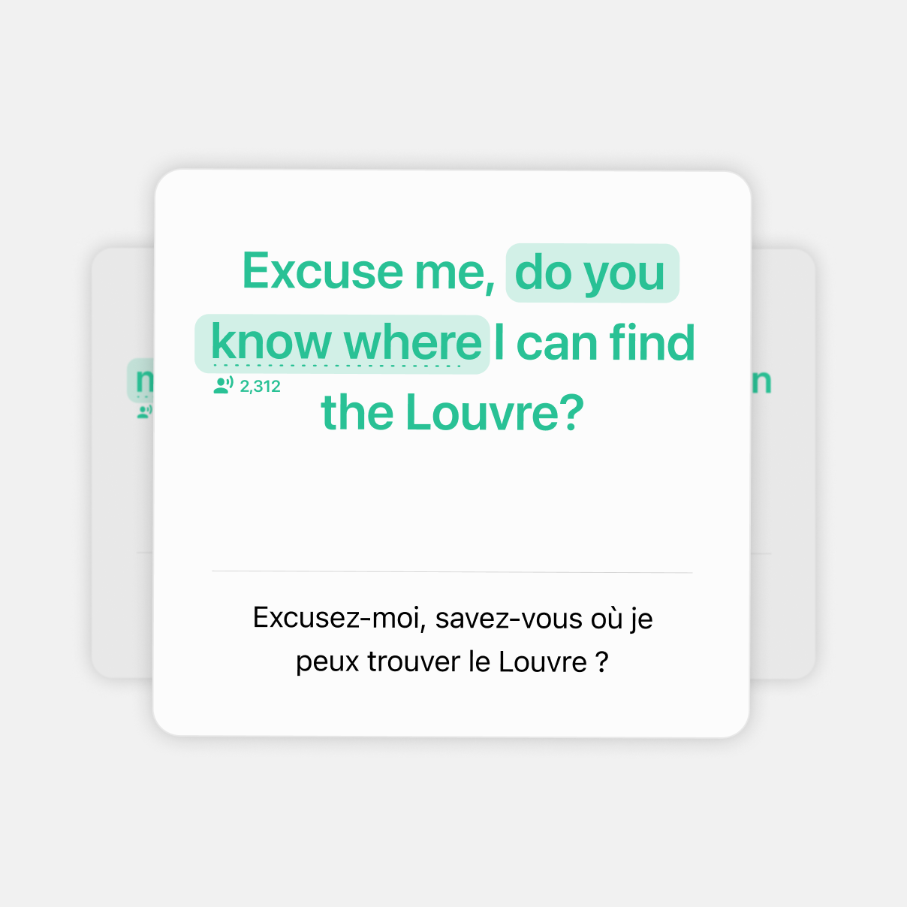
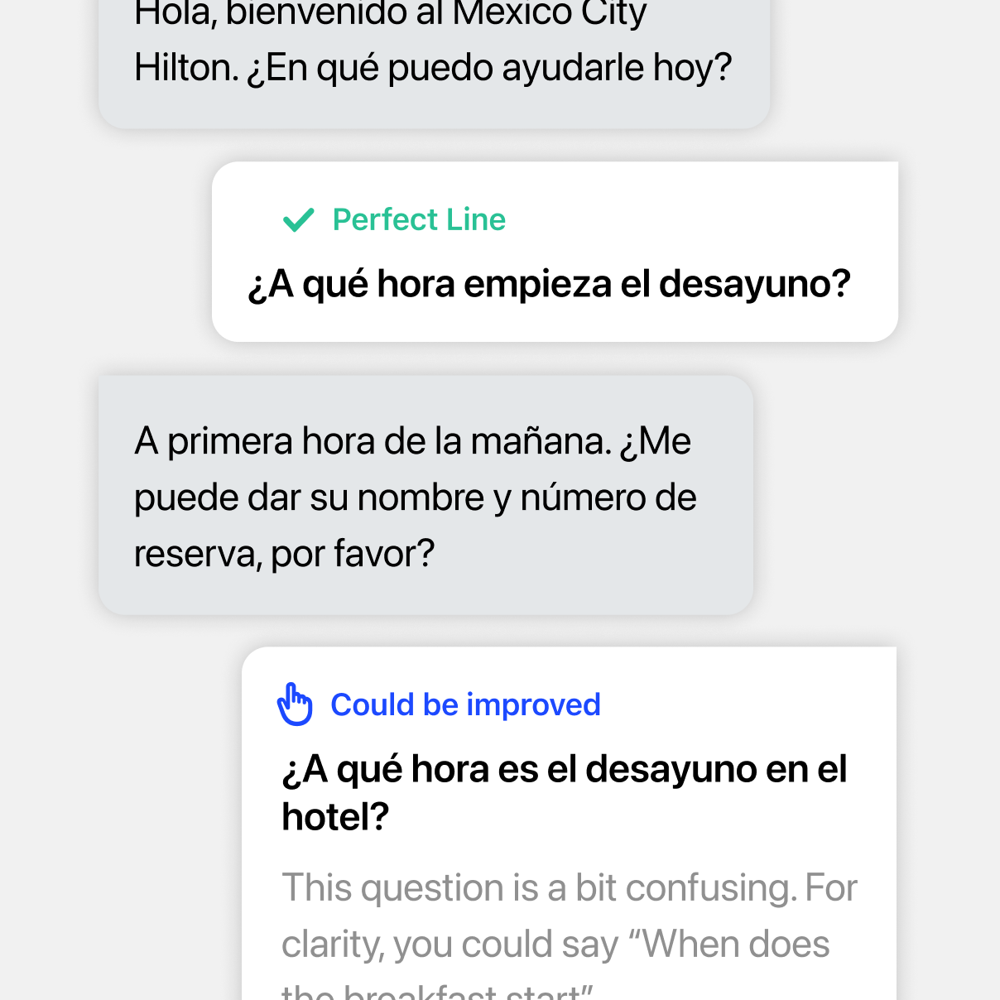
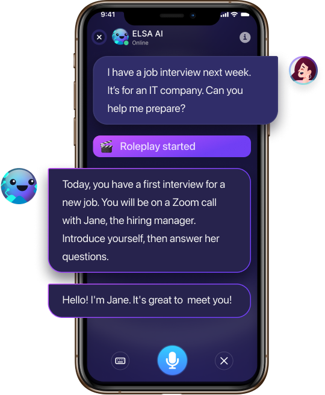
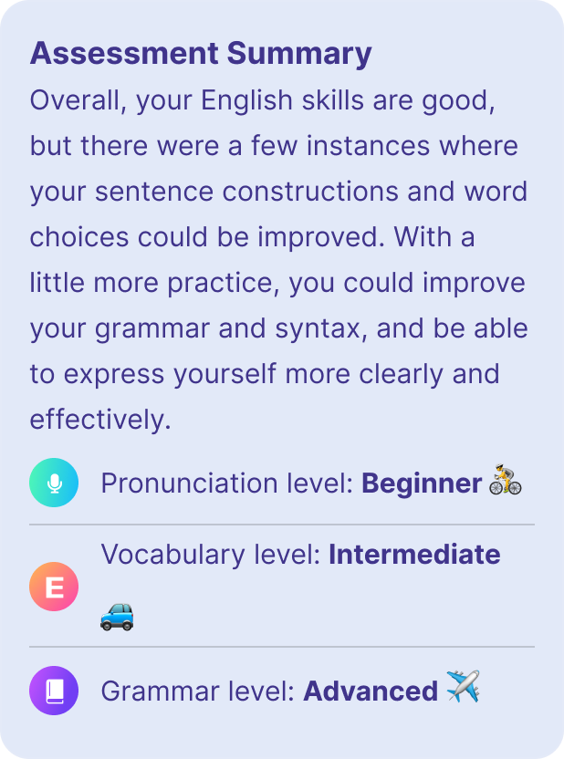
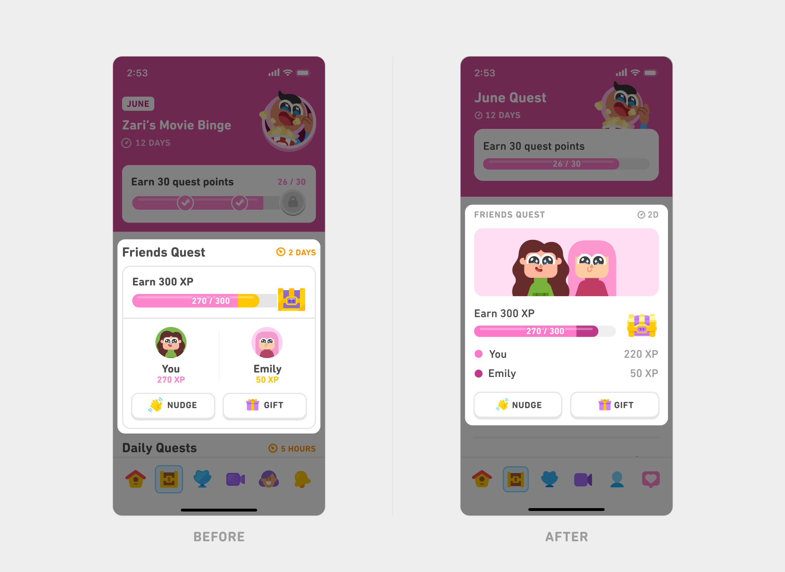

# Tham khảo giao diện học tập cho HeyMimic

Ngày khảo sát: 11/09/2026. Phạm vi: sản phẩm học ngoại ngữ/từ vựng. Đây là các sản phẩm tham khảo, không xác nhận quan hệ đối tác với HeyMimic.

## Cách đọc bằng chứng

- **Quan sát hình**: ảnh minh họa sản phẩm được chính hãng công bố, đã tải và xem trực tiếp. Các ảnh có thể là mockup quảng bá, không đại diện mọi phiên bản đang phát hành.
- **Mô tả chính hãng**: tài liệu mô tả thao tác/tính năng, không chứng minh chi tiết hình thức hoặc tốc độ animation.
- **Đề xuất HeyMimic**: quyết định thiết kế của plan; không phải tuyên bố hãng kia dùng chính xác thông số này.
- Không đăng nhập hoặc chạy buổi học bên trong ứng dụng của các hãng. Chưa đo animation của họ. Tất cả thời lượng motion trong plan là thông số đề xuất.
- Các tài liệu PDF/trang bị 403 không được coi là đã quan sát. Không dùng concept trên Dribbble hoặc nhận xét của người dùng làm bằng chứng về UI đang chạy.

## 1. Speak — ưu tiên câu học và lượt nói

Nguồn: [Speak: The Speak Method và hình sản phẩm](https://www.speak.com/). Loại: mô tả chính hãng + hình minh họa sản phẩm.

Quan sát: hình luyện tập đặt câu ngoại ngữ ở cỡ lớn, làm nổi cụm từ và tách bản dịch xuống dưới. Hình hội thoại phân biệt lượt nói với các khối góp ý có nhãn và giải thích ngay gần câu liên quan. Trang mô tả vòng Learn–Practice–Apply. Chưa xác nhận chuyển động của thẻ từ ảnh tĩnh.

**Áp dụng đề xuất:** câu đang luyện trở thành nội dung lớn nhất trong vùng học; gợi ý cải thiện đi cùng câu gốc; giảm phần giới thiệu trước mic. Dùng màu HeyMimic và dữ liệu có sẵn, không sao chép shadow/typography nguyên mẫu.

## 2. ELSA — phân biệt hội thoại và phần nhận xét

Nguồn: [ELSA AI: Choose a scenario, Speak, Get feedback](https://elsaspeak.com/en/ai/). Loại: mô tả chính hãng + hình minh họa sản phẩm; không xác định ngày thiết kế các ảnh.

Quan sát: hình điện thoại có chủ thể hội thoại rõ, nhãn bắt đầu roleplay và mic ở đáy. Ảnh tổng kết có phần nhận xét chung, sau đó chia nhóm pronunciation, vocabulary, grammar. Đó là hình quảng bá, không phải một phiên sử dụng đã kiểm thử.

**Áp dụng đề xuất:** chia Speaking thành chuẩn bị, ghi âm, chờ kết quả và xem góp ý; đưa một điều cần luyện lại lên trước các chỉ số. Không chuyển màu tím/gradient hoặc các thang trình độ của ELSA sang HeyMimic; không tự suy ra điểm phát âm từ transcript.

## 3. Duolingo — hệ thống thống nhất, mỗi nhiệm vụ có bố cục riêng

Nguồn: [Duolingo: Core tabs redesign](https://blog.duolingo.com/core-tabs-redesign/). Loại: case study thiết kế chính hãng + hình so sánh trước/sau. Đường dẫn asset có thư mục 2026/01; không dùng nó để suy ra ngày phát hành ứng dụng.

Quan sát: bản so sánh gom tiến trình và mục tiêu thành nhóm dễ đọc, giảm viền lồng nhau; giữ phần minh họa khi phục vụ nội dung. Bài viết nói về việc cân bằng tính nhất quán với mục đích riêng của tab, đồng thời kiểm tra thiết kế trên thiết bị. Không coi các hướng thử nghiệm trong bài là bản cuối cùng.

**Áp dụng đề xuất:** đồng nhất vị trí tiêu đề, điều khiển và nhãn; cho phép phòng nói, flashcard và trang tiến độ có cấu trúc khác nhau. Dùng phản hồi hoàn thành ngắn, không sao chép mascot, bảng xếp hạng hoặc hệ điểm XP.

## 4. Quizlet — thao tác học trên từng thẻ

Nguồn: [Quizlet Help: Studying with Flashcards](https://help.quizlet.com/hc/en-us/articles/360030988091-Studying-with-Flashcards), [Quizlet: Flashcards](https://quizlet.com/features/flashcards). Loại: mô tả chính hãng. Help Center đọc được; trang features có kết quả được lập chỉ mục nhưng lần mở trực tiếp lỗi. PDF hướng dẫn trả 403. Chưa quan sát ảnh UI Quizlet đủ tin cậy trong lượt này.

Tài liệu hướng dẫn lật thẻ, chuyển thẻ bằng phím/nút, nghe âm thanh và phân nhóm mức độ nhớ. Vì thế chỉ dùng để tham khảo mô hình thao tác; không lấy màu, bố cục pixel hoặc animation làm bằng chứng đã kiểm chứng.

**Áp dụng đề xuất:** thống nhất flashcard ở kho từ và phiên ôn, giữ hai thao tác “Cần ôn lại”/“Đã nhớ”; thêm chuyển động lật có thể giảm motion. Thao tác ghi nhận phải theo API hiện có, không đổi thuật toán ôn tập.

## 5. Nguồn kỹ thuật motion

[Motion for React: Accessibility](https://motion.dev/docs/react-accessibility) mô tả `MotionConfig reducedMotion="user"` và `useReducedMotion`. Plan chọn giảm các chuyển động lớn khi hệ điều hành yêu cầu. Đây là tài liệu kỹ thuật, không phải đối chuẩn giao diện học tập.

## Nguồn asset nguyên bản

| File | URL tải trực tiếp |
| --- | --- |
| speak-practice.png | https://cdn.prod.website-files.com/61a88c135006e8345b005efd/6a0cb0534a3c1b9fbdeece44_feature-2.png |
| speak-conversation.png | https://cdn.prod.website-files.com/61a88c135006e8345b005efd/6a0cb0b8f5349546e5f9a6fc_feature-3.png |
| elsa-conversation.png | https://d1t11jpd823i7r.cloudfront.net/roleplay/gold-2-2-mob.png |
| elsa-feedback.png | https://d1t11jpd823i7r.cloudfront.net/20200225_1031/Chat%20Bubble%203%20mb.png |
| duolingo-spacing.png | https://storage.ghost.io/c/7a/33/7a33d0f4-927d-4fe8-a6bf-96131b5e76d4/content/images/2026/01/11.-Caption.-Cleaned-up-visual-spacing-1.png |

Ảnh thuộc các chủ sở hữu tương ứng, chỉ lưu làm tài liệu tham khảo nội bộ. Không đưa ảnh, logo hoặc nhân vật của họ vào asset sản phẩm HeyMimic.
